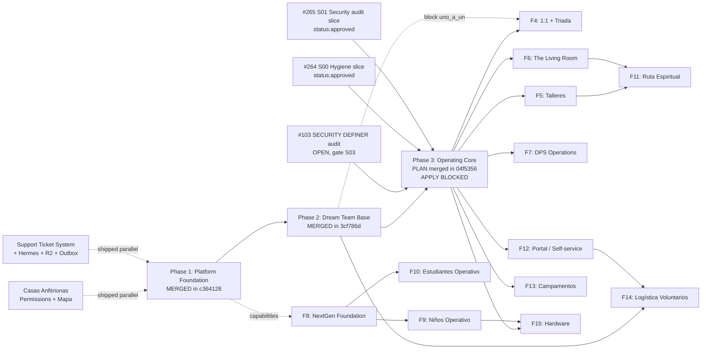
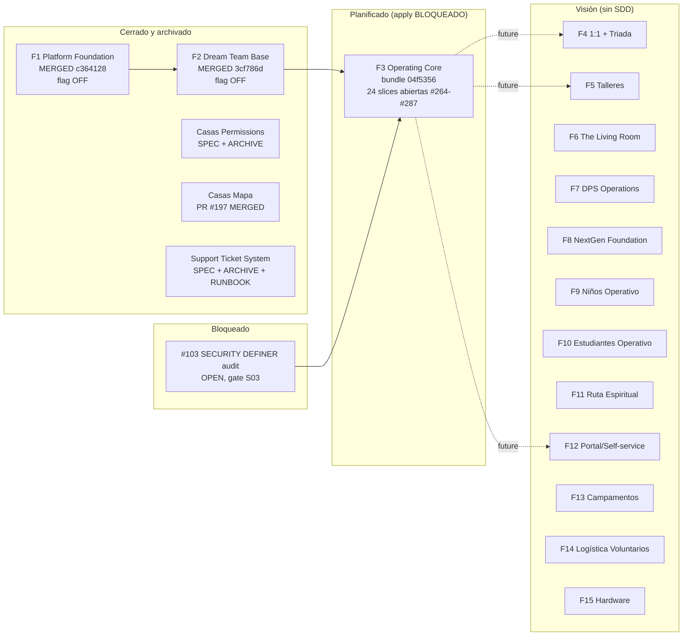
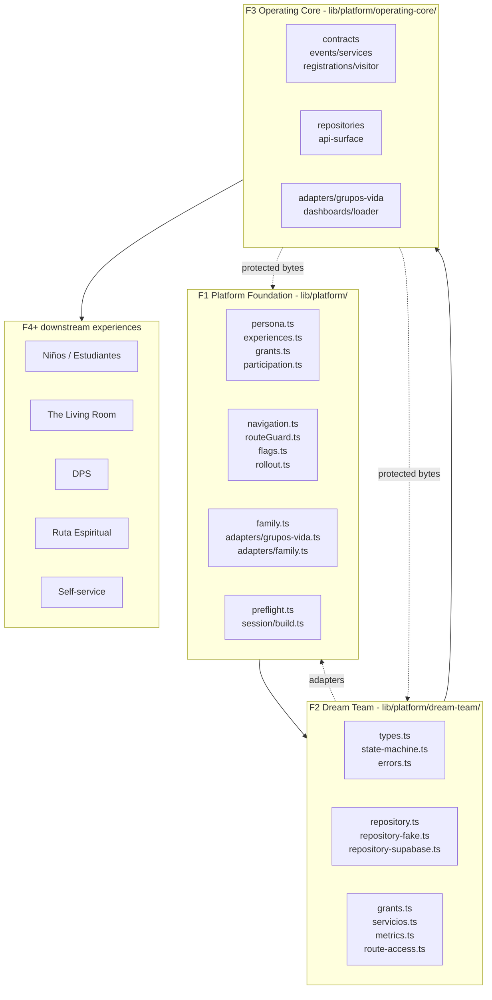
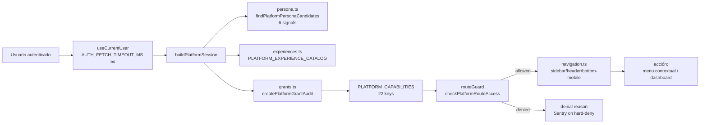
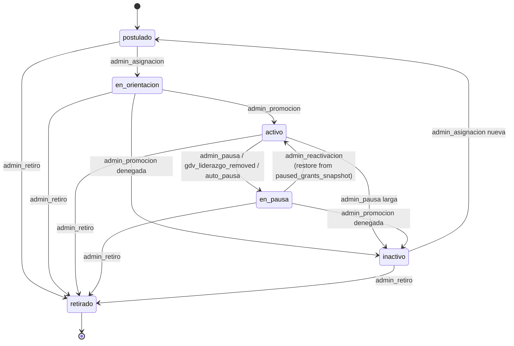
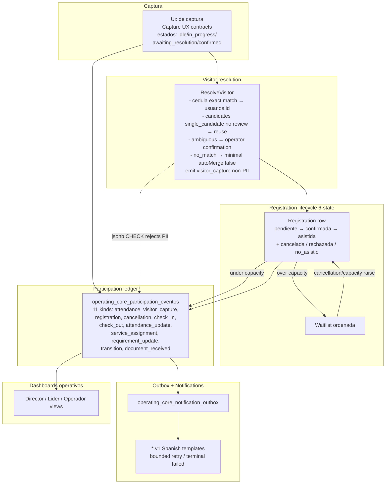
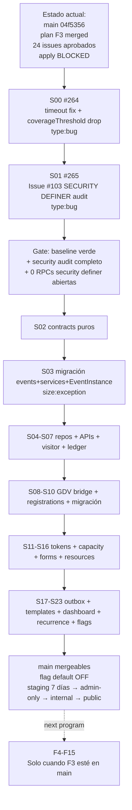

# Reporte Maestro — GlobalConnect: Plan vs Realidad

> **Auditoría documental, read-only.** No se modificó ningún archivo fuera de este.
> **Fecha de auditoría:** 2026-07-15
> **Rama inicial:** `feat/264-S00-hygiene`. Durante la tarea se hizo checkout a `main` (reflog `04f5356 HEAD@{1}: checkout: moving from feat/264-S00-hygiene to main` a 2026-07-15 18:37:06 -0400); HEAD y tree quedaron en el mismo SHA, sin diff de código/config. `main` está 3 commits adelante de `origin/main`.
> **SHA auditado:** `04f5356720b00aabf901c81198fad61ed45a12b6` (constante en ambas ramas).
> **Working tree:** limpio al inicio; al cierre el único cambio era este archivo nuevo no trackeado.
> **Origen:** `global-ministries/global-connect` (remoto `origin`)

---

## 1. Resumen ejecutivo

**Qué estamos construyendo.** GlobalConnect es la plataforma operativa y relacional de GlobalChurch. Una persona única puede tener múltiples contextos simultáneos (padre, líder, servidor, director, asistente) sin duplicar identidad ni recibir permisos cruzados. El programa se gobierna por un roadmap de **15 fases** declarado en `docs/roadmap/globalconnect-roadmap-maestro-v1.md`, alimentado por seis capacidades transversales: Persona, Experiencias, Dream Team, Operating Core, Ruta Espiritual y Grupos de Vida (este último preexistente y no se rediseña).

**Dónde estamos hoy.** Las primeras dos fases (Platform Foundation y Dream Team Global Base) están **cerradas y archivadas** en `main`. La Fase 3 (Operating Core) tiene su **bundle de planificación completo y mergeado** en `main` (PR #262, `93688fb`), pero la autorización de apply está **explícitamente BLOQUEADA** en `tasks.md` hasta nueva orden. Lateralmente, Casas Anfitrionas (Permisos y Mapa) y el Support Ticket System están **mergeados** y archivados. Es decir: el programa tiene **planificación fresca, dos fases implementadas, varios entregables laterales en producción y una única pieza de seguridad abierta (Issue #103) que es prerequisito de cualquier feature de Fase 3**.

**Qué sigue — orden real, no orden narrativo del roadmap.**
1. Cerrar el baseline verde de tests: S00 (Issue #264) — timeout de `mobile-platform-navigation.test.tsx` y remoción del bloque `coverageThreshold` en `jest.config.ts`.
2. Cerrar la auditoría de RPCs `SECURITY DEFINER` (Issue #103) — Issue #265 = S01; es el gate de seguridad antes de S03.
3. Recién entonces, ejecutar S02 → S23 contra `main` con la cadencia `force-chained stacked-to-main` ya probada en Fase 2.
4. Reactivar flags en staging por ≥7 días antes de producción (regla vigente desde el rollout de Fase 2 — ver `docs/roadmap/handoffs/fase-02-rollout.md`).

**Lo que NO hay que tocar todavía.** Las Fases 4 a 15 están definidas como visión en el roadmap. No existe SDD, ni specs, ni siquiera PR de planificación. Cualquier conversación para entrar a Fase 4 (1:1 + Triada) requiere primero reabrir la decisión cerrada de `uno_a_uno` (`archive`), y eso solo está permitido mediante un nuevo issue aprobado fuera del alcance de Fase 3.

---

## 2. Leyenda de estados y método de auditoría

### 2.1 Estados usados en este reporte

| Estado | Significado | Evidencia mínima |
|---|---|---|
| **Implementado en main** | Código mergeado, archivado y, cuando aplica, con flag OFF por defecto. | SHA/PR + ruta en `lib/**`/`supabase/migrations/**` + `verify-report.md` PASS. |
| **Plan SDD completo (Fase 3)** | Exploración + propuesta + N specs + diseño + tasks mergeados. Apply bloqueado. | PR de docs + `apply authorization: BLOCKED` en `tasks.md`. |
| **Plan general del roadmap (Fases 4-15)** | Definición estratégica, sin SDD, sin propuesta, sin spec. | Bullet en `globalconnect-roadmap-maestro-v1.md`. |
| **Archivado** | Cambio terminado y movido a `openspec/changes/archive/<fecha>/`. | Carpeta archivada + `verify-report.md` PASS. |
| **Bloqueado** | Mergeado, archivado o con flag, pero con un prerrequisito que aún no cierra. | Issue abierto con `status:approved` y dependencia explícita. |
| **Cerrado en GitHub** | Issue con `state:CLOSED` (no necesariamente mergeado). | `gh issue view` con `state:CLOSED`. |

### 2.2 Método de auditoría

- **Sólo lectura.** `git status`, `git log`, `git diff` consultivo, `gh issue view`, `gh pr list` sin mutaciones.
- No se ejecutó la suite de tests. La auditoría documental acepta los conteos declarados en `verify-report.md`, `apply-progress.md`, handoffs y snapshots de cobertura provistos por runs anteriores delegadas.
- No se editaron workflows, archivos fuera de `docs/REPORTE_FASES_PLAN_VS_REALIDAD.md`, ni se aplicaron migraciones.
- Cada afirmación material lleva una ruta, SHA, issue o PR. Donde el repo calló, el reporte lo dice explícitamente.

### 2.3 Convenciones tipográficas

- **Ruta:** `lib/platform/...` o `openspec/changes/...`
- **PR:** `#256`
- **Issue:** #103
- **SHA:** `04f5356`
- **Estado:** sigue la leyenda de §2.1

---

## 3. Tabla de las 15 fases del roadmap

| # | Fase | Outcome | Dependencias upstream críticas | Artefactos en repo | Estado real | Brecha vs plan | Próximo gate |
|---|---|---|---|---|---|---|---|
| 1 | **Platform Foundation** | Persona única + experiencias + capacidades scoped + navegación contextual | — (base) | `lib/platform/**` (14 archivos), `openspec/changes/fase-01-platform-foundation/`, `openspec/specs/platform/` | **Cerrada / Archivada** | Flag `NEXT_PUBLIC_PLATFORM_NAVIGATION_ENABLED=off` por defecto; retention defaults marcados `pending legal review`; `lib/platform/adapters/{family,participation-adapter}.ts` siguen como stubs con `FamilyReadRepository` / `ParticipationReadRepository`; preflight bloquea `uno_a_uno` | Decidir `uno_a_uno` (mantener `archive`) y resolver retención cuando Legal lo permita |
| 2 | **Dream Team Global Base** | Toda persona que sirve modelada con state machine de 6 estados, grants, GDV read-only, métricas | F1 completa | `lib/platform/dream-team/**` (10 archivos), migración `20260707183000_dream_team_base.sql` (8 tablas), spec consolidada `openspec/specs/platform/dream-team/spec.md` | **Cerrada / Archivada** | Flag `NEXT_PUBLIC_DREAM_TEAM_ENABLED=off`; sólo accesible por capability gating; e2e Ana verificado en staging; 812+ tests | Reactivar flag en staging con plan de rollout documentado en `fase-02-rollout.md` |
| 3 | **Operating Core** | Tubería operativa común: eventos, inscripciones, asistencia, capacidad, formularios, recursos, notificaciones, dashboards operativos, integración read-only con GDV | F2 completa, Issue #103 cerrado, baseline verde | `openspec/changes/fase-03-operating-core/{exploration,proposal,design,tasks}.md` + 14 specs | **Plan SDD completo** (apply BLOQUEADO) | 24 issues #264-#287 abiertos, todos con `status:approved`, `type:feature` o `type:bug`; ningún archivo en `lib/platform/operating-core/**` aún | Aplicar S00 (#264) y S01 (#265); Issue #103; luego S02→S23 |
| 4 | **Seguimiento Pastoral: 1:1 + Triada** | 1:1 para GDV / Living Room, reportes generales, triadas | F3 (ledger compartido) | (aún no en repo) | **Plan general del roadmap** | `uno_a_uno=archive`; nada en `openspec/changes/`; sin spec | Inicia Fase 4 solo si Issue #103 cierra y Fase 3 expone la unión canónica del ledger |
| 5 | **Talleres de Crecimiento Base** | Catálogo, cohortes, inscripción, asistencia, completación | F3 Operating Core | (aún no en repo) | **Plan general del roadmap** | Sin propuesta; `Camp` kind explícitamente rechazado en F3 | F3 funcional primero |
| 6 | **The Living Room Operativo** | Grupos universitarios, asistencia, mentoría, transición | F1 + F3 + Ruta Espiritual | (aún no en repo) | **Plan general del roadmap** | The Living Room aparece como `experience` en `PLATFORM_EXPERIENCE_CATALOG` pero sin SDD | F3 + F11 |
| 7 | **DPS Operations** | Estructura multiárea, dashboards, evaluaciones, repertorio | F2 + F3 | (aún no en repo) | **Plan general del roadmap** | Sólo se modelan capabilities (`dps.team.{serve,lead,director}`) en `lib/platform/experiences.ts:37-39`. PCO no integra en MVP | F3 completo |
| 8 | **NextGen Foundation** | Base Niños + Estudiantes con datos sensibles + permisos estrictos | F1 base ya preparada | (aún no en repo) | **Plan general del roadmap** | Permiso `family.minor.read` y `family.minor.consent` definidos; guard `canAccessMinorData` activo | Inicia Fase 8 solo si F3 cerrado |
| 9 | **Niños Operativo** | Ambientes/salones, check-in/out, capacidad operativa, autorizados | F8 | (aún no en repo) | **Plan general del roadmap** | `ninos.room.read` y `ninos.team.serve` capabilities existen; sin operación | F8 + F3 |
| 10 | **Estudiantes Operativo** | Registro adolescentes, visitantes, grupos propios, asistencia nominal | F8 | (aún no en repo) | **Plan general del roadmap** | `estudiantes.room.read`, `estudiantes.team.{serve,lead}` capabilities existen | F8 + F3 |
| 11 | **Ruta Espiritual Completa** | Pasos, progreso, hitos, talleres, recomendaciones | F5 + F6 + F9 + F10 | (aún no en repo) | **Plan general del roadmap** | Sin SDD | F5 + F6 |
| 12 | **Portal / Self-service** | Cuenta de miembro, historial, portal de padres, autogestión | F1 + F3 | (aún no en repo) | **Plan general del roadmap** | Inscripción self-service explícitamente F12 en handoff Fase 3 | F3 funcional |
| 13 | **Campamentos / Eventos Avanzados** | Pagos, becas, lista de espera, documentos, ficha médica | F3 | (aún no en repo) | **Plan general del roadmap** | `camp` kind explícitamente rechazado como kind válido en F3; se difiere a F13 | F3 funcional |
| 14 | **Logística de Voluntarios** | Refrigerio, planificación semanal, QR validación | F2 maduro + F12 | (aún no en repo) | **Plan general del roadmap** | Depende explícita del roadmap | F12 + F2 maduro |
| 15 | **Hardware / Automatización** | Tablets, kioskos, impresoras, etiquetas, QR scanning, self check-in | F9 cerrado | (aún no en repo) | **Plan general del roadmap** | El roadmap declara textualmente "Hardware no bloquea MVP" | F9 maduro |

**Entregables laterales ya mergeados al margen del roadmap:**

| Entregable | Estado | Spec / PR | Notas |
|---|---|---|---|
| **Casas Anfitrionas Permissions** | **Cerrado / Archivado** | spec consolidada `openspec/specs/casas-anfitrionas-permissions/spec.md`; archive `openspec/changes/archive/2026-06-17-casas-anfitrionas-permissions/`. 249 tests pasando. | 6 PRs #180-#188 + #189-#192; verificación 12/12 tareas. |
| **Casas Anfitrionas Mapa** | **Cerrado / Mergeado** (planning tree aún en `openspec/changes/casas-anfitrionas-mapa/`) | Issue #196 CLOSED, PR #197 MERGED 2026-06-24; planning `openspec/changes/casas-anfitrionas-mapa/{proposal,design,tasks}.md`. | 8 work units; task 3.4 (create-and-link pending Casa) queda diferida; production-safety gates (Supabase advisors) no corridos en docs. |
| **Support Ticket System** | **Cerrado / Archivado** | spec `openspec/specs/support-ticket-system/spec.md`; archive `openspec/changes/archive/2026-06-11-support-ticket-production-readiness/`; runbook `docs/support-operations.md`. | Production-readiness extendido: Hermes + Resend + R2 + Sentry privacy; outbox drain; safe degraded mode. |
| **Issue #103 (RPC `SECURITY DEFINER` audit)** | **Bloqueado / Abierto** | Issue #103 OPEN, `status:approved`, `priority:high`; bloquea S03 de F3. | 4 RPCs endurecidos en migración `20260608173000_harden_rpc_auth_identity.sql` (Issue #99/PR #100 cerrado); resta `crear_grupo` y la cohorte restante de `SECURITY DEFINER + p_auth_id`. |

---

## 4. Fase 1 — Platform Foundation (en profundidad)

### 4.1 Propósito

Construir el cimiento común — persona única con cuenta auth opcional, familias y tutores, experiencias, capacidades scoped, historial longitudinal base, navegación contextual — **sin rediseñar Grupos de Vida** que es producción-crítico.

### 4.2 Arquitectura (lo que se ve en `lib/platform/**`)

```
lib/platform/
├── auth-timeout.ts        — AUTH_FETCH_TIMEOUT_MS = 5_000 (compartido cliente↔middleware)
├── persona.ts             — 6 señales (email, telefono, cedula, nombre, apellido, fechaNacimiento)
├── persona.ts:5-13        — PlatformPersonaUsuario (cedula nullable)
├── persona.ts:46-52       — Pesos: email 4 / telefono 3 / cedula 4 / nombre 1 / apellido 1 / fechaNac 2
├── experiences.ts         — 8 experiencias, 6 scope types, 22 capability keys
├── family.ts              — 8 tipos de relación (6 actuales + 2 diferidos)
├── family/canAccessMinorData.ts — guard deny-by-default para datos de menores
├── grants.ts              — append-only audit logger + métricas + denial threshold
├── navigation.ts          — 9 navigation definitions, fail-open cuando flag OFF
├── routeGuard.ts          — checkPlatformRouteAccess, fail-open con flag OFF (PR #243)
├── flags.ts               — getPlatformNavigationFlags + getDreamTeamFlags
├── participation.ts       — 7 PLATFORM_PARTICIPATION_EVENT_TYPES, sensitivity map
├── preflight.ts           — bloquea uno_a_uno hasta decision registrada
├── rollout.ts             — 5 PR gates + plan de 5 stages (0% → 100%)
├── adapters/
│   ├── grupos-vida.ts     — GruposVidaReadRepository (read-only, no muta GDV)
│   ├── dream-team-gdv.ts  — leadership diff, scope validation
│   ├── family.ts          — resolveFamilyRelations
│   └── participation-adapter.ts — in-memory + Supabase writer (coverage 48.33%)
└── session/               — PlatformSession read-only desde auth backend
```

### 4.3 Flujo de autorización y navegación

```
Usuario entra a ruta /
  └─> middleware.ts → auth.getUser() con timeout AUTH_FETCH_TIMEOUT_MS
       ├─ ON: plataforma habilitada (NEXT_PUBLIC_PLATFORM_NAVIGATION_ENABLED=true)
       │    ├─ checkPlatformRouteAccess({ session, requiredCapability, flags })
       │    │    ├─ flags.enabled ? capability check : allow (fail-open por PR #243)
       │    │    └─ has capability ? allow : deny (razón específica)
       │    ├─ sidebar-moderna / header-movil / menu-inferior-movil
       │    │    lee navigation.ts y filtra por capabilities activas
       │    └─ dashboard/page.tsx → obtenerDatosDashboard() filtra por capabilities
       └─ OFF: navegación legacy por rolPrincipal (modo actual en producción)
```

### 4.4 Estado de rollout

| Aspecto | Valor |
|---|---|
| Flag por defecto | **OFF** — `NEXT_PUBLIC_PLATFORM_NAVIGATION_ENABLED=false` |
| Razón documentada | Foundation invisible: no entrega valor de usuario, no se reactiva sin rollout staged documentado (`rollout.ts:39`). |
| Kill switch | `NEXT_PUBLIC_PLATFORM_NAVIGATION_KILL_SWITCH=true` lee en call time (no inline build). |
| Métrica en CI | 666 tests en `pnpm test:ci` (62 suites + 26 node tests al cierre de F1). |
| Byte-identity post-F2 | 0 bytes diff en módulos críticos protegidos (`grants`, `participation`, `navigation`, `routeGuard`, `persona`, `preflight`, `flags`, `adapters/grupos-vida`). |

### 4.5 Pruebas y evidencia

- 26 archivos `.test.ts(x)` en `__tests__/lib/platform/**`.
- 14 archivos externos que referencian plataforma: `__tests__/app/api/dream-team/**`, `__tests__/app/{configuracion-pages,dashboard-page,support-pages}.test.tsx`, etc.
- `pnpm test:ci` verde al cierre de F1.

### 4.6 Límites y deuda viva

| Tema | Detalle |
|---|---|
| **Retention** | `lib/platform/participation.ts:79-98` tiene defaults marcados `pending legal review`. Operating Core no debe aplicarlos hasta Legal firme. |
| **Adapters stubs** | `FamilyReadRepository` y `ParticipationReadRepository` son interfaces con `TODO`. Las impls con Supabase son scope de fases futuras. |
| **`uno_a_uno` decision** | `lib/platform/preflight.ts:60-67` rechaza cualquier uso. La decisión queda en `archive` por F3 (ver §6). |
| **Cobertura** | `lib/platform/**` no figura en `jest.config.ts` `collectCoverageFrom`. Living coverage gap. `participation-adapter.ts` está al 48.33%. |
| **`coverageThreshold.branches: 3`** | Válido en Jest 30 (equivale a 3%, no 0.03%). La falla observada en baseline es por timeout de `mobile-platform-navigation.test.tsx`, no por threshold. Solución recomendada: eliminar el bloque entero en S00 de F3. |

---

## 5. Fase 2 — Dream Team Global Base (en profundidad)

### 5.1 Propósito

Modelar a **toda persona que sirve** en cualquier experiencia, no solo a un ministerio. Cada servicio es `(persona, equipo, rol)` con state machine, grants, requirements, métricas y audit.

### 5.2 Arquitectura (lo que se ve en `lib/platform/dream-team/` y la migración)

```
lib/platform/dream-team/
├── types.ts          — 6 estados, 10 motivos, 6 participation event kinds
├── state-machine.ts  — TRANSICIONES_VALIDAS (matriz 6×6, forward-only)
├── errors.ts         — 6 error codes (MISSING_MOTIVO, INVALID_STATE_TRANSITION, etc.)
├── repository.ts     — read+write+history interface
├── repository-fake.ts — in-memory para tests
├── repository-supabase.ts — Supabase adapter (438 líneas, ConcurrencyConflictError)
├── route-access.ts   — hasDreamTeamReadCapability/hasDreamTeamWriteCapability
├── grants.ts         — buildGrantsForServicio, applyGrantsForTransition (265 líneas)
├── servicios.ts      — transitionWithGrants (orquestador)
└── metrics.ts        — 4 agregados puros
```

```
Migración 20260707183000_dream_team_base.sql — aplicada a supabase_global_staging
├── 8 tablas: servicios, roles, equipos, requisitos, requisitos_verificacion, estados_historial, participation_eventos, capability_grants
├── 5 enums: dream_team_estado, dream_team_obligatoriedad, dream_team_requisito_estado, dream_team_requisito_tipo, dream_team_transicion_motivo
├── Helper: auth_has_dream_team_capability
└── 20 RLS policies
```

### 5.3 State machine de 6 estados — CONTRATO PUBLICADO (consolidado en `openspec/specs/platform/dream-team/spec.md:65-72`)

> **Esta matriz es el contrato normativo publicado en el spec consolidado.** Mientras la divergencia de §5.3.b no se reconcilie, este es el contrato y `lib/platform/dream-team/state-machine.ts` representa el comportamiento runtime actual (ver tabla de divergencia abajo).

| From → To | postulado | en_orientacion | activo | en_pausa | inactivo | retirado |
|---|---|---|---|---|---|---|
| `postulado` | — | ✅ | ❌ | ❌ | ❌ | ❌ |
| `en_orientacion` | ❌ | — | ✅ | ❌ | ❌ | ❌ |
| `activo` | ❌ | ❌ | — | ✅ | ✅ | ✅ |
| `en_pausa` | ❌ | ❌ | ✅ | — | ❌ | ✅ |
| `inactivo` | ✅ | ❌ | ❌ | ❌ | — | ❌ |
| `retirado` | ❌ | ❌ | ❌ | ❌ | ❌ | — (terminal) |

#### 5.3.b Divergencia runtime vs contrato (deuda viva)

`lib/platform/dream-team/state-machine.ts:5-12` permite **cinco** transiciones que el contrato publicado de §5.3 prohíbe explícitamente:

| # | Transición | Spec §5.3 | Runtime (state-machine.ts) | Impacto |
|---|---|---|---|---|
| 1 | `postulado → retirado` | ❌ | ✅ (`Set(['en_orientacion','retirado'])` línea 6) | Saltea `en_orientacion`; el spec dice "no se puede retirar un postulado sin pasar por orientación". |
| 2 | `en_orientacion → inactivo` | ❌ | ✅ (línea 7) | El spec sólo permite `en_orientacion → activo`. |
| 3 | `en_orientacion → retirado` | ❌ | ✅ (línea 7) | Permite retiro directo desde orientación sin pasar por `activo`. |
| 4 | `en_pausa → inactivo` | ❌ | ✅ (línea 9) | El spec sólo permite `en_pausa → activo` o `en_pausa → retirado`. |
| 5 | `inactivo → retirado` | ❌ | ✅ (línea 10) | El spec exige pasar por `postulado` antes de `retirado` desde `inactivo`. |

**Lectura normativa:** hasta que se reconcilie, el spec consolidado es el contrato y `state-machine.ts` es el comportamiento actual. La API runtime es más laxa que el contrato publicado. **Esto NO se debe ocultar:** cualquier integrador que confíe en el spec esperando rechazo de estas cinco transiciones verá aceptación silenciosa en runtime.

- Cada transición exige `motivo` del enum cerrado `dream_team_transicion_motivo` (10 valores: admin_asignacion, admin_promocion, admin_pausa, admin_reactivacion, admin_retiro, reasignacion, requisito_vencido, gdv_liderazgo_removed, auto_pausa, otro).
- Versión: `dream_team_servicios.version` se incrementa por escritura; `expectedVersion` mismatch → `409 Conflict` (last-write-wins + audit).
- **Pausa/reactivación:** `activo → en_pausa` emite revokes y persiste `paused_grants_snapshot` (JSONB array) en `dream_team_estados_historial`. Reactivación restaura desde snapshot.

### 5.4 Capabilities + Grants (modelo híbrido)

15 capabilities en `PLATFORM_CAPABILITIES`:

- **Genéricas** (`experience: 'dream_team'`): `dream_team.serve`, `dream_team.lead`, `dream_team.coordinate`, `dream_team.director.coordinate`, `dream_team.requirements.manage`, `dream_team.metrics.read`, `dream_team.gdv.lead`.
- **Específicas** (existente/nueva en `experiences.ts`): `dps.team.{serve,lead,director}`, `estudiantes.team.{serve,lead}`, `talleres_crecimiento.team.serve`, `ninos.team.serve`, `the_living_room.team.serve`.
- **Grupo de Vida bridge:** `dream_team.gdv.lead` con `scopeType: 'grupo'` derivado del adapter `lib/platform/adapters/dream-team-gdv.ts` (read-only sobre `grupo_miembros` liderazgo).
- **Audit:** todas las operaciones pasan por `createPlatformGrantAudit().logger.record(event)` de `lib/platform/grants.ts` (Fase 1 intacto).

### 5.5 Integración GDV (read-only)

- `lib/platform/adapters/dream-team-gdv.ts` (234 líneas): leadership diff, scope validation. Emite `gdv_liderazgo_removed` cuando un liderazgo se quita de `grupo_miembros`.
- `lib/platform/adapters/grupos-vida.ts` (145 líneas, **0 bytes diff post-F2**): consumido intacto, provee `GruposVidaReadRepository` y `GruposVidaAuthorizedScope`.

### 5.6 Eventos y métricas

- **Eventos participation** de F2 (`service_assigned`, `service_state_changed`, `service_paused_grants_snapshot`, `service_reactivated`, `service_retired`, `requirement_overdue`): retention 365-1095 días.
- **Writer:** `lib/platform/adapters/participation-adapter.ts` (`createDreamTeamParticipationSupabaseWriter`) → `dream_team_participation_eventos` en Supabase (scoped a `servicio_id`).
- **Métricas** (`getDreamTeamMetrics()`): cuatro agregados puros: `servicios_por_experiencia_equipo`, `servicios_por_estado`, `distribucion_roles`, `requisitos_vencidos`. Endpoint `/api/dream-team/metrics` gated por `dream_team.metrics.read`.

### 5.7 Estado de rollout

| Aspecto | Valor |
|---|---|
| Flag | `NEXT_PUBLIC_DREAM_TEAM_ENABLED` con `rolloutStage ∈ {off, admin-only, internal, public}`. Default OFF. |
| Kill switch | `getDreamTeamFlags()` lee en call time; rollback = `false` en Vercel → 404 en API. |
| `minVersion` | Opcional: `NEXT_PUBLIC_DREAM_TEAM_MIN_VERSION` gatea por versión cliente. |
| Tests | 812 unit + 24 integration skipped sin credenciales staging (e2e Ana contra staging en 1 PR). |
| Hotfixes post-merge | #258 (`useCurrentUser` timeout, issue #257), #260 (`DashboardLayout` root mount, issue #259). |

### 5.8 Pruebas y evidencia

- 10 archivos `__tests__/lib/platform/dream-team/*.test.ts`.
- 3 archivos `__tests__/app/api/dream-team/{metrics,servicios,servicios-id}.test.ts`.
- Archivo `__tests__/app/{configuracion-pages,dashboard-page,support-pages}.test.tsx` cubre navegación contextual que consume estos grants.
- e2e Ana: caso STS 9-services → grants emitidos, pausa revoca + snapshot, reactivación restaura. Validado en `verify-report.md`.

### 5.9 Límites y deuda viva

| Tema | Detalle |
|---|---|
| **Self-service** | Líder no se auto-promueve a `activo`. Toda promoción pasa por un admin/grants holder. |
| **Permisos de admin** | La creación de servicio sigue dependiendo de un grants holder explícito; sin role-string check. |
| **Reasignación** | Se hace como `retirado` + nuevo servicio, no como mutación in-place (decisión documentada en spec §"Reassignment"). |
| **`participation-adapter.ts`** | Cobertura 48.33%. Operating Core lo usa como espejo de patrón pero no lo extiende. |

---

## 6. Fase 3 — Operating Core (en profundidad)

### 6.1 Estado del SDD

- **Cambio OpenSpec:** `openspec/changes/fase-03-operating-core/`
- **Bundle mergeado:** PR #262 / SHA `93688fb` → sincronizado en main como `04f5356` el 2026-07-14.
- **Issue origen:** #261 CLOSED.
- **Apply authorization:** `tasks.md:64` declara literalmente "BLOCKED until explicit user approval".

### 6.2 Artefactos del bundle (lo que está MERGED)

| Archivo | Función | Tamaño |
|---|---|---|
| `exploration.md` | 17 preguntas respondidas, 20 decisiones arquitectónicas (D7/D19/D20 diferidas a Legal/Product/Ops), 13 invariantes protegidos | 574 líneas |
| `proposal.md` | PRD con 14 capabilities, restricciones de no-regreso, dependencia de #103 | 71 líneas |
| `specs/operating-core-{events,services,registrations,visitor-resolution,participation-ledger,capacity,forms,resources,notifications,dashboards,capture-ux,recurrent-events,grupos-vida-bridge,api-surface}/spec.md` | 14 specs Given/When/Then, ≤650 palabras cada uno | 14 archivos |
| `design.md` | Arquitectura, threat matrix, decisiones D1-D9 | 79 líneas |
| `tasks.md` | 24 slices S00-S23, apply explícitamente BLOQUEADO | 64 líneas |

### 6.3 Las 14 capabilities (taxonomía canónica)

| # | Capability | Cobertura |
|---|---|---|
| 1 | `operating-core-events` | Single table + `kind ∈ {service, group_meeting, workshop, activity, custom}`; `camp` rechazado. Service ≠ Experience ≠ Event ≠ EventInstance. |
| 2 | `operating-core-services` | Schedule semanal configurable (multi-campus) — service_per_row, multi-tenant OUT OF SCOPE. |
| 3 | `operating-core-visitor-resolution` | Reusa `usuarios.cedula` + `PlatformPersonaUsuario.cedula`; ambiguous → operator; `no_match` → minimal con `autoMerge=false`. NO se agrega `cedula_country`. |
| 4 | `operating-core-registrations` | State machine de 6 estados: `pendiente \| confirmada \| asistida \| no_asistio \| cancelada \| rechazada`. Idempotencia por partial unique. |
| 5 | `operating-core-participation-ledger` | Unión canónica de **11 kinds** (1 compartido con F1, 10 aditivos); `one_on_one_logged` EXCLUIDO. |
| 6 | `operating-core-capacity` | Capacity base + override operativa por instancia; override ≤ base (above-base rechazado, sin silent cap). |
| 7 | `operating-core-forms` | Schema cerrado: text/email/phone/number/date/select/multiselect/checkbox/textarea. |
| 8 | `operating-core-resources` | Biblioteca link/file/video; ownership changes archivan el previo. |
| 9 | `operating-core-notifications` | Outbox compartido, plantillas `*.vN` (default español, 90 días tail antes de remoción). |
| 10 | `operating-core-dashboards` | 3 vistas (Director / Líder / Operador); KPI targets diferidos. |
| 11 | `operating-core-capture-ux` | Contratos compartidos sobre un ledger (estados: `idle \| in_progress \| awaiting_resolution \| confirmed \| overridden \| rejected`). |
| 12 | `operating-core-recurrent-events` | RRULE subset cerrado (`freq, interval, count, until, byDay, start_time`); materialización lazy. |
| 13 | `operating-core-grupos-vida-bridge` | Adapter read-only **separado**; emite `attendance`/`attendance_update`; start-clean (sin backfill). |
| 14 | `operating-core-api-surface` | Capability-gated, 409 reservado, kill switch por sub-fase. |

### 6.4 Las 24 slices planificadas (S00 → S23)

| Familia | Slices | Notas |
|---|---|---|
| **Prereq** | S00 (#264), S01 (#265) | type:bug; S00 = mobile-nav + coverageThreshold drop; S01 = Issue #103 audit. |
| **Foundation** | S02 (#266), S03 (#267, `size:exception`), S04 (#268), S05 (#269), S06 (#270), S07 (#271) | Contratos puros → migración → repos+fakes → APIs → visitor adapter → participation ledger schema+repo. |
| **Registrations/Capacity/Forms/Resources** | S08 (#272), S09 (#273), S10 (#274, `size:exception`), S11 (#275), S12 (#276), S13 (#277), S14 (#278), S15 (#279), S16 (#280) | GDV bridge → 6-state contract → migration registrations → public tokens + APIs → capacity → forms → resources. |
| **Notifications/Capture-UX/Dashboard/Recurrence/Rollout** | S17 (#281), S18 (#282), S19 (#283), S20 (#284), S21 (#285), S22 (#286), S23 (#287) | Outbox schema → templates v1 → state machine → capture-ux contracts → dashboard loader → recurrent materialization → flags + route-access + rollout. |

### 6.5 Decisiones arquitectónicas cerradas (no se reabren en F3)

- **Identidad.** Operating Core usa SOLO la columna existente `public.usuarios.cedula` y la señal existente `PlatformPersonaUsuario.cedula`. NO se agrega `cedula_country`, NO se introduce score paralelo `≥ 0.85`, NO se crea contract paralelo de identidad. Match exacto de cédula reusa `usuarios.id`; account/auth linking reusa `usuarios.auth_id`. Ambiguous → operator confirmation. Solo `no_match` crea usuario con `autoMerge=false`.
- **Capacidad.** Override por scoped `operating_core.capacity.manage`; sin role-string check; directores default grantees. Above-base override se rechaza con error de dominio (sin silent cap, sin persistencia).
- **Confirmación de registration.** Por evento: `confirmation_mode ∈ {automatic, manual}`. Default automatic confirma hasta capacidad efectiva y waitlisteable el overflow. Waitlist overflow → HTTP 200 `{outcome:'waitlisted'}`. Manual deja filas en `pendiente`.
- **`uno_a_uno = archive`.** Preflight en `lib/platform/preflight.ts` permanece bloqueado indefinidamente. NO se llama `registerPlatformUnoAUnoDecision` desde ningún artefacto F3. El `one_on_one_logged` está EXCLUIDO de la unión canónica de 11 kinds.
- **Fase 3 precede Fase 4 (CLOSED).** Sin `one_on_one_logged` en kinds iniciales.
- **Multi-tenant / multi-campus:** OUT de scope MVP. Single-campus por Service row. Tracked-issues note.

### 6.6 Precondiciones verificadas (a 2026-07-15)

| Precondición | Estado |
|---|---|
| Persona + capabilities + grants (F1) | ✅ completo |
| Dream Team + servicios + repos (F2) | ✅ completo |
| `lib/platform/adapters/grupos-vida.ts` (F1) | ✅ completo, consumido |
| `DreamTeamParticipationEventWriter` (F2) | ✅ completo |
| `lib/email/` + `emails/` (Resend) | ✅ existe |
| Auth + flags (F1+F2) | ✅ completos |
| `buscar_usuarios_para_grupo` signature intacta | ✅ verificado en `database.types.ts:4591` |
| 8 tablas `dream_team_*` aplicadas en staging | ✅ (`20260707183000_dream_team_base.sql`) |
| Migraciones DDL aditivas | ✅ garantizado por handoff §"Reglas" |
| Baseline verde (`pnpm test`) | ⚠️ observado: 839 passing + 24 skipped + **1 fail por timeout de 5s en `__tests__/components/mobile-platform-navigation.test.tsx`** |
| Migrations destructivas | ✅ ninguna realizada; `lib/platform/grants.ts` no modificado |
| Apply authorization | ⛔ BLOQUEADO hasta nueva orden explícita |

### 6.7 Blockers actuales (verificados)

| # | Bloqueador | Detalle |
|---|---|---|
| 1 | **Issue #103 OPEN** | Audit de RPCs `SECURITY DEFINER` no completado. Estado: `status:approved`, `priority:high`. Migration gate antes de S03. |
| 2 | **Baseline green** | La falla de timeout en `mobile-platform-navigation.test.tsx` precede S02. S00 ya está emitido como Issue #264 (`status:approved`, `type:bug`). |
| 3 | **`pr-size.yml` bug** | El workflow `pull_request` no relee labels después de `gh pr create --label`; en PRs con label post-create, falla el size check. Decisión del equipo de repo, fuera del scope del orquestador F3. |

### 6.8 Lo que NO existe aún en runtime (a 2026-07-15)

- No existe el directorio `lib/platform/operating-core/` (sólo el planning bundle en `openspec/changes/fase-03-operating-core/`).
- No existen tablas `operating_core_*` en DB.
- No existe API route bajo `app/api/operating-core/**`.
- No hay dashboard loader separado de `lib/dashboard/obtenerDatosDashboard.ts` (F3 proveerá `lib/platform/operating-core/dashboards/loader.ts`).
- `next_public_operating_core_*` flags no definidas aún.
- No hay webhook de Vercel Cron asociado; el host del drain propuesto es Vercel Cron (no Inngest, a diferencia de Support).

---

## 7. Fases 4-15 — Visión y dependencias

Las fases 4 a 15 existen **solo como bullets estratégicos en el roadmap maestro**. No se construyó SDD, ni especificación, ni propuesta, ni diseño. Esta sección documenta qué son, qué dependencias tienen y dónde NO se debe confundir visión con contrato ejecutable.

### 7.1 Resumen una-línea por fase (y por qué no se debe confundir con producto)

| Fase | Resumen | Por qué aún no es producto |
|---|---|---|
| 4 | 1:1 + Triada como seguimiento pastoral básico | `uno_a_uno=archive` (bloqueado por F3) |
| 5 | Talleres de Crecimiento operativos | Depende de participación ledger (F3) |
| 6 | The Living Room operativo | Necesita `the_living_room` capabilities activas y F1 |
| 7 | DPS Operations (Planning Center complement, no reemplazo) | Capabilities de DPS existen, pero no hay operación |
| 8 | NextGen Foundation (Niños + Estudiantes) | `canAccessMinorData` activo, pero no hay operación |
| 9 | Niños Operativo (ambientes, check-in/out) | Capacidad operativa necesita F3 |
| 10 | Estudiantes Operativo | Mismo: F3 |
| 11 | Ruta Espiritual Completa | Requiere completación de F5 |
| 12 | Portal / Self-service | Inscripción self-service pospuesta a F12 por handoff F3 |
| 13 | Campamentos y eventos avanzados | `camp` kind explícitamente rechazado en F3 |
| 14 | Logística de Voluntarios | Hard-dependency declarada: F2 maduro + F12 |
| 15 | Hardware / Automatización | Roadmap dice textualmente "no bloquea MVP" |

### 7.2 Capacidades pre-existentes que abren el camino a fases futuras

Las siguientes capabilities ya existen en `lib/platform/experiences.ts:18-43` y dejan a F8-F15 con un primer cableado de authorization:

- `family.minor.read`, `family.minor.consent` → F8.
- `ninos.room.read`, `ninos.team.serve` → F9.
- `estudiantes.room.read`, `estudiantes.team.{serve,lead}` → F10.
- `talleres_crecimiento.team.serve` → F5.
- `dps.team.{serve,lead,director}` → F7.
- `the_living_room.team.serve` + `platform.context.read` → F6.

Lo que falta para cada una es la operación real: capturar asistencia, manejar capacidades operativas, registrar participación, etc. — todos temas que F3 entrega.

---

## 8. Entregables transversales y laterales

### 8.1 Casas Anfitrionas Permissions

- **Spec consolidada:** `openspec/specs/casas-anfitrionas-permissions/spec.md` (5 requisitos, 8 escenarios Given/When/Then). Cubres: granular role permissions, scoped visibility + re-validación, UI/Server/RPC consistency, sensitive edits con renovación de review, migración no-destructiva.
- **Archive:** `openspec/changes/archive/2026-06-17-casas-anfitrionas-permissions/` (design, exploration, proposal, specs, tasks, verify-report).
- **Verify:** 12/12 tareas completas; 41/41 targeted Casas tests + 249/249 full suite; lint+migrations limpios. PRs #180-#188 + verificación #186.
- **Riesgos cerrados:** data safety rule explícita: no delete/rewrite production casas; por defecto, sensitive edits vuelven a pending/review.

### 8.2 Casas Anfitrionas Mapa

- **Estado:** Issue #196 CLOSED, PR #197 MERGED el 2026-06-24. **Planning tree** sigue presente en `openspec/changes/casas-anfitrionas-mapa/` (proposal, design, tasks + 5 specs) — eso es el contrato, no el código.
- **Problema resuelto:** mapa solo con grupos que tienen host-home aprobado; advertencias no bloqueantes para grupos faltantes; capa de miembros visible solo a admin/director.
- **Decisiones técnicas:** mutation grants de `asignar_casa_anfitriona_a_grupo` y `procesar_revision_ubicacion_casa` quedan **service-role-only en PR1**; la ampliación a `authenticated` requiere validación de server action + rollout notes.
- **Lo que queda abierto:**
  - Task 3.4 ("create-and-link pending Casa") diferida hasta un contrato backend seguro específico.
  - **Release a producción sigue gated por:** staging SQL execution, Supabase Security/Performance Advisors, y smoke testing.
  - Local/static Jest y SQL evidence gates preparados en PR8; **Supabase advisors en vivo no fueron corridos** por ese PR — es un release gate pendiente.
- **Migraciones implicadas:** `20260621190000_casas_map_location_review.sql`, `20260622170000_casas_map_guarded_backfill.sql`, `20260623170000_fix_casas_map_auth_service_role_claims.sql`.

### 8.3 Support Ticket System

- **Estado:** Issue #107 + #154 (production readiness) + #175 (durable outbox drain) + Hermes inbound callbacks todos CLOSED. **Shipped.**
- **Spec:** `openspec/specs/support-ticket-system/spec.md` (7 requisitos: ticket submission, R2 attachment, support capability authorization, staff console, privacy-safe evidence, notifications + audit, FTS search).
- **Archive:** `openspec/changes/archive/2026-06-11-support-ticket-production-readiness/`.
- **Stack:** Supabase Auth/Postgres/RLS, **R2 privado** para attachments (signed PUT 5 min, signed GET 60 s, 5×10 MB screenshots, 1×100 MB video, 150 MB/ticket max), **Inngest** para outbox drain (safe dual mode: `/api/inngest` legacy + `/api/inngest/official` oficial), **Resend** con emails sanitizados, **Sentry** con privacy-scrubbed references.
- **Runbook:** `docs/support-operations.md` (299 líneas) cubre DB gate, provider gate, environment gate, RLS/privacy gate, smoke gate, rollback gate. Modo degraded es explícito: ocultar entry points antes de tocar data.
- **Limitaciones explícitas:** GitHub sync NO es MVP; sync futuro será engineering artifact sanitized downstream.

### 8.4 Issue #103 — RPC SECURITY DEFINER audit

- **Estado:** OPEN, `status:approved`, `priority:high`. Creadas 2025-06-09.
- **Cierre parcial:** Issue #99 cerrado vía PR #100 (`20260608173000_harden_rpc_auth_identity.sql`). Endurecidas 4 RPCs (registrar_asistencia, agregar_miembro_a_grupo, actualizar_rol_miembro, eliminar_miembro_de_grupo) con bind a `auth.uid()` y `REVOKE` de `anon`/`PUBLIC`.
- **Pendiente:** audit + remediación de `crear_grupo` (drift de signature entre migración y types generados: types exponen `p_campus_id` opcional, mientras migración/app usan 4 argumentos) y la cohorte: `crear_solicitud_grupo`, `procesar_solicitud_grupo`, `asignar_lider_matrimonio`, `asignar_director_etapa_a_ubicacion`, `procesar_aprobacion_casa_anfitriona`.
- **Es el gate de F3 S03 (#267).**

---

## 9. Matriz plan vs realidad y mapa de dependencias

### 9.1 Matriz plan vs realidad (resumen)

| Capa | Plan | Realidad | Gap |
|---|---|---|---|
| Persona + experiencias + navegación | F1 implementado | F1 mergeado en main, flag OFF | Reactivar flag con rollout |
| Dream Team | F2 implementado | F2 mergeado en main, flag OFF | Reactivar flag con rollout |
| Operating Core | F3 plan completo | PR #262 merged, apply BLOQUEADO | Cerrar #103 + baseline + ejecutar S00→S23 |
| Casas Anfitrionas | Lateral (anterior a F3) | Permissions shipped; Mapa shipped | Production release gated por Supabase advisors en vivo |
| Support Tickets | Lateral | Shipped, includes Hermes inbound | Degraded mode documented |
| 1:1 / Triada | F4 visión | Bloqueado por `uno_a_uno=archive` | Issue nuevo fuera de F3 |
| NextGen + Talleres + The Living Room + DPS + Self-service | F5-F12 visión | Capacidades catalogadas en `experiences.ts`, operación futura | Inicia cuando F3 esté en main |

### 9.2 Grafo de dependencias (alto nivel)



### 9.3 Distribución por estado en `main` (hoy)

| Categoría | Carpeta / artefacto | Estado |
|---|---|---|
| Implementado en main | `lib/platform/**`, `lib/platform/dream-team/**`, migración `20260707183000_dream_team_base.sql`, `app/api/dream-team/**` | ✅ |
| Implementado solo en rama | (ninguno en `main`) | — |
| Plan SDD completo (Fase 3) | `openspec/changes/fase-03-operating-core/**` | ✅ docs, ⛔ apply |
| Plan general del roadmap (F4-F15) | `docs/roadmap/globalconnect-roadmap-maestro-v1.md` | solo visión |
| Bloqueado / Abierto | `uno_a_uno` decisión (F3 archive), Issue #103 audit | gate |
| Cerrado y archivado | `openspec/changes/archive/{2026-06-10-support-ticket-system, 2026-06-11-support-ticket-production-readiness, 2026-06-17-casas-anfitrionas-permissions, 2026-07-08-fase-02-dream-team-base}/` | ✅ |
| Specs consolidados | `openspec/specs/{casas-anfitrionas-permissions, support-ticket-system, platform/dream-team}/spec.md` | ✅ |

---

## 10. Riesgos, contradicciones y decisiones pendientes

### 10.1 Riesgos abiertos

1. **Issue #103 sigue OPEN.** Cualquier feature slice de F3 posterior a S00+S01 que toque RPC `SECURITY DEFINER` queda bloqueado. La superficie conocida incluye `crear_grupo` y 5 RPCs más (ver §8.4).
2. **Baseline verde no confirmado.** El run delegado documentado en `exploration.md:127` observó 839 passing / 24 skipped / 1 fail por timeout de 5 s en `mobile-platform-navigation.test.tsx`. El PR trivial S00 (#264) debe restaurar el verde antes de S02.
3. **`pr-size.yml` workflow bug.** `on: pull_request` no relee labels aplicadas después de `gh pr create --label`; falla con `7189 changed lines` aunque la label esté aplicada. Out of scope para el orquestador F3.
4. **`uno_a_uno` archive se mantiene.** Si Fase 4 (1:1+Triada) requiere reabrir esta decisión, debe ser un nuevo issue aprobado fuera de F3.
5. **Retention defaults `pending legal review`.** `lib/platform/participation.ts:79-98` y la participación de Operating Core no pueden bake defaults hasta Legal firme.
6. **`DreamTeamParticipationEventWriter` y `participation-adapter.ts` con cobertura 48.33%.** Precedente estructural para F3, pero no se ha elevado a ≥70%.
7. **Casa Anfitrionas Mapa (PR #197):** Release a producción aún gated por Supabase Security/Performance Advisors en vivo. El PR corrió SQL/static gates pero NO los advisors.
8. **Sent-email retention (decisión D19 de F3).** Defendida a una decisión Legal/Product separada; los defaults NO deben bake en DB.

### 10.2 Contradicciones detectadas entre memoria, git y artefactos

| # | Memoria / plan verbal | Realidad verificada | Acción |
|---|---|---|---|
| 1 | Memoria mencionaba un `docs/REPORTE_FASES_PLAN_VS_REALIDAD.md` previo | El archivo **no existe en el árbol** (`find . -name "REPORTE_FASES_PLAN*"` = vacío) | Crear este reporte |
| 2 | Memoria mencionaba split `S00a/S00b` por timeout + flaky tests | GitHub Issue #264 vivo declara **un solo slice combinado** S00 (timeout + `coverageThreshold` drop), ~120 líneas | Citar S00 como slice único |
| 3 | Memoria mencionaba "`Fase 3 primero, Fase 4 después`" como cerrado | Confirmado en `exploration.md:13`, `tasks.md`, handoff Fase 3 §"Decisiones cerradas" | Tomar como invariante |
| 4 | Memoria menciona "`casas-anfitrionas-mapa` cadena de PRs/rama" | Issue #196 está **CLOSED**, PR #197 MERGED en main el 2026-06-24; planning tree vive en `openspec/changes/casas-anfitrionas-mapa/` pero el trabajo está shipped | Marcar como shipped, no como rama activa |
| 5 | Memoria menciona brecha de artefactos en Casas Anfitrionas Permissions | Spec consolidada existe (`openspec/specs/casas-anfitrionas-permissions/spec.md`); archive con verify-report PASS existe | Sin brecha actual |
| 6 | Memoria menciona "`Support Ticket System` shipped" | Issue #107 CLOSED + archive production-readiness 2026-06-11 + spec consolidado + runbook operativo | Confirmado |
| 7 | Memoria dice "666 tests al cierre de F1" | Mismo número aparece en `globalconnect-roadmap-maestro-v1.md:73` y es coherente con F2 que reporta 812+ después | Aceptar |
| 8 | Spec Dream Team vs runtime: implementación permite 5 transiciones que el spec prohíbe | `lib/platform/dream-team/state-machine.ts:5-12` permite `postulado→retirado`, `en_orientacion→inactivo`, `en_orientacion→retirado`, `en_pausa→inactivo`, `inactivo→retirado` (líneas 6, 7, 9, 10). El contrato publicado en `openspec/specs/platform/dream-team/spec.md:65-72` las marca ❌. Detalle exhaustivo en §5.3 (contrato) y §5.3.b (divergencia runtime) | Hasta reconciliar, spec es contrato; `state-machine.ts` es comportamiento actual. No ocultar la deuda en producción |

### 10.3 Decisiones pendientes (todavía no tomadas, necesarias para arrancar F3)

1. **Ownership de Issue #103.** ¿Lo cierra el equipo de repo o lo absorbe F3 como Issue #265 (S01)? Handoff dice que el primer PR de F3 puede incluir el fix minimalista del workflow si el equipo de repo lo aprueba; mientras tanto, decisión del orquestador.
2. **Coverage floors para `lib/platform/operating-core/**`.** Exploración propone 60/50/60/60 (statements/branches/functions/lines). Pendiente de aprobación de Engineering.
3. **Sent-email retention owner.** Legal/Product por separado; no debe confundirse con participation retention (Legal).
4. **KPI targets operativos.** Producto/Ops. F3 entrega la infraestructura, no los KPIs.
5. **`mobile-nav` test timeout root cause.** Frontend. ¿Aumentar timeout a 30s o corregir la lentitud subyacente? S00 debe decidirlo.

---

## 11. Recomendación priorizada de aterrizaje

### 11.1 Cerrar primero (esta semana si hay luz verde)

1. **Ejecutar S00 (#264)** — restore del baseline verde.
   - Aprobar impl: timeout `mobile-platform-navigation.test.tsx` → 30s (o arreglar la causa subyacente).
   - Aprobar impl: remover el bloque `coverageThreshold` entero de `jest.config.ts`.
   - Verificar: `pnpm test:ci` en verde, `tsc --noEmit` exit 0.
   - Revert: `revert=baseline` (re-aplicar `jest.config.ts` previo y revertir fix de timeout).

2. **Ejecutar S01 (#265)** — Issue #103 audit.
   - Auditar y endurecer (o documentar como seguro) las 6 RPCs `SECURITY DEFINER` restantes: `crear_grupo` (reconciliar drift primero), `crear_solicitud_grupo`, `procesar_solicitud_grupo`, `asignar_lider_matrimonio`, `asignar_director_etapa_a_ubicacion`, `procesar_aprobacion_casa_anfitriona`.
   - Aplicar migración aditiva tras preflight/postflight read-only.
   - Verificar `pnpm test` y `pnpm test:rls` o equivalente staging.

3. **Mantener Apply BLOQUEADO** durante este tiempo. Las 22 slices S02-S23 deben esperar a que S00+S01 estén en main.

### 11.2 Qué ejecutar después (cadencia slice-by-slice)

- **Cadencia:** un slice por bloque de revisión, stacked-to-main, ≤400 líneas (S03 y S10 con `size:exception` ya autorizadas).
- **Cada slice requiere:** issue `status:approved`, exactamente una label `type:*`, `pnpm test` verde, `tsc --noEmit` exit 0, protected-path byte-check (`lib/platform/{grants,participation,navigation,routeGuard,persona,preflight,flags}.ts`, `lib/platform/dream-team/**`, `lib/platform/adapters/grupos-vida.ts` deben permanecer byte-identical).
- **Reactivación de flags:** POST-merge, `admin-only` en staging, validar 24-48 h, luego `internal`, luego `public`. Regla vigente desde `docs/roadmap/handoffs/fase-02-rollout.md` para F2; replicar para F3 con `lib/platform/operating-core/flags.ts`.

### 11.3 Qué no empezar todavía (incluso si las preguntas aparecen)

- **Fase 4 (1:1+Triada).** Bloqueada por `uno_a_uno=archive`. La única vía es reabrir la decisión con nuevo issue aprobado, fuera de F3.
- **Multi-tenant / multi-campus en F3.** OUT of MVP. No reabrir salvo que el usuario cambie de opinión.
- **Operación específica de Niños / Estudiantes / TLR / DPS.** Depende explícita de F3 funcional.
- **Ruta Espiritual completa.** Es F11; depende de F5 y F6.
- **Self-service de inscripciones.** Explícitamente F12 en el handoff de F3.

### 11.4 Resoluciones puntuales que mejorarían el programa

1. **Producción release de Casas Anfitrionas Mapa.** Correr Supabase advisors en vivo para destrabar producción (PR #197 merged pero sin ese gate).
2. **Cobertura ≥70% en `participation-adapter.ts`.** Living debt preexistente que se arrastra a F3.
3. **`jest.config.ts collectCoverageFrom` con `lib/platform/**/*.ts`.** Falta propuesta en S00.
4. **Fix del workflow `pr-size.yml`.** Ownership: equipo de repo. Mientras tanto, workaround documentado en cada PR.

---

## 12. Diagramas Mermaid

### 12.1 Roadmap macro y estados actuales



### 12.2 Arquitectura por capas (F1 → F2 → F3 → futuras)



### 12.3 Flujo Persona → scope → capability → grant → navegación/acción (F1)



### 12.4 Modelo Dream Team y state machine de 6 estados (F2)

> **Comportamiento runtime actual — no contrato normativo; ver divergencia §5.3.** Las flechas incluyen las cinco transiciones que `state-machine.ts:5-12` permite y que el spec consolidado §5.3 prohíbe. Para el contrato publicado y la tabla de divergencia usar §5.3.



### 12.5 Operating Core — Event → registration/waitlist → attendance → notifications/dashboard



### 12.6 Plan vs realidad — swimlane main / ramas / SDD / backlog

```mermaid
flowchart LR
  subgraph InMain["In main (SHIP)"]
    A1[lib/platform/ sin dream-team]
    A2[lib/platform/dream-team/]
    A3[migration 20260707183000_dream_team_base.sql]
    A4[app/api/dream-team/]
    A5[app/(auth)/grupos-vida/mapa/ + casas-anfitrionas/**]
    A6[support routes, R2 outbox, Hermes]
  end

  subgraph OnBranch["Only on hygiene branch feat/264-S00-hygiene"]
    B0[(aligned 1:1 con main<br/>0 commits propios)]
  end

  subgraph InSDD["In OpenSpec planning"]
    C1[openspec/changes/fase-03-operating-core/<br/>exploration + proposal + 14 specs<br/>+ design + tasks<br/>APPLY BLOCKED]
    C2[openspec/changes/casas-anfitrionas-mapa/<br/>shipped pero planning visible]
    C3[openspec/changes/issue-99/<br/>applied at PR #100; production rollout pending]
  end

  subgraph Archive["Archived (done)"]
    D1[fase-02-dream-team-base<br/>2026-07-08]
    D2[casas-anfitrionas-permissions<br/>2026-06-17]
    D3[support-ticket-production-readiness<br/>2026-06-11]
  end

  subgraph Backlog["Backlog / blocked"]
    E1[Issue #103<br/>RPC SECURITY DEFINER audit]
    E2[Issues #264-287<br/>S00-S23 apply BLOCKED]
    E3[F4-F15 vision only]
  end
```

### 12.7 Camino crítico recomendado desde el estado actual



---

## 13. Apéndice de fuentes y evidencia

### 13.1 Archivos leídos

**Roadmap y handoffs:**
- `docs/roadmap/globalconnect-roadmap-maestro-v1.md` (369 líneas)
- `docs/roadmap/handoffs/fase-01-platform-foundation.md` (246 líneas)
- `docs/roadmap/handoffs/fase-02-dream-team-base.md` (270 líneas)
- `docs/roadmap/handoffs/fase-02-rollout.md` (64 líneas)
- `docs/roadmap/handoffs/fase-03-operating-core.md` (624 líneas)

**OpenSpec Fase 3 (bundle mergeado):**
- `openspec/changes/fase-03-operating-core/exploration.md` (574 líneas)
- `openspec/changes/fase-03-operating-core/proposal.md` (71 líneas)
- `openspec/changes/fase-03-operating-core/design.md` (79 líneas)
- `openspec/changes/fase-03-operating-core/tasks.md` (64 líneas)
- `openspec/changes/fase-03-operating-core/specs/{operating-core-events,registrations,...}/spec.md` (14 specs)

**OpenSpec Fase 2 (archive):**
- `openspec/changes/archive/2026-07-08-fase-02-dream-team-base/{apply-progress,verify-report,exploration,proposal,design,tasks}.md`
- `openspec/specs/platform/dream-team/spec.md` (294 líneas consolidado)

**OpenSpec Fase 1:**
- `openspec/changes/fase-01-platform-foundation/{exploration,exploration-4.1,explore-5.1-preflight,explore-5.2-participation,proposal,design,tasks}.md`

**OpenSpec Casas Anfitrionas:**
- `openspec/specs/casas-anfitrionas-permissions/spec.md` (78 líneas)
- `openspec/changes/casas-anfitrionas-mapa/{proposal,design,tasks}.md`
- `openspec/changes/archive/2026-06-17-casas-anfitrionas-permissions/{verify-report,...}.md` (extracto 60/226)

**OpenSpec Support:**
- `openspec/specs/support-ticket-system/spec.md` (187 líneas)
- `openspec/changes/archive/2026-06-11-support-ticket-production-readiness/`
- `docs/support-operations.md` (299 líneas runbook)

**Plataforma:**
- `lib/platform/persona.ts` (243 líneas — primeras 100 leídas, incluye cédula weight 4)
- `lib/platform/flags.ts` (37 líneas — ambos lectores `getPlatformNavigationFlags`, `getDreamTeamFlags`)
- `lib/platform/preflight.ts` (68 líneas — bloquea `uno_a_uno`)
- `lib/platform/participation.ts` (224 líneas; primeras 80 leídas; 7 kinds F1)
- `lib/platform/rollout.ts` (72 líneas — 5 PR gates + 5 stages)
- `lib/platform/routeGuard.ts` (67 líneas — fail-open con flag OFF)
- `lib/platform/auth-timeout.ts` (10 líneas — `AUTH_FETCH_TIMEOUT_MS = 5_000`)
- `lib/platform/dream-team/{types,state-machine,errors}.ts` (leídos en su totalidad; state machine 6×6 + motivos)
- `lib/platform/dream-team/repository-supabase.ts` (438 líneas; patrón mirror para F3)
- `lib/platform/experiences.ts` (257 líneas; 8 experiencias, 22 capabilities)

**Migraciones:**
- `supabase/migrations/20250906111510_grupo_detalle_y_miembros.sql` (signature `buscar_usuarios_para_grupo`)
- `supabase/migrations/20260707183000_dream_team_base.sql` (8 tablas dream_team_*)
- `supabase/migrations/20260617161620_casas_anfitrionas_granular_permissions.sql` (cobertura)
- `supabase/migrations/20260621190000_casas_map_location_review.sql` (y otras dos de mapa listadas en §8.2)

**GitHub (read-only):**
- Issues #103, #107, #154, #165, #167, #169, #171, #173, #175, #179, #181-#192, #196, #197, #198, #200, #215-#237, #239, #241, #243, #245, #252-#254, #256, #258, #260, #261-#287
- PRs archived/issues #180-#186, #189-#192 (Casas); #256 (Fase 2 consolidado); #243 (routeGuard fail-open); #262 (F3 bundle)

### 13.2 Evidencia por afirmación crítica

| Afirmación | Fuente |
|---|---|
| Fase 3 bundle merged at `04f5356` (PR #262) | `git log --merges`, `gh pr list` state=MERGED |
| `tasks.md:64` declara `Apply authorization: BLOCKED` | lectura directa del archivo |
| `lib/platform/{grants,participation,navigation,routeGuard,persona,preflight,flags}.ts` byte-identical post-F2 | commit lineage + handoff §"Estado pre-fase" |
| Issue #103 OPEN con `status:approved`, `priority:high` | `gh issue view 103 --json labels,state` |
| 24 issues de Fase 3 abiertos (#264-#287), todos `status:approved` | `gh issue list --limit 30` |
| F2 verificada: 812 tests passing, 0 failures | `openspec/changes/archive/2026-07-08-fase-02-dream-team-base/verify-report.md` |
| F2 e2e Ana contra staging | `end-to-end-ana.test.ts` |
| F3 visitor_resolution no agrega `cédula_country` | `fase-03-operating-core/exploration.md:19`, `proposal.md` |
| F3 unión canónica de 11 kinds excluye `one_on_one_logged` | `design.md:48-52`, `tasks.md:49` |
| `DreamTeamEstado = 6`, transiciones forward-only con return limitado | `lib/platform/dream-team/state-machine.ts:5-12`, `openspec/specs/platform/dream-team/spec.md` §"Six states" |
| `auth.uid()` binding aplicado en 4 RPCs por Issue #99 / PR #100 | `openspec/changes/issue-99/verify-report.md:73-78` |
| Casa Anfitrionas Mapa MERGED 2026-06-24 | `gh pr list` number=197 state=MERGED mergedAt=2026-06-24T00:32:43Z |
| Casas Anfitrionas Permissions 249/249 tests passing | `archive/2026-06-17-casas-anfitrionas-permissions/verify-report.md:30-33` |
| Support Ticket System shipped | `gh issue list` issues #107, #154, #175 todos CLOSED |
| Branch `feat/264-S00-hygiene` aligned 1:1 con main | `git log origin/main..feat/264-S00-hygiene` vacío |

### 13.3 Memoria persistida en Engram

- `discovery/audit-2026-07-15-globalconnect-plan-vs-reality-snapshot` (project: global-connect) — guardada durante esta sesión.
- Intento fallido de `decision/fase-3-s00-current-scope-is-single-combined-slice` por timeout del servicio Engram; el contenido está en este reporte §6.4 y §10.2.

### 13.4 Lo que NO se hizo (alcance explícito)

- No se editaron archivos fuera de `docs/REPORTE_FASES_PLAN_VS_REALIDAD.md`. Verificado con `git status --short`.
- No se ejecutó `pnpm test`, `pnpm test:ci`, ni `pnpm test:rls`.
- No se aplicaron migraciones contra staging ni producción.
- No se modificaron workflows `.github/workflows/**`.
- No se cambió configuración de Vercel (`vercel.json`), `.env.local`, `package.json`, ni nada del toolchain.
- No se delegó trabajo a sub-agentes; la auditoría fue directa.
- No se reabrieron decisiones cerradas (`uno_a_uno=archive`, Fase 3 precede Fase 4).
