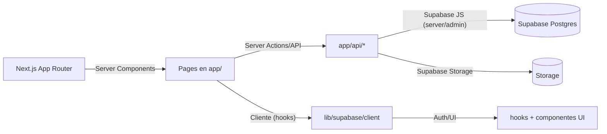

# REPORTE COMPLETO DEL SISTEMA: GlobalConnect

## 1) Resumen Ejecutivo

GlobalConnect es una aplicación web de gestión para una organización eclesiástica, construida con Next.js 15 (App Router) + React 19 + TypeScript y Supabase como backend (Auth, Postgres y Storage). El sistema gestiona usuarios, grupos, segmentos, temporadas, asistencia, fotos de perfil y un dashboard con métricas. La seguridad se basa en permisos por rol con lógica centralizada en RPCs y RLS en Supabase.

- Estado actual: Producción lista, con múltiples módulos completados.
- Enfoque: Server Components por defecto, UI consistente tipo “app nativa” móvil, caché y paginación del lado servidor, y documentación viva en `docs/`.
- Base de datos: Modelo real con tablas para `usuarios`, `grupos`, `grupo_miembros`, `segmento_lideres`, asignación granular de directores a grupos, relaciones familiares y direcciones.

---

## 2) Stack Tecnológico y Principios

- Framework: `Next.js 15 (App Router)` con Server Components por defecto
- UI: `React 19`, `TailwindCSS 4`, Radix UI, `lucide-react`, sistema de diseño propio (`/components/ui/sistema-diseno.tsx`)
- Gráficos: `recharts`
- Drag & drop: `swapy`
- Mapas: `@vis.gl/react-google-maps`
- Formularios: `react-hook-form` + `zod`
- Backend: Supabase (`@supabase/supabase-js`, SSR helpers, Postgres, Storage)
- Estilo: Glassmorphism/“VisionOS” (blur, transparencias, bordes grandes, gradientes suaves)
- Idioma: Español en código, UI y docs
- Calidad (ver `CONTRIBUTING.md`): Prettier/ESLint, simplicidad, DRY, separación de lógica (hooks y `lib/`), manejo explícito de estados loading/error

---

## 3) Estructura de Directorios (alto nivel)

- `app/` Páginas y rutas API (App Router).
- `components/` Componentes UI, dashboard, modales, mapas y layouts.
- `hooks/` Hooks de negocio y utilitarios (paginación, permisos, KPIs, toasts).
- `lib/` Lógica de servidor/cliente, acciones server, utilidades y clientes Supabase.
- `supabase/` Migraciones SQL, funciones RPC, policies y config del proyecto.
- `docs/` Documentación funcional y técnica (permisos, diseño, segmentos, etc.).
- `scripts/` Pruebas de humo y pruebas automatizadas (módulos clave y RPCs).
- `database/` Elementos de BD adicionales y storage.
- `styles/` Estilos globales.

Ejemplos:
- `app/dashboard/users/` lista, detalle, edición y creación de usuarios
- `app/dashboard/grupos/` lista, detalle, asistencia, importación y papelera
- `app/api/...` endpoints REST internos para acciones específicas
- `components/ui/` sistema de diseño reutilizable

---

## 4) Configuración del Proyecto

- `package.json` principales scripts:
  - build/dev/start/lint, pruebas de humo (`scripts/*`), generación de tipos de Supabase, y comandos de migración en staging.
- `next.config.mjs`:
  - `images.remotePatterns` para cargar imágenes desde Supabase Storage
  - `experimental.serverActions.allowedOrigins` para Server Actions en desarrollo
  - `allowedDevOrigins` para desarrollo con proxy
- `tailwind.config.ts`:
  - Tokens de color desde CSS variables, animaciones definidas (`fade-in`, `slide-in`), y soporte `tailwindcss-animate`.
- `.env.local` (no versionado): Debe contener al menos
  - `NEXT_PUBLIC_SUPABASE_URL`
  - `NEXT_PUBLIC_SUPABASE_ANON_KEY`
  - `SUPABASE_SERVICE_ROLE_KEY` (solo en server actions/api seguras)
  - Variables opcionales: `NEXT_PUBLIC_LOGO_URL`

---

## 5) Autenticación y Middleware

- Cliente SSR: `lib/supabase/server.ts` (Server Actions y páginas server)
- Cliente admin: `lib/supabase/admin.ts` y `lib/supabase/service-role.ts` (operaciones privilegiadas tras validar rol)
- Cliente cliente: `lib/supabase/client.ts`
- Middleware (`middleware.ts`):
  - Define rutas públicas (`/`, `/signup`, `/reset-password`, `/verify-email`, `/update-password`, `/welcome`, callbacks de auth)
  - Intercambia `code` de recuperación por sesión (`exchangeCodeForSession`)
  - Limpia cookies inválidas/expiradas de Supabase (`sb-*`, `supabase-auth-token`)
  - Redirige usuarios autenticados desde `/` a `/dashboard` y fuerza login para rutas privadas

- Server Actions de auth (`lib/actions/auth.actions.ts`):
  - `login()`: email+password
  - `signup()`: con fallback automático vía Admin API cuando el email de confirmación falla; crea o vincula perfil en `usuarios`
  - Flujo de reset/verify actualizado (páginas en `app/`)

---

## 6) Diseño de UI y Sistema de Componentes

Código central en `components/ui/sistema-diseno.tsx` y documentado en `docs/sistema-diseno.md`.

- Componentes base: `InputSistema`, `BotonSistema`, `TarjetaSistema`, `BadgeSistema`, `SeparadorSistema`, `SkeletonSistema`, `TituloSistema`, `TextoSistema`, `EnlaceSistema`, `FondoAutenticacion`, `ContenedorPrincipal`.
- Estilo: Colores de marca (`#363D45`, `#E96C20`), glassmorphism, radios 8px y 16px+, tipografía y espaciados consistentes.
- Layout Dashboard: `components/dashboard-layout.tsx` (sidebar, navegación móvil/desktop, orbes flotantes, glassmorphism).

Patrón móvil tipo app nativa (acordado en docs):
- Header fijo superior con logo GC, menú inferior de secciones, listas duales (móvil simple vs desktop enriquecido), skeletons, paginación con selector, búsqueda con debounce.

---

## 7) Páginas y Navegación (App Router)

- `app/layout.tsx`: metadatos, fuentes Geist, Analytics y Speed Insights.
- Autenticación:
  - `app/page.tsx`: login
  - `app/signup/page.tsx`, `app/reset-password/page.tsx`, `app/verify-email/page.tsx`, `app/update-password/page.tsx`, `app/welcome/page.tsx`
- Dashboard:
  - `app/dashboard/page.tsx`: tablero principal con widgets (gráficos, métricas, quick actions). Ver `components/dashboard/*`.
- Usuarios (`app/dashboard/users/`):
  - `page.tsx`: listado con paginación server, búsqueda debounce, filtros, y UI adaptada por rol
  - `create/page.tsx`, `[id]/page.tsx`, `[id]/edit/page.tsx`
  - Hook principal: `hooks/use-usuarios-con-permisos.ts`
- Grupos (`app/dashboard/grupos/`):
  - `page.tsx`: listado + KPIs y filtros; soporte papelera (soft delete)
  - `[id]/page.tsx`: detalle con miembros, liderazgo, permisos; `edit/page.tsx`
  - Asistencia: `[id]/asistencia/page.tsx`, historial y edición por evento (`eventos_grupo` + `asistencia`)
  - Importación: `importar/page.tsx`
- Segmentos (`app/dashboard/segments/`):
  - Listado, detalle `[segmentoId]`, directores por segmento y asignación de ubicaciones (ciudad única) y grupos asignables
- Temporadas (`app/dashboard/temporadas/`):
  - Listado, crear y editar
- Perfil de usuario actual: `app/dashboard/perfil/page.tsx`

---

## 8) Endpoints API (rutas en `app/api/`)

- Auditoría miembros de grupo: `app/api/auditoria/miembros/route.ts`
- Debug: roles y toolbar: `app/api/debug/roles/route.ts`, `app/api/debug/toolbar/route.ts`
- Grupos:
  - CRUD y papelera: `app/api/grupos/[id]/route.ts`, `app/api/grupos/[id]/restore/route.ts`
  - Miembros: `app/api/grupos/[id]/miembros/route.ts`, `app/api/grupos/[id]/miembros/[usuarioId]/route.ts`
  - Directores de etapa for grupo: `app/api/grupos/[id]/directores/route.ts`
  - Asistencia: `app/api/grupos/[id]/asistencia/route.ts`
  - KPIs: `app/api/grupos/kpis/route.ts`
  - Sugerir nombre: `app/api/grupos/sugerir-nombre/route.ts`
  - Importación CSV/JSON: `app/api/import/grupos/route.ts`
- Segmentos:
  - Gestión de directores de etapa: 
    - `app/api/segmentos/[segmentoId]/directores-etapa/route.ts`
    - `app/api/segmentos/[segmentoId]/directores-etapa/crear/route.ts`
    - `app/api/segmentos/[segmentoId]/directores-etapa/[directorId]/grupos-asignables/route.ts`
    - `app/api/segmentos/[segmentoId]/directores-etapa/grupos-asignables/route.ts`
    - `app/api/segmentos/[segmentoId]/directores-etapa/ubicaciones/route.ts`
  - Ubicaciones de segmento: `app/api/segmentos/[segmentoId]/ubicaciones/route.ts`
  - Segmentos base: `app/api/segmentos/route.ts`
- Usuarios:
  - Búsqueda para líderes y relaciones: 
    - `app/api/usuarios/buscar-para-lider/route.ts`
    - `app/api/usuarios/buscar-para-relacion/route.ts`
  - Cambio de rol (lote): `app/api/usuarios/cambiar-rol/route.ts`
- Auth callback: `app/auth/callback/route.ts`

Cada endpoint utiliza clientes Supabase apropiados (server/admin), valida permisos (ej. `getUserWithRoles()`), y usa RPCs/queries tipadas.

---

## 9) Hooks de Frontend (parcial)

- `hooks/use-usuarios-con-permisos.ts` (principal en Usuarios):
  - Estados: `usuarios`, `estadisticas`, `cargando`, `cargandoEstadisticas`, `error`, `paginaActual`, `totalUsuarios`…
  - Filtros: `busqueda`, `roles`, `con_email`, `con_telefono`, `en_grupo`, `limite`
  - Paginación: 20 por página; `hayMasPaginas` derivado
  - Debounce: 400ms en búsqueda
  - Caché de estadísticas: 5 minutos por clave de filtros
- Otros hooks:
  - `use-usuarios.ts`, `use-usuario-detalle.ts` (detalle y listas base)
  - `use-kpis-grupos.ts` (métricas de grupos)
  - `use-toast.ts`, `use-mobile.ts`, `usar-formulario-autenticacion.ts`, `usar-sidebar.ts`

---

## 10) Librería (`lib/`)

- Acciones (Server Actions en `/lib/actions/*`):
  - `auth.actions.ts`: login/signup con fallback y creación/vinculación de perfil
  - `user.actions.ts`, `group.actions.ts`, `groupMember.actions.ts`, `season.actions.ts`, `photo.actions.ts`, `location.actions.ts`, `form.data.actions.ts`
- Supabase: `lib/supabase/client.ts`, `server.ts`, `admin.ts`, `service-role.ts`, tipos `lib/supabase/database.types.ts`
- Dashboard: `lib/dashboard/*` con funciones para contadores y KPIs
- Roles/Permisos: `getUserWithRoles.ts`, `obtenerRolesUsuarioActual.ts`
- Utilidades: `normalizarNombre.ts`, `datos-estaticos.ts`, `utils.ts`
- Configs: `lib/config/relaciones-familiares.ts`

---

## 11) Base de Datos (tipos generados)

Archivo: `lib/supabase/database.types.ts` (generado por `supabase gen types`), con relaciones y enums. Tablas principales usadas por el sistema:

- `usuarios`: datos personales, enlace con Auth por `auth_id`, `foto_perfil_url`, `familia_id`, `direccion_id`.
- `roles_sistema` y `usuario_roles`: sistema de roles (e.g. `admin`, `pastor`, `director-general`, `director_etapa`, `miembro` y roles de grupo `Líder`/`Colíder`).
- `grupos`: `segmento_id`, `temporada_id`, datos de reunión, `activo` y notas.
- `grupo_miembros`: relación usuarios↔grupos con `rol` (enum_rol_grupo), fechas.
- `segmento_lideres`: liga usuarios a segmentos con `tipo_lider` (incluye `director_etapa`).
- `director_etapa_grupos`: asignación explícita de director↔grupo (granularidad real de permisos).
- `eventos_grupo` + `asistencia`: registro de eventos y asistencia por usuario.
- `familias` + `relaciones_usuarios`: núcleo de relaciones familiares.
- Geografía: `paises`, `estados`, `municipios`, `parroquias`, `direcciones`.
- Catálogos: `ocupaciones`, `profesiones`.
- Uno a uno: `uno_a_uno_reuniones`, `uno_a_uno_participantes`.
- Auditoría: `audit_grupo_miembros`.
- `debug_toolbar_whitelist`: whitelist para herramientas de debug.

Enums relevantes:
- `enum_rol_grupo` (incluye `Líder`, `Colíder`)
- `enum_tipo_lider` (incluye `director_etapa`)
- `enum_dia_semana`, `enum_genero`, `enum_estado_civil`, `enum_tipo_relacion`

---

## 12) RPCs y Migraciones (resumen)

Ubicación: `supabase/migrations/*.sql`. RPCs y funciones clave con historia de fixes/refactors:

- Usuarios con permisos:
  - `listar_usuarios_con_permisos` (20250910210000) y `obtener_estadisticas_usuarios_con_permisos` (20250910211000)
- Grupos (visibilidad/operaciones):
  - `obtener_grupos_para_usuario` (serie de updates y fixes 20250905–20251008, incluye soporte `eliminado`/papelera, campo `supervisado_por_mi`, conteo de miembros y KPIs auxiliares)
  - Permisos: `define_puede_ver_grupo`, `define_puede_crear_grupo`, `define_puede_editar_grupo`
  - Asignación granular: `asignar_director_etapa_a_grupo`
  - KPIs: `obtener_kpis_grupos_para_usuario`
- Asistencia y eventos:
  - `registrar_asistencia`, `obtener_asistencia_lectura`, `listar_eventos_grupo` (+ varias correcciones de tipos/permisos)
- Segmentos/Directores:
  - `_puede_ver_segmento_lider` (policy consolidada)
  - `obtener_segmentos_para_director`
  - Ubi segmentales (ciudad única por director): `segmento_ubicaciones` + `asignar_director_etapa_a_ubicacion` (upsert)
- Storage:
  - `update_storage_policies_for_leaders` (permite a líderes operar con fotos de su grupo/propias, manteniendo RLS/seguridad)
- Otros:
  - Auditoría: `rpc_obtener_auditoria_miembros` y tabla `audit_grupo_miembros`
  - Debug: `debug_toolbar_whitelist`, `debug_cambiar_rol_usuario`

Policies/RLS: múltiples endurecimientos/relajaciones controladas para lectura/escritura en eventos y asistencia, y policies específicas en storage.

---

## 13) Flujos Funcionales Clave

- Permisos por rol (documentado en `docs/sistema-permisos-usuarios-final.md`):
  - `admin/pastor/director-general`: ven todos los usuarios/grupos
  - `director_etapa`: solo grupos explícitamente asignados (flag `supervisado_por_mi`), lectura/edición dentro de su alcance
  - `líder`: sus propios grupos; en contexto de relaciones familiares puede ver un universo extendido solo para esa acción
  - `miembro`: su familia

- Usuarios:
  - Listado paginado (20 por página), búsqueda con `debounce` 400ms, filtros (roles, email, teléfono, en_grupo), y estadísticas con caché 5 min
  - Cambio de roles en lote vía `POST /api/usuarios/cambiar-rol`

- Grupos:
  - Listado/Detalle: miembros, líderes, directores asignados, notas y KPIs
  - Papelera: `DELETE /api/grupos/:id` → `eliminado=true`; `POST /api/grupos/:id/restore`
  - Asistencia: crear eventos, registrar asistencia por usuario, historial y edición
  - Importar grupos: endpoint de importación
  - Sugerencia de nombre de grupo: endpoint dedicado

- Segmentos y directores de etapa:
  - Asignación granular de grupos al director (alta/baja)
  - Asignación de ciudad única por director dentro del segmento (upsert)

- Fotos de perfil (ver `docs/PROFILE_PHOTOS_SETUP.md`):
  - Subida drag&drop o selfie con cámara, redimensionado 800x800, compresión JPEG 80%
  - Eliminación segura de foto anterior, validación de tipo/tamaño, URLs firmadas si aplica
  - Integrada en formularios de edición de usuario

- Autenticación/Registro:
  - Signup con fallback automático admin si falla el envío de email; creación/vinculación de perfil en `usuarios`; mensajes claros de éxito/estado
  - Middleware robustece limpieza de cookies y gestión de redirect seguro

---

## 14) Seguridad y Buenas Prácticas

- Nunca exponer credenciales en código: usar variables de entorno (`.env.local`)
- RLS y policies en tablas sensibles (usuarios, grupos, asistencia, storage)
- Clientes Supabase:
  - `service-role` solo en server (rutas API/Server Actions) y tras validar rol del solicitante
  - `server`/`SSR` para páginas y acciones del lado servidor
  - `client` únicamente para interacciones cliente controladas
- Middleware limpia cookies de tokens expirados y evita estados de sesión corruptos
- Formularios validados con `zod`, estados de carga y error siempre visibles en UI

---

## 15) Rendimiento

- Server Components por defecto (Next.js 15)
- Paginación en servidor (20 elementos) en módulos de alto volumen (usuarios y grupos)
- Búsqueda con debounce 400ms
- Caché de estadísticas (5 minutos) para reducir lecturas
- RPCs optimizadas con índices y correcciones de tipos (COUNT -> int, COALESCE)

---

## 16) Pruebas y Scripts

- `scripts/` (ejemplos):
  - `smoke-en-grupo.mjs`, `smoke-stats.mjs`, `smoke-relaciones-buscar.mjs`
  - `test-grupos-permisos.mjs` (suite permisos granular director↔grupos)
  - `test-ciudades.mjs` (unicidad ciudad por director y efectos en grupos)
  - `test-rpc-asistencia.ts` (validación de RPCs de asistencia)
- Cómo correr:
  - `pnpm test:grupos-permisos`, `pnpm test:ciudades`, `pnpm test:smoke:*`

---

## 17) Despliegue

- Compatible con Vercel (edge opcional, no requerido). Assets remotos desde Supabase Storage.
- Mantener `experimental.serverActions.allowedOrigins` y `allowedDevOrigins` coherentes con entorno.
- Generar tipos con `pnpm gen:types` cuando cambie el modelo.
- Aplicar migraciones seguras: `supabase db push` (o pipeline de staging previsto en scripts).

---

## 18) Guía Rápida de Desarrollo Local

1. Clonar repo y crear `.env.local` con:
   - `NEXT_PUBLIC_SUPABASE_URL`
   - `NEXT_PUBLIC_SUPABASE_ANON_KEY`
   - `SUPABASE_SERVICE_ROLE_KEY`
2. Instalar deps: `pnpm i`
3. Arrancar: `pnpm dev`
4. Generar tipos (opcional): `pnpm gen:types`
5. Ejecutar pruebas de humo: `pnpm test:smoke:members`

---

## 19) Arquitectura (Diagrama Simplificado)

---

## 20) Decisiones Clave y Documentos Relacionados

- Permisos usuarios por roles (implementación final): `docs/sistema-permisos-usuarios-final.md`
- Sistema de diseño: `docs/sistema-diseno.md`
- Fotos de perfil: `docs/PROFILE_PHOTOS_SETUP.md`
- Segmentos y director de etapa (ciudad única, granularidad): `docs/segments/README.md`
- Cambios de UI dashboard y grupos: `docs/dashboard/*`, `docs/papelera-grupos.md`

---

## 21) Backlog Recomendado (alto nivel)

- Auditoría extendida (acciones de asignación director↔grupo, cambios de rol)
- KPIs con asistencia (tie-in con `eventos_grupo` + `asistencia`)
- Endpoint de purga definitiva de papelera (hard delete) con `deleted_at`
- Ranking de búsqueda por similitud (prefijo > substring) y paginación en búsquedas > 50
- Tema oscuro y más componentes de navegación en sistema de diseño
- Test de regresión de permisos para segmentos, papelera y storage

---

## 22) Glosario Rápido de Archivos Relevantes

- Layouts y base
  - `app/layout.tsx`, `app/globals.css`, `components/dashboard-layout.tsx`
- Autenticación y middleware
  - `middleware.ts`, `app/page.tsx`, `lib/actions/auth.actions.ts`
- Usuarios
  - `app/dashboard/users/page.tsx`, `[id]/page.tsx`, `[id]/edit/page.tsx`, `create/page.tsx`
  - Hook: `hooks/use-usuarios-con-permisos.ts`
- Grupos
  - `app/dashboard/grupos/page.tsx`, `[id]/page.tsx`, `edit/page.tsx`
  - Asistencia: `[id]/asistencia/*`
- Segmentos y temporadas
  - `app/dashboard/segments/*`, `app/dashboard/temporadas/*`
- API
  - `app/api/*` (ver sección 8)
- Supabase
  - `lib/supabase/*`, `supabase/migrations/*`, `lib/supabase/database.types.ts`
- Documentación
  - `docs/*` (permiso, diseño, segmentos, dashboard, papelera)

---

## 23) Notas de Seguridad Operativa

- Validar roles siempre del lado servidor antes de usar `service-role`
- Evitar logs con datos sensibles; limpiar cookies de supabase cuando haya errores de refresh
- RLS activa: verificar policies antes de exponer nuevas tablas/funciones

---

## 24) Conclusión

El proyecto GlobalConnect está listo para continuar su expansión con bases sólidas: permisos por rol robustos y tipados, arquitectura Next.js moderna (App Router + Server Components), documentación clara, y un modelo de datos alineado a necesidades reales (grupos, directores, relaciones familiares y asistencia). Este reporte sirve como mapa para cualquier colaborador o modelo AI que desee continuar el desarrollo desde este punto.
