# Módulo Grupos de Vida — Documentación Técnica

> Versión: 2.0.0 | Última actualización: 2026-03-14

## Descripción

El módulo Grupos de Vida es el sistema central de gestión de grupos pequeños de la organización. Abarca desde la creación y aprobación de grupos hasta el registro de asistencia avanzada, seguimiento pastoral, casas anfitrionas, solicitudes de miembros, y dashboards de riesgo. Se encuentra bajo `app/(auth)/grupos-vida/`.

## Arquitectura

```mermaid
graph TD
    subgraph Frontend
        GV["/grupos-vida (lista)"]
        GD["/grupos-vida/[id] (detalle)"]
        GE["/grupos-vida/[id]/edit"]
        GA["/grupos-vida/[id]/asistencia"]
        GS["/grupos-vida/[id]/salud"]
        CA["/grupos-vida/casas-anfitrionas"]
        MP["/grupos-vida/mapa"]
        SG["/grupos-vida/segmentos"]
        SL["/grupos-vida/solicitudes"]
        CF["/grupos-vida/configuracion"]
        DR["/grupos-vida/dashboard-riesgo"]
        MR["/grupos-vida/miembros-riesgo"]
        NL["/notas-lideres"]
    end

    subgraph "Server Actions"
        SA1["group.actions.ts"]
        SA2["solicitudes-grupo.actions.ts"]
        SA3["casas-anfitrionas.actions.ts"]
        SA4["asistencia-avanzada.actions.ts"]
        SA5["configuracion-grupos-vida.actions.ts"]
        SA6["branding.actions.ts"]
    end

    subgraph "Supabase RPCs"
        R1["obtener_grupos_para_usuario"]
        R2["obtener_detalle_grupo"]
        R3["registrar_asistencia"]
        R4["crear_solicitud_grupo"]
        R5["procesar_solicitud_grupo"]
        R6["obtener_dashboard_riesgo"]
        R7["ranking_asistencia_miembros"]
        R8["obtener_miembros_en_riesgo"]
        R9["rpc_casas_visibles_por_rol"]
    end

    GV --> SA1 --> R1
    GD --> SA1 --> R2
    GA --> SA4 --> R3
    SL --> SA2 --> R4
    SL --> SA2 --> R5
    DR --> SA4 --> R6
    MR --> SA4 --> R8
    CA --> SA3
    CF --> SA5
```

## Tablas de Base de Datos

| Tabla | Propósito | RLS |
|-------|-----------|-----|
| `grupos` | Grupos de vida con nombre, segmento, temporada, campus, estado | ✅ |
| `grupo_miembros` | Relación N:N entre usuarios y grupos con rol | ✅ |
| `casas_anfitrionas` | Lugares de reunión con anfitrión, co-anfitrión, capacidad, disponibilidad | ✅ |
| `eventos_grupo` | Eventos de asistencia con notas pastorales y visitantes | ✅ |
| `asistencia` | Registros individuales: tipo_presencia, motivo, tardanza | ✅ |
| `solicitudes_grupo` | Flujo de aprobaciones: ingreso, egreso, traslado, activación | ✅ |
| `historial_movimientos_grupo` | Auditoría de cambios de miembros en grupos | ✅ |
| `segmentos` | Categorías de grupos (Matrimonios, Jóvenes, etc.) | ✅ |
| `temporadas` | Períodos de actividad con estado (planificacion, activa, finalizada) | ✅ |
| `configuracion_grupos_vida` | Config por campus: ventana edición, umbrales, visitantes | ✅ |
| `director_etapa_grupos` | Asignación de directores a grupos (ON DELETE CASCADE) | ✅ |
| `director_general_segmentos` | Scope del DG por segmentos | ✅ |
| `configuracion_plataforma` | Config global: nombre org, logos, colores | ✅ |
| `direcciones` | Direcciones con lat/lng y parroquia_id | ✅ |

### Vistas

| Vista | Propósito |
|-------|-----------|
| `v_salud_miembros_grupo` | Salud de miembros con niveles dinámicos basados en `configuracion_grupos_vida` |
| `v_solicitudes_pendientes` | Solicitudes con datos enriquecidos de miembro, grupo y temporada |

## Server Actions

| Action | Archivo | Permisos | Descripción |
|--------|---------|----------|-------------|
| `createGroup` | `lib/actions/group.actions.ts` | admin, pastor, director_general, director_etapa | Crea grupo con dirección, campus, localidad |
| `updateGroup` | `lib/actions/group.actions.ts` | admin, pastor, director_general, director_etapa | Actualiza grupo; si tiene casa, no crea dirección separada |
| `crearSolicitudGrupo` | `lib/actions/solicitudes-grupo.actions.ts` | Autenticado | Crea solicitud (ingreso, egreso, traslado, activación) |
| `procesarSolicitudGrupo` | `lib/actions/solicitudes-grupo.actions.ts` | director_general+, admin, pastor | Aprueba o rechaza solicitudes; rechazar activación = hard-delete grupo |
| `cancelarSolicitudActivacion` | `lib/actions/solicitudes-grupo.actions.ts` | director_etapa+ | Cancela solicitud + hard-delete del grupo |
| `listarSolicitudesCompletadas` | `lib/actions/solicitudes-grupo.actions.ts` | admin, director_general+ | Lista solicitudes procesadas con tab y filtros |
| `registrarAsistenciaAvanzada` | `lib/actions/asistencia-avanzada.actions.ts` | líder+, auth | Registra asistencia v2 con tipo_presencia y notas |
| `obtenerDashboardRiesgo` | `lib/actions/asistencia-avanzada.actions.ts` | director_etapa+ | Dashboard con distribución, miembros críticos, segmentos, sin reunión |
| `obtenerMiembrosEnRiesgo` | `lib/actions/asistencia-avanzada.actions.ts` | director_etapa+ | Listado filtrable de miembros en riesgo por nivel |
| `obtenerConfiguracionGrupos` | `lib/actions/configuracion-grupos-vida.actions.ts` | admin | Lee configuración con `.maybeSingle()` |
| `guardarConfiguracionGrupos` | `lib/actions/configuracion-grupos-vida.actions.ts` | admin | Upsert de configuración |
| `crearCasaAnfitriona` | `lib/actions/casas-anfitrionas.actions.ts` | auth | Crea casa + dirección con geocodificación |
| `actualizarCasaAnfitriona` | `lib/actions/casas-anfitrionas.actions.ts` | auth | Actualiza casa existente |

## Componentes Principales

| Componente | Tipo | Archivo | Descripción |
|-----------|------|---------|-------------|
| `GruposList` | Client | `components/grupos/GruposList.client.tsx` | Lista con tabs, filtros, KPIs, búsqueda, paginación 100 |
| `GrupoDetailServer` | Server | `app/(auth)/grupos-vida/[id]/GrupoDetailServer.tsx` | Fetcha datos del grupo, roles, configuración |
| `GrupoDetailClient` | Client | `app/(auth)/grupos-vida/[id]/GrupoDetailClient.tsx` | Detalle con permisos, agregar/eliminar miembros |
| `GroupEditForm` | Client | `components/forms/GroupEditForm.tsx` | Formulario edición con Zod + cascading ubicación |
| `GroupCreateForm` | Client | `components/forms/GroupCreateForm.tsx` | Formulario creación con campus, segmento, líder |
| `RegistroAsistenciaAvanzado` | Client | `components/grupos/RegistroAsistenciaAvanzado.client.tsx` | Registro v2: tipo_presencia, notas, visitantes |
| `AttendanceList` | Client | `components/grupos/AttendanceList.client.tsx` | Lista de asistencia con agrupación por cónyuges |
| `DashboardRiesgo` | Client | `components/reportes/DashboardRiesgo.client.tsx` | Donut, area trend, tabla críticos, barras segmento |
| `ConfiguracionPanel` | Client | `components/grupos-vida/configuracion-panel.tsx` | Panel de configuración: umbrales, ventana, permisos |
| `SolicitudesPendientesClient` | Client | `app/(auth)/grupos-vida/solicitudes/SolicitudesPendientesClient.tsx` | Tabs Pendientes/Completadas + filtros + tabla |
| `FormularioSegmento` | Client | `components/grupos/FormularioSegmento.client.tsx` | Formulario creación/edición de segmentos |
| `FormCasaAnfitriona` | Client | `components/grupos-vida/form-casa-anfitriona.tsx` | Formulario casa con anfitrión, co-anfitrión, disponibilidad |
| `MiembrosRiesgo` | Client | `app/(auth)/grupos-vida/miembros-riesgo/MiembrosRiesgo.client.tsx` | Listado filtrable por nivel de riesgo |

## Hooks

| Hook | Archivo | Descripción |
|------|---------|-------------|
| `useNotificaciones` | `hooks/use-notificaciones.ts` | Toast notifications (success, error) |
| `useBranding` | `hooks/useBranding.tsx` | Logos y colores personalizados de la organización |
| `useCampus` | `hooks/useCampus.tsx` | Campus seleccionado con persistencia localStorage |

## Helpers

| Helper | Archivo | Descripción |
|--------|---------|-------------|
| `upsertDireccion` | `lib/helpers/direccion.helper.ts` | Upsert de dirección reutilizable; solo persiste `parroquia_id` (no `estado_id`/`municipio_id`/`pais_id`) |
| `extraerRelacion<T>` | `lib/helpers/supabase-relation.helper.ts` | Type-safe casting de relaciones Supabase |

## API Routes

| Endpoint | Método | Archivo | Descripción |
|----------|--------|---------|-------------|
| `/api/grupos/[id]/miembros` | POST | `app/api/grupos/[id]/miembros/route.ts` | Agregar miembro vía `crear_solicitud_grupo` |
| `/api/grupos/[id]/miembros/[usuarioId]` | PATCH/DELETE | `app/api/grupos/[id]/miembros/[usuarioId]/route.ts` | Cambiar rol / eliminar vía solicitud |
| `/api/grupos/kpis` | GET | `app/api/grupos/kpis/route.ts` | KPIs filtrados por campus |
| `/api/grupos/bulk-update-status` | POST | `app/api/grupos/bulk-update-status/route.ts` | Activar/desactivar grupos en lote |
| `/api/segmentos/[id]/directores-etapa` | GET/POST/DELETE | `app/api/segmentos/[id]/directores-etapa/route.ts` | Gestión de directores de segmento |
| `/api/lideres/buscar` | GET | `app/api/lideres/buscar/route.ts` | Búsqueda de líderes con fotos |

## Flujo de Datos: Crear un Grupo

1. Usuario completa `GroupCreateForm` con datos + líder + casa anfitriona
2. `onSubmit` → `createGroup()` Server Action
3. Action valida con Zod → llama `upsertDireccion()` si no hay casa → llama RPC `crear_grupo`
4. RPC inserta en `grupos` + `grupo_miembros` (líder) + actualiza `direccion_id`
5. Action crea solicitud de activación vía `crear_solicitud_grupo` con tipo `activacion_grupo`
6. Grupo queda en `estado_aprobacion = 'pendiente'`
7. Director/Admin aprueba desde **Solicitudes** → RPC `procesar_solicitud_grupo` → setea `estado_aprobacion = 'aprobado'` + `activo = true`

## Flujo de Datos: Registrar Asistencia

1. Líder abre `/grupos-vida/[id]/asistencia`
2. Server Component carga miembros y configuración (ventana edición, visitantes)
3. Líder marca tipo_presencia por miembro, agrega notas
4. `onSubmit` → `registrarAsistenciaAvanzada()` Server Action
5. Action valida con Zod → función `to24h()` convierte hora a `HH:MM:SS`
6. Action llama RPC `registrar_asistencia` con formato v2 (`tipo_presencia: text`)
7. RPC hace `ON CONFLICT DO UPDATE` para evitar duplicados

## Flujo de Datos: Solicitudes

1. Acción que requiere solicitud (agregar miembro, eliminar, cambiar rol)
2. API route llama `crear_solicitud_grupo` con tipo apropiado
3. Solicitud queda en estado `pendiente` con `metadata` jsonb
4. Director/Admin ve la solicitud en **Solicitudes > Pendientes**
5. Al aprobar/rechazar, RPC `procesar_solicitud_grupo`:
   - **Aprobar ingreso**: INSERT en `grupo_miembros` + historial
   - **Aprobar egreso**: DELETE de `grupo_miembros` (hard-delete) + historial
   - **Rechazar activación**: DELETE solicitud + DELETE grupo (hard-delete)

## Decisiones de Diseño

| Decisión | Razón | Alternativa descartada |
|----------|-------|----------------------|
| `.maybeSingle()` en config | Soporta 0 o 1 filas sin error | `.single()` fallaba con 0 filas |
| Hard-delete en egreso/rechazo | Datos limpios; historial se mantiene en `historial_movimientos_grupo` | Soft-delete con `fecha_salida` generaba registros zombis |
| `to24h()` devuelve `HH:MM:SS` | PostgreSQL `time` type requiere formato completo | `HH:MM` causaba error de tipo |
| `adminDb` para queries de casas | RLS en `usuarios` bloqueaba joins para roles como `lider` | Supabase RLS no permite bypass parcial por join |
| `parroquia_id` única FK en `direcciones` | `estado_id`/`municipio_id`/`pais_id` son para cascading UI, no persisten | Columnas inexistentes causaban error |
| Paginación fija 100 items | Selector de page-size confundía al usuario | Selector con [10, 20, 50, 100] era innecesario |
| `puedeAprobar` separado de `puedeGestionar` | Líderes pueden gestionar (ver) casas pero no aprobar | Un solo flag daba permisos excesivos a líderes |
| `config_efectiva` CTE para riesgo | `NULL = NULL` en SQL es `false`; config global con `campus_id IS NULL` nunca se unía | `LEFT JOIN` directo producía umbrales NULL |

## Migraciones (Fase 3d)

| Archivo | Descripción |
|---------|-------------|
| `20260313_010_fix_enum_rol_grupo_cast.sql` | Fix cast de enum `rol_grupo` |
| `20260313_011_co_anfitrion_casas.sql` | Columna `co_anfitrion_id` en `casas_anfitrionas` |
| `20260313_013_hard_delete_rechazar.sql` | RPC: rechazar → DELETE solicitud+grupo |
| `20260313_014_fix_director_grupos_cascade.sql` | FK `ON DELETE CASCADE` en `director_etapa_grupos` |
| `20260314_001_config_rol_eliminar_miembro.sql` | Columna `rol_minimo_eliminar_miembro` |
| `20260314_002_rpc_roles_sistema_usuario.sql` | RPC `obtener_roles_sistema_usuario` (SECURITY DEFINER) |
| `20260314_003_fix_tipo_check_egreso.sql` | CHECK constraint expandido para `egreso` y `traslado` |
| `20260314_004_fix_detalle_grupo_fecha_salida.sql` | RPC filtra `fecha_salida IS NULL` |
| `20260314_005_egreso_hard_delete.sql` | Egreso cambia de soft-delete a hard-delete |
| `20260314_006_rpc_ranking_asistencia_miembros.sql` | RPC ranking con ordenamiento flexible |
| `20260314_007_rpc_eventos_con_notas.sql` | RPC eventos con notas filtradas por rol |
| `20260314_008_fix_riesgo_umbral_75.sql` | Umbral de riesgo < 70% (antes < 100%) |
| `20260314_009_rpc_dashboard_riesgo_v2.sql` | Dashboard con 4 CTEs: distribución, críticos, segmentos, sin reunión |
| `20260314_010_fix_vista_salud_config_null.sql` | CTE `config_efectiva` para config global NULL |
| `20260314_011_rpc_miembros_en_riesgo.sql` | RPC miembros en riesgo con filtro por rol |
| `20260314_012_dashboard_riesgo_filtro_rol.sql` | Filtro por rol en RPCs de dashboard |
| `20260314_013_configuracion_plataforma.sql` | Tabla `configuracion_plataforma` |
| `20260314_015_org_contacto_campos.sql` | Columnas de contacto en organización |
| `20260315_010_registrar_asistencia_v2.sql` | Fix menor en RPC de asistencia |
| `20260317_002_rpc_casas_visibles_por_rol.sql` | RPC filtro de casas por rol |
