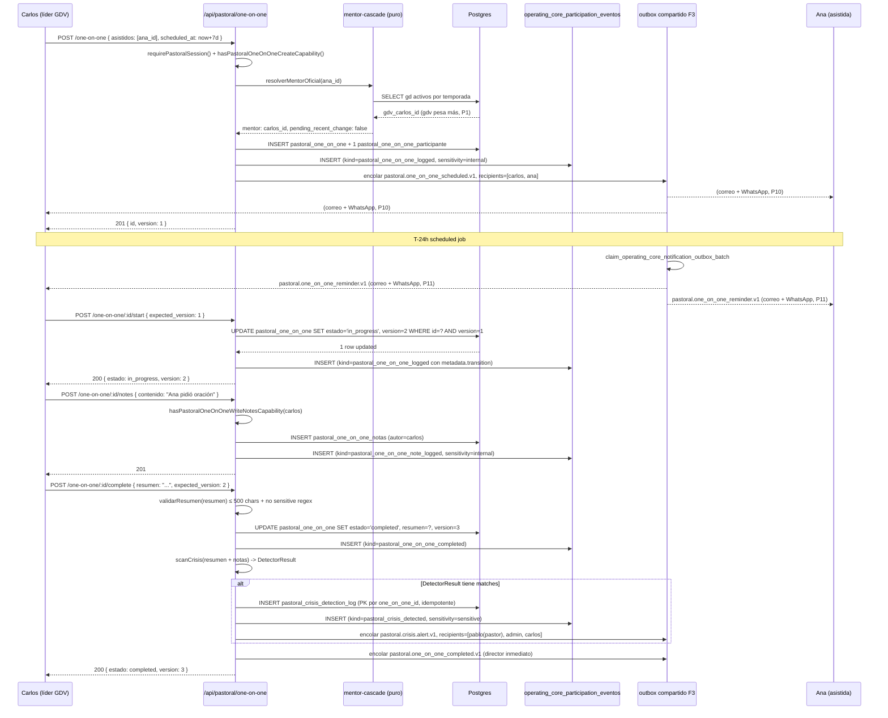
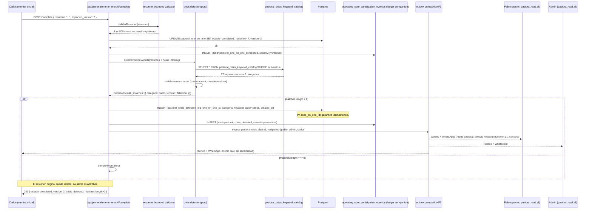
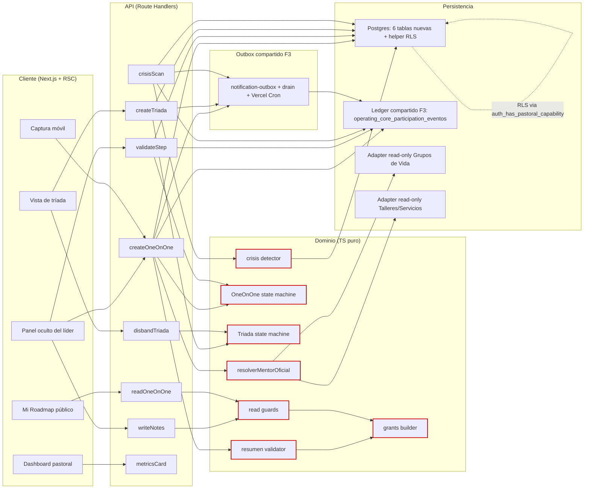

# Design: Fase 4 — Seguimiento Pastoral (1:1 + Tríada)

> Aditivo sobre Fase 3; ledger compartido, outbox compartido, capacidades pastorales nuevas; módulos de Fase 1/2/3 byte-identical; `uno_a_uno` archivado sigue bloqueado.

Decision needed before apply: No
Chained PRs recommended: Yes
Chain strategy: stacked-to-main
400-line budget risk: High
Skill resolution: paths-injected (sdd-design SKILL loaded)

## 1. Contexto técnico

Fase 4 aterriza la **estación 4 de la ruta espiritual** (`docs/REUNION_PASTOR_ROADMAP.html:1488-1495`) sobre el cimiento ya construido de F1-F3. El sistema debe permitir a un líder pastoral programar un 1:1 con una persona acompañada, escribir notas privadas durante el acompañamiento, validar pasos espirituales como mentor oficial, y visibilizar la conversación pastoral con un coordinador de área o líder de un nuevo paso a través de una tríada. El principio rector es **"el sistema sugiere, el mentor valida"** (`REUNION_PASTOR_ROADMAP.html:1907`); ningún artefacto de F4 puede promover a una persona en su camino espiritual sin un líder con rol formal.

F4 NO reemplaza nada; **extiende** aditivamente sobre:

- **Ledger longitudinal unificado** `operating_core_participation_eventos` (Fase 3, slice S03) reusando el mismo módulo hermano `lib/platform/operating-core/participation-ledger-repository*.ts`. Los eventos pastorales se nombran con prefijo `pastoral_` y sensibilidad `internal` por defecto. La única excepción es `pastoral_crisis_detected`, con sensibilidad `sensitive` por la naturaleza del evento (P16).
- **Outbox compartido** `lib/platform/operating-core/notification-outbox/` con plantillas versionadas `pastoral.*.v1`. Canales del MVP: correo electrónico y WhatsApp (P11). Push queda fuera del MVP.
- **Helper de capacidades** Postgres `auth_has_pastoral_capability(p_capability_key text)` que sigue la forma de `auth_has_dream_team_capability` y `auth_has_operating_core_capability`.
- **Adaptador read-only** `lib/platform/adapters/grupos-vida.ts` (Fase 1+2 byte-identical) para resolver quién está en qué GDV.

F4 añade TODO en `lib/platform/pastoral/**` (sibling) y en `app/api/pastoral/**`. Modifica solo `lib/platform/experiences.ts` (extensión aditiva) y `lib/supabase/database.types.ts` (regeneración post-migration). **Sin tocar ninguno de los 16 archivos protegidos** (ver §5).

### 1.1 Decisiones pastorales cerradas que el diseño respeta literalmente

| ID | Decisión | Traducción técnica |
|---|---|---|
| P1 | Una persona solo en un GDV activo por temporada activa. | La cascada opera contra una única membresía activa; no requiere desempate por doble GDV en MVP (D23). |
| P2 | Asignación del mentor automática, sin confirmación del líder. | `resolverMentorOficial` se evalúa on-demand; no existe paso de confirmación en el flujo. |
| P3 | Persona no puede rechazar al mentor. | No existe endpoint ni capability que permita al asistido solicitar mentor alternativo. |
| P4 | Tríada por nuevo paso se crea automáticamente. | El evento pastoral de paso tomado dispara `pastoral_triada_formed` con tipo `nuevo_paso`. |
| P5 | `pastoral.read.all` no habilita validar pasos. | El helper de capacidades rechaza `validate_step` cuando el actor no es el mentor oficial autor. |
| P6 | Persona solo ve roadmap agregado. | `canReadPastoralOneOnOneRoadmap` filtra campos privados antes de la consulta (no en la vista). |
| P7 | Coordinador de área en simultaneidad no ve notas del líder de GDV. | `canReadPastoralTriadaNote` aplica una excepción explícita para el caso `simultaneidad` + `rol=coordinador_area`. |
| P8 | Pareja: un único `one_on_one` con dos participantes y un único resumen. | Una fila `pastoral_one_on_one` + dos filas en `pastoral_one_on_one_participantes`. |
| P9 | Pareja comparte hitos solo de matrimonio. | El roadmap público filtra hitos por categoría; solo `categoria='matrimonio'` se proyecta cruzada en ambos roadmaps. |
| P10 | Notificación al programar llega a ambos. | Plantilla `pastoral.one_on_one_scheduled.v1` dirigida a mentor oficial + asistidos. |
| P11 | Recordatorio a ambos. Canales MVP: correo y WhatsApp. | Plantilla `pastoral.one_on_one_reminder.v1` vía outbox compartido. Push documentado como deuda. |
| P14 | Sin GDV/taller/servicio → no tiene mentor; solo servir → coordinador; solo taller → líder taller. | `resolverMentorOficial` retorna una unión discriminada con `kind: 'gdv' | 'taller' | 'servicio' | 'none'`. |
| P15 | Multi-tenant fuera del MVP. | Ninguna migración introduce `church_id`/`campus_id`/`tenant_id` (D30 los prepara). |
| P16 | Detección de crisis por keyword al cerrar el 1:1. | Spec `pastoral-crisis-keywords` con catálogo cerrado y evento `pastoral_crisis_detected`. |

## 2. Vista por capas

| Capa | Responsabilidad | Archivos clave |
|---|---|---|
| **UI (Next.js RSC + cliente)** | Vista pública del roadmap del asistido (fechas, hitos validados, próximo paso sugerido, sin notas privadas). Panel oculto del mentor (registro completo, incluye sus notas). Vista de tríada con la matriz de visibilidad. Captura rápida desde el celular reusando los 6 estados `CAPTURE_UX_STATES` con nuevo shape `pastoral_one_on_one` (D22). | `app/(pastoral)/mi-roadmap/page.tsx`, `app/(pastoral)/lider/uno-auno/[id]/page.tsx`, `app/(pastoral)/lider/triada/[id]/page.tsx`, `app/(pastoral)/captura/` |
| **API (route handlers)** | Endpoints REST bajo `app/api/pastoral/**`. Deny-by-default (401 sin sesión, 403 sin capability, 404 con flag off, 409 en conflicto de versión, 400 en input malformado). Ningún endpoint NUNCA devuelve 500 por outcome de negocio. Los payloads validan campos limitados sin PII sensible (mismo principio de Fase 3: `metadata ? 'cedula'|'telefono'|'email'` rechazado en CHECK). | `app/api/pastoral/one-on-one/route.ts`, `app/api/pastoral/one-on-one/[id]/complete/route.ts`, `app/api/pastoral/triada/route.ts`, `app/api/pastoral/triada/[id]/disband/route.ts`, `app/api/pastoral/crisis/scan/route.ts` |
| **Dominio (TS puro)** | State machines (1:1 y tríada), catálogo de motivos de disolución, validador de resumen (500 chars + regex de patrones sensibles, NO GPT), reglas puras de la cascada del mentor, catálogo de keywords de crisis, contrato de capacidades pastorales. Toda lógica crítica es pura, sin acceso a red ni a disco. | `lib/platform/pastoral/state.ts`, `lib/platform/pastoral/triad-state.ts`, `lib/platform/pastoral/errors.ts`, `lib/platform/pastoral/mentor-cascade.ts`, `lib/platform/pastoral/crisis/detector.ts`, `lib/platform/pastoral/crisis/keyword-catalog.ts`, `lib/platform/pastoral/one-on-one/validators.ts` |
| **Persistencia (Supabase + Postgres)** | 6 tablas nuevas (`pastoral_one_on_one`, `pastoral_one_on_one_participantes`, `pastoral_one_on_one_notas`, `pastoral_triada`, `pastoral_triada_miembros`, `pastoral_triada_eventos`) con RLS activada. Los eventos pastorales escriben en la tabla compartida `operating_core_participation_eventos` con `kind LIKE 'pastoral_%'`. Helper Postgres `auth_has_pastoral_capability(p_capability_key text)`. | `supabase/migrations/<ts>_pastoral_*.sql`, `lib/platform/pastoral/one-on-one/repository-supabase.ts`, `lib/platform/pastoral/triad/repository-supabase.ts`, `lib/platform/pastoral/participation-ledger-pastoral-writer.ts` |
| **Adaptadores read-only** | Bridges hacia Fase 1 (Grupos de Vida) y Fase 3 (Talleres/Servicios) sin modificarlos. Resuelven "¿quién está en GDV activo por temporada?" y "¿quién es líder de taller?". | `lib/platform/pastoral/adapters/pastoral-grupos-vida.ts`, `lib/platform/pastoral/adapters/pastoral-talleres.ts`, `lib/platform/pastoral/adapters/pastoral-servicios.ts` |
| **Outbox compartido** | Reusa `lib/platform/operating-core/notification-outbox/` con plantillas `pastoral.*.v1`. F4 no crea un buzón paralelo (verificación por grep). | `lib/platform/pastoral/notifications/outbox-mapper.ts`, `emails/pastoral/*` |
| **Dashboards aditivo** | Sección pastoral aditiva en el dashboard del líder y del pastor. NO rediseña `obtenerDatosDashboard.ts`. Sigue el patrón de `lib/platform/operating-core/dashboards/loader.ts`. | `lib/platform/pastoral/dashboards/loader.ts`, `app/(pastoral)/dashboard/widgets/pastoral-*.tsx` |

## 3. Modelo de dominio

### 3.1 Entidades y relaciones

```text
Persona (Fase 1, canónica)
   │
   ├─ participa como ──► pastoral_one_on_one_participantes ◄── pertenece a ──► pastoral_one_on_one
   │                                                                              │
   │                                                                              ├─ estado (state machine)
   │                                                                              ├─ mentor_oficial_persona_id
   │                                                                              ├─ resumen (bounded 500)
   │                                                                              ├─ motivo_cancelacion (si cancelado)
   │                                                                              ├─ motivo_no_realizado
   │                                                                              └─ version (optimistic concurrency)
   │
   ├─ es miembro de ──► pastoral_triada_miembros ◄── pertenece a ──► pastoral_triada
   │                                                              │
   │                                                              ├─ asistida_persona_id
   │                                                              ├─ estado (state machine)
   │                                                              ├─ contexto (nuevo_paso | simultaneidad | inicial | reformada)
   │                                                              ├─ motivo_disolucion
   │                                                              └─ version
   │
   └─ es autor de ──► pastoral_one_on_one_notas (anexables; nunca mutables)
                       └─ sensibilidad = 'privada_interna' (D16)

pastoral_one_on_one ◄── escribe_en ──► pastoral_one_on_one_notas
                                          └─ visible_solo_a (autor + pastoral.read.all)

pastoral_triada ◄── tiene ──► pastoral_triada_eventos (bitácora interna)
                       └─ tipo_evento (formada | miembro_anadido | miembro_removido | pausada | reactivada | disuelta | paso_sugerido | paso_validado)

operating_core_participation_eventos (tabla compartida F3)
   └─ kind IN (pastoral_one_on_one_logged, pastoral_one_on_one_completed, pastoral_one_on_one_cancelled,
               pastoral_one_on_one_note_logged, pastoral_one_on_one_followup_set, pastoral_one_on_one_followup_completed,
               pastoral_one_on_one_step_validated, pastoral_triada_formed, pastoral_triada_member_added,
               pastoral_triada_member_removed, pastoral_triada_disbanded, pastoral_triada_step_suggested,
               pastoral_triada_step_validated, pastoral_crisis_detected)
   └─ sensitivity = 'internal' (excepto pastoral_crisis_detected = 'sensitive')

pastoral_crisis_keyword_catalog (catálogo cerrado)
   └─ categoria ∈ (duelo | crisis_matrimonial | ideacion_suicida | violencia_intrafamiliar | crisis_de_fe)

pastoral_crisis_detection_log (log de detecciones; append-only)
   └─ one_on_one_id, categoria, keyword_matcheada, actor_persona_id, fecha
```

### 3.2 Cardinalidad y reglas duras

- **1:1 ↔ Participantes**: muchos a muchos. Una persona puede ser asistida en N 1:1. Una pareja se modela con exactamente dos filas `pastoral_one_on_one_participantes` referenciando el mismo `pastoral_one_on_one.id` (P8).
- **1:1 ↔ Notas**: cero a N. Las notas son anexables (nunca modificables). Cada nota lleva `autor_persona_id` (solo mentor oficial autor o pastor con `pastoral.read.all`).
- **Tríada ↔ Miembros**: muchos a muchos con `rol_en_triada ∈ {asistida, mentor_oficial, lider_paso, coordinador_area, acompanante}`. Cardinalidad total exactamente 3 personas distintas (REQ-01 de `pastoral-triada-create`). El `rol_en_triada` puede repetirse si una persona tiene doble rol (líder de GDV que también es mentor oficial del nuevo paso), pero la **cardinalidad humana sigue siendo 3**.
- **Tríada ↔ Eventos**: uno a N (bitácora inmutable). Cada transición de estado y cada cambio de membresía emite un evento pastoral con `tipo_evento`.
- **Persona ↔ Mentor oficial**: muchos a uno. Un GDV/taller/servicio activo implica que su líder es el candidato a mentor oficial. La cascada GDV → taller → servicio con GDV como ganador (PC-2) entrega el resultado.

### 3.3 State machines (cerradas)

**1:1** (alineado con Fase 2 `DREAM_TEAM_ESTADOS`):

```text
pending_participant → scheduled → in_progress → completed (terminal)
                                              → cancelled (terminal, motivo_obligatorio)
                                              → no_realizado (terminal, motivo='vencido_por_tiempo')
pending_participant → cancelled (terminal, motivo_obligatorio)
scheduled          → scheduled (reprogramar, motivo opcional)
in_progress        → in_progress (nota anexa)
```

Cada paso emite un evento pastoral con `kind='pastoral_one_on_one_<tipo>'`. `version` se incrementa en cada escritura (D8, precedente Fase 2 `dream_team_servicios.version`); escritura con versión obsoleta → `409 concurrency_conflict` (código `PastoralErrorCode.CONCURRENCY_CONFLICT`).

**Tríada**:

```text
pending_confirmation → active → disbanded (terminal, motivo_obligatorio)
                                  → completed (terminal, motivo opcional; propósito pastoral cumplido)
active              → en_pausa → active (round-trip permitido)
                                → disbanded
en_pausa            → disbanded
```

Catálogo cerrado de motivos de disolución (D13, alineado con Fase 2 `DREAM_TEAM_MOTIVOS`):

```text
gdv_liderazgo_removed | servicio_retirado | cambio_de_temporada | pastoral_decision | otro
```

Una tríada `disbanded` es **terminal absoluto**: no se reforma. Si la persona necesita acompañamiento pastoral de nuevo, se crea una tríada nueva con `contexto='reformada'`.

## 4. Modelo de seguridad

### 4.1 Capacidades (extensión aditiva de `PLATFORM_CAPABILITIES`)

| Capability key | ScopeType | Quién la recibe por defecto | Notas |
|---|---|---|---|
| `pastoral.mentor.cascade.resolve` | `experience` | Todo actor con `pastoral.*` | Permite invocar `resolverMentorOficial`. |
| `pastoral.one_on_one.create` | `one_on_one` | Líderes GDV/TLR/Servicio activos | Crea registros en `pending_participant`. |
| `pastoral.one_on_one.read` | `one_on_one` | Mentor oficial, director del área, asistido, pastor/admin | Lectura con tres círculos (P6, REQ-01 read). |
| `pastoral.one_on_one.write_notes` | `one_on_one` | Solo mentor oficial autor y `pastoral.read.all` | Notas anexables, nunca mutables. |
| `pastoral.one_on_one.validate_step` | `one_on_one` | Solo mentor oficial autor (no `pastoral.read.all`) | **Separación leer vs validar, P5.** |
| `pastoral.one_on_one.complete` | `one_on_one` | Solo mentor oficial autor | Cerrar como `completed` o `cancelled`. |
| `pastoral.triada.create` | `triada` | Líderes con rol formal pastoral | Crear por simultaneidad (nuevo paso es automático, P4). |
| `pastoral.triada.read` | `triada` | Asistido, miembros activos, director, pastor/admin | Cuatro círculos (REQ-01 triada-read). |
| `pastoral.triada.write_notes` | `triada` | Solo mentor oficial autor y `pastoral.read.all` | En simultaneidad, coordinador de área NO entra (P7). |
| `pastoral.triada.disband` | `triada` | Solo mentor oficial autor | Motivo obligatorio. |
| `pastoral.metrics.read` | `experience` | Líderes habilitados y pastor/admin | Acceso a las cuatro tarjetas del dashboard. |
| `pastoral.read.all` | `experience` | Pastor y administrador (default) | Lectura completa sin capacidad de validar (P5). |
| `pastoral.crisis.detect` | `experience` | Sistema (no humano): la ejecuta el job de cierre | Dispara alerta al outbox compartido. |

13 capacidades en total (11 originales + 1 `metrics.read` ya implícita + 1 `crisis.detect`). El granting se hace en el script de seeding (R7) para líderes GDV activos, coordinadores de área activos, y `pastoral.read.all` para pastor/admin.

### 4.2 ScopeTypes nuevos

```text
PLATFORM_SCOPE_TYPES = [..., 'one_on_one', 'triada']   // extendido aditivamente
PLATFORM_EXPERIENCE_CATALOG.pastoral = { label: 'Pastoral', scopeTypes: ['one_on_one', 'triada'] }  // nuevo
```

### 4.3 RLS vía helper Postgres

La 6 tablas nuevas activan RLS. El helper `auth_has_pastoral_capability(p_capability_key text)` sigue la forma de `auth_has_dream_team_capability` (Fase 2, `lib/supabase/database.types.ts:4587`):

```sql
CREATE FUNCTION public.auth_has_pastoral_capability(p_capability_key text)
RETURNS boolean LANGUAGE plpgsql STABLE SECURITY DEFINER AS $$
DECLARE
  v_persona_id uuid := public.current_persona_id();
  v_has boolean;
BEGIN
  SELECT EXISTS (
    SELECT 1
    FROM public.platform_capability_grants g
    WHERE g.persona_id = v_persona_id
      AND g.capability_key = p_capability_key
  ) INTO v_has;
  RETURN COALESCE(v_has, false);
END;
$$;
```

Las políticas de fila en cada tabla pastoral consultan `auth_has_pastoral_capability(...)`. Por ejemplo:

```sql
-- pastoral_one_on_one
CREATE POLICY pastoral_one_on_one_mentor_read ON public.pastoral_one_on_one
  FOR SELECT USING (
    mentor_oficial_persona_id = public.current_persona_id()  -- el mentor autor
    OR auth_has_pastoral_capability('pastoral.read.all')      -- pastor/admin
  );

CREATE POLICY pastoral_one_on_one_asistido_roadmap_read ON public.pastoral_one_on_one
  FOR SELECT USING (
    EXISTS (
      SELECT 1 FROM public.pastoral_one_on_one_participantes p
      WHERE p.one_on_one_id = pastoral_one_on_one.id
        AND p.persona_id = public.current_persona_id()
    )
  );
```

La lectura del asistido filtra columnas en la capa aplicación, no en la policy (porque Postgres RLS controla filas enteras, no columnas). El componente `canReadPastoralOneOnOneRoadmap` aplica el campo-proyección antes de armar el JSON de respuesta.

### 4.4 Separación leer vs validar (P5)

`pastoral.read.all` **NO** incluye `pastoral.one_on_one.validate_step` ni `pastoral.triada.disband` ni `pastoral.one_on_one.complete`. Esa separación se enforce en dos lugares:

1. **`lib/platform/pastoral/route-access.ts`** rechaza la asignación automática de capabilities sensibles cuando el actor solo tiene `pastoral.read.all`.
2. **Postgres RLS** rechaza la escritura en `pastoral_one_on_one` cuando `current_persona_id()` no es `mentor_oficial_persona_id`. El pastor/admin solo tiene `SELECT`, no `UPDATE`.

El test crítico: `expect(rejected = validateStep(actor=pastorAdmin, record=someOneOnOne)).toEqual('forbidden_separacion_leer_vs_validar')`.

## 5. Byte-identity invariants

El PR de F4 debe pasar estas verificaciones automáticas (CI grep + diff contra `main`):

| # | Archivo / patrón | Verificación | Consecuencia si falla |
|---|---|---|---|
| **I-1** | `lib/platform/grants.ts` | `git diff main...HEAD -- lib/platform/grants.ts` vacío | CI falla PR |
| **I-2** | `lib/platform/participation.ts` | `git diff main...HEAD -- lib/platform/participation.ts` vacío | CI falla PR |
| **I-3** | `lib/platform/navigation.ts` | `git diff main...HEAD -- lib/platform/navigation.ts` vacío | CI falla PR |
| **I-4** | `lib/platform/routeGuard.ts` | `git diff main...HEAD -- lib/platform/routeGuard.ts` vacío | CI falla PR |
| **I-5** | `lib/platform/persona.ts` | `git diff main...HEAD -- lib/platform/persona.ts` vacío | CI falla PR |
| **I-6** | `lib/platform/preflight.ts` | `git diff main...HEAD -- lib/platform/preflight.ts` vacío | CI falla PR |
| **I-7** | `lib/platform/flags.ts` | `git diff main...HEAD -- lib/platform/flags.ts` vacío | CI falla PR |
| **I-8** | `lib/platform/family.ts` | `git diff main...HEAD -- lib/platform/family.ts` vacío | CI falla PR |
| **I-9** | `lib/platform/dream-team/**` (todos los archivos) | `git diff main...HEAD -- lib/platform/dream-team/` vacío | CI falla PR |
| **I-10** | `lib/platform/operating-core/kinds.ts` | `git diff main...HEAD -- lib/platform/operating-core/kinds.ts` vacío | CI falla PR |
| **I-11** | `lib/platform/operating-core/state.ts` | `git diff main...HEAD -- lib/platform/operating-core/state.ts` vacío | CI falla PR |
| **I-12** | `lib/platform/operating-core/capture-states.ts` | `git diff main...HEAD -- lib/platform/operating-core/capture-states.ts` vacío | CI falla PR |
| **I-13** | `lib/platform/operating-core/participation-read-guard.ts` | `git diff main...HEAD -- lib/platform/operating-core/participation-read-guard.ts` vacío | CI falla PR |
| **I-14** | `lib/platform/operating-core/capture-ux/capture-ux-types.ts` | `git diff main...HEAD` sobre ese path vacío | CI falla PR |
| **I-15** | `lib/platform/operating-core/types.ts` | `git diff main...HEAD -- lib/platform/operating-core/types.ts` vacío | CI falla PR |
| **I-16** | `lib/platform/adapters/grupos-vida.ts` | `git diff main...HEAD -- lib/platform/adapters/grupos-vida.ts` vacío | CI falla PR |
| **I-17** | Firma `buscar_usuarios_para_grupo` intacta | `rg 'buscar_usuarios_para_grupo' supabase/migrations/` no muestra `CREATE OR REPLACE FUNCTION` posterior a `20251005113000` | CI falla PR |
| **I-18** | `uno_a_uno=archive` sigue bloqueado | `rg 'registerPlatformUnoAUnoDecision' lib/` retorna solo en tests | CI falla PR |
| **I-19** | F4 no escribe en `uno_a_uno_reuniones` ni `uno_a_uno_participantes` | `rg 'uno_a_uno_' lib/platform/pastoral/` retorna vacío | CI falla PR |
| **I-20** | Sin migraciones destructivas | `rg -l 'DROP TABLE operating_core_participation_eventos' supabase/migrations/` retorna vacío en cada PR | CI falla PR |

**Total: 20 invariantes verificadas por grep/diff automatizado.** Los 16 primeros son archivos de código; los 4 últimos son invariantes de comportamiento.

## 6. Decisiones arquitectónicas

| # | Decisión | Elección | Rationale | Pregunta abierta que cierra |
|---|---|---|---|---|
| **D1** | Estructura del módulo | `lib/platform/pastoral/**` como sibling de `lib/platform/operating-core/**`. Carpeta nueva, sin tocar F3. | Byte-identity de F3 preservado; un namespace pastoral propio refleja "no es un módulo más". | — |
| **D2** | Tabla para eventos pastorales | Misma tabla `operating_core_participation_eventos` con prefijo `pastoral_`. | El ledger unificado es decisión de F3 cerrada. Crear tabla paralela sería drift. | — |
| **D3** | Outbox | Mismo `lib/platform/operating-core/notification-outbox/` con plantillas `pastoral.*.v1`. | F3 docs ya mencionan que se puede extender con prefijo. Reuso canónico. | — |
| **D4** | Helper de capacidades | `auth_has_pastoral_capability(p_capability_key text)` Postgres, mismo patrón que `auth_has_dream_team_capability` y `auth_has_operating_core_capability`. | Precedente directo de F2 documentado en `database.types.ts:4587`. | — |
| **D5** | Catálogo de experiencias | Añadir `pastoral` a `PLATFORM_EXPERIENCE_CATALOG` y `one_on_one`/`triada` a `PLATFORM_SCOPE_TYPES`. | Extensión aditiva, no edición. | — |
| **D6** | Nuevas capabilities | 13 capabilities nuevas, registradas en `PLATFORM_CAPABILITIES` sin tocar las existentes. | Roles globales pocos + capabilities scoped (principio rector F1). | — |
| **D7** | Sin usar `uno_a_uno` | F4 modela su propio `pastoral_one_on_one` paralelo al legado. No escribe en `uno_a_uno_reuniones`. | Decisión pastoral de producto cerrada desde F3 (preflight sigue bloqueando). | — |
| **D8** | Concurrencia | `version integer NOT NULL DEFAULT 1` con `+1` por escritura; 409 en versión obsoleta. | Precedente Fase 2 `dream_team_servicios.version`. | — |
| **D9** | Audit append-only | Correcciones emiten nueva fila `kind='pastoral_one_on_one_note_logged'` con `corrects_event_id`. Fila previa nunca se muta. | Precedente F3 `attendance_update`. | — |
| **D10** | Feature flags | `lib/platform/pastoral/flags.ts` sibling de `lib/platform/operating-core/flags.ts`. NO edita `lib/platform/flags.ts`. | Matiene byte-identity de F1. | — |
| **D11** | Sin multi-tenant | Ningún `church_id`/`campus_id`/`tenant_id`. | P15 decisión pastoral cerrada. | — |
| **D12** | State machine del 1:1 | 6 estados cerrados: `pending_participant`, `scheduled`, `in_progress`, `completed`, `cancelled`, `no_realizado`. `completed`/`cancelled`/`no_realizado` terminales. | Confirmado en `pastoral-lifecycle` REQ-01. | — |
| **D13** | State machine de la tríada | 4 estados cerrados: `pending_confirmation`, `active`, `en_pausa`, `disbanded`. `disbanded` terminal absoluto. | Confirmado en `pastoral-lifecycle` REQ-02. | — |
| **D14** | Catálogo de motivos de disolución | 5 valores cerrados: `gdv_liderazgo_removed`, `servicio_retirado`, `cambio_de_temporada`, `pastoral_decision`, `otro`. | Alineado con Fase 2 `DREAM_TEAM_MOTIVOS`. | — |
| **D15** | Kinds nuevos | 14 kinds nuevos con prefijo `pastoral_`. 13 con `sensitivity = 'internal'`, 1 (`pastoral_crisis_detected`) con `sensitivity = 'sensitive'`. | Prefijo separa del namespace operacional F3. Migración aditiva extiende check constraint de la tabla compartida. | — |
| **D16** | Notas privadas | `autor_persona_id` único lector garantizado. Pastor/admin con `pastoral.read.all` también lee. En tríada por simultaneidad, coordinador de área NO lee (P7). Doble enforcement: read guard TS + filtro SQL. | Decisión pastoral; precedente F3 `canReadOperatingCoreParticipationEvent`. | — |
| **D17** | Resumen bounded | `resumen TEXT CHECK (length(resumen) <= 500 AND resumen !~* '\y(cedula|pasaporte|diagnostico|suicidio|matrimonio infiel)\y')`. | Validación pura, sin GPT. | — |
| **D18** | Roadmap público | Función pura `loadPublicRoadmap(personaId, actor)` con field-projection. Filtrado de columnas se ejecuta antes de serializar, no en la vista. | P6 decisión pastoral. | — |
| **D19** | Métricas base | 4 funciones puras (`uno_auno_por_periodo`, `lideres_activos_por_ventana`, `triadas_por_tipo`, `alarma_gdv_sin_uno_auno_en_90_dias`). Sin páginas dedicadas en MVP. | Sigue patrón F2 `metrics.ts`. | — |
| **D20** | Trigger "todo empieza termina" | Scheduled job Vercel Cron (heredado de F3) en T-7d y T-1d avisa al mentor; en T+0 marca `no_realizado` con motivo `vencido_por_tiempo` solo si no hubo reprogramación. Tríadas: no se disuelven automáticamente; el sistema sugiere revisión al líder después de 180 días sin hitos. | "Sin workflows pesados" + responsabilidad pastoral del líder. | — |
| **D21** | RLS activado en 6 tablas nuevas | Cada tabla con `ENABLE ROW LEVEL SECURITY` y 2-3 policies: lectura del mentor autor, lectura del asistido, lectura admin/pastor, escritura solo del mentor autor. | Defensa en profundidad. | — |
| **D22** | Captura UX móvil | Reusa los 6 estados `CAPTURE_UX_STATES` de F3 (`idle | in_progress | awaiting_resolution | confirmed | overridden | rejected`) con un nuevo `CAPTURE_UX_SHAPE = 'pastoral_one_on_one'`. Sin UI dedicada en MVP. | "Sin workflows pesados". | Q-diseño-UX #7 |
| **D23** | Doble GDV | No hay regla de desempate. Asumimos una única membresía activa por temporada activa (P1). El validador de la migración rechaza la fila de `grupo_participantes` con más de un GDV activo simultáneo. Si llegara, se registrará en log como advertencia, no se asigna mentor hasta que se resuelva. | P1 cerrado: una persona solo en un GDV activo por temporada. | Q-cascada #1 |
| **D24** | Ventana de confirmación tras cambio de GDV | 7 días. Si el asistido cambió de GDV hace menos de 7 días, el sistema marca `pastoral_mentor_assignment_status='pending_recent_change'` y notifica al nuevo líder para confirmación suave (no bloqueante). Después de 7 días, el sistema usa el nuevo mentor automáticamente. | Balance entre "automático" (P2) y robustez ante cambios recientes (R3). | Q-cascada #2 |
| **D25** | Cardinalidad cuando dos roles colapsan | Si una persona es a la vez líder de GDV y mentor oficial del nuevo paso, se mantiene un único registro con doble `rol_en_triada`. Cardinalidad humana sigue siendo 3. | Cumplir REQ-01 de triada-create sin romper cardinalidad pastoral. | Q-cardinalidad #3 |
| **D26** | Próximo paso sugerido | Reglas declarativas puras en `lib/platform/pastoral/public-roadmap/next-step-suggestion.ts`. Evaluación on-demand, sin columna denormalizada. Reglas cerradas en MVP: (a) bautismo sugerido si bautizado=false y activo pastoral >= 6 meses; (b) taller básico sugerido si asistencia >= 50%; (c) servicio sugerido si no sirve. Versión futura: tabla `pastoral_step_catalog` para extenderse. | "Sistema sugiere, mentor valida" — la sugerencia es un suggestion, no un fact. | Q-próximo-paso #4 |
| **D27** | Métricas con líder pausado | Histórico se preserva pero el líder pausado no aparece en `lideres_activos_por_ventana` durante su pausa. Al reactivar, vuelve a aparecer. El job de métrica consulta `servicios_activos` para excluir pausados. | No esconder historia; reflejar estado actual. | Q-métricas #6 |
| **D28** | Evento de crisis en ledger | Nueva fila en `operating_core_participation_eventos` con `kind='pastoral_crisis_detected'`, `sensitivity='sensitive'`, `metadata={categoria, keyword_matcheada, one_on_one_id, actor_persona_id}`. Deduplicación: si ya existe una fila `pastoral_crisis_detected` para ese `one_on_one_id`, NO se crea otra (idempotencia con constraint único parcial). | Idempotencia ante reintentos del job de cierre. | Q-crisis-forma #5 |
| **D29** | Catálogo de keywords de crisis | Tabla `pastoral_crisis_keyword_catalog (id, categoria, termino, version, activo)` con catálogo cerrado cargado en migration aditiva. Categorías: `duelo`, `crisis_matrimonial`, `ideacion_suicida`, `violencia_intrafamiliar`, `crisis_de_fe`. Match contra `resumen` y notas (sin case-insensitive + acentos normalizados con `unaccent`). | P16 catálogo cerrado y consultable. | Q-crisis-catálogo #3 |
| **D30** | Future-proofing multi-tenant | Las 6 tablas referencian `usuarios.id` (persona canónica) y opcionalmente `grupo_id` (sin `church_id` aún). Cuando multi-tenant llegue, una migration aditiva agregará `tenant_id uuid NOT NULL DEFAULT '<default>'`. F4 ya deja nullable=`true` en las FKs a `grupo_id`/`taller_id` para admitir el cambio. | P15 deuda documentada; el modelo no se opone a multi-tenant futuro. | Q-multi-tenant #8 |
| **D31** | Pareja: notificación al cerrar | Cuando se cierra un 1:1 de pareja, la notificación al asistido se envía **una sola vez** con el cierre del registro compartido. No se genera notificación paralela por participante. | P8 ya cerrado. | — |
| **D32** | Auditoría de accesos pastor-admin | Cada `SELECT` con `pastoral.read.all` se registra con `actor`, `resource_type`, `resource_id`, `timestamp` en `pastoral_access_audit_log` (append-only). Trigger en DB. | Separación de poderes exige trazabilidad. | — |

## 7. Plan de migración (DDL aditiva)

### 7.1 Orden de migrations

```text
M1. <ts>_pastoral_helper_auth_has_capability.sql
   Crea auth_has_pastoral_capability(p_capability_key text) STABLE SECURITY DEFINER.
   GRANT EXECUTE TO authenticated, service_role.

M2. <ts>_pastoral_tables_part1_one_on_one.sql
   Crea:
     - pastoral_one_on_one
     - pastoral_one_on_one_participantes
     - pastoral_one_on_one_notas
   Con RLS activada, CHECK constraints, índices parciales.
   Trigger de audit append-only en pastoral_one_on_one_notas.

M3. <ts>_pastoral_tables_part2_triada.sql
   Crea:
     - pastoral_triada
     - pastoral_triada_miembros
     - pastoral_triada_eventos
   Con RLS activada, CHECK constraints, índices.

M4. <ts>_pastoral_kinds_extension.sql
   ALTER TABLE operating_core_participation_eventos
     DROP CONSTRAINT IF EXISTS operating_core_participation_eventos_kind_check;
   ALTER TABLE operating_core_participation_eventos
     ADD CONSTRAINT operating_core_participation_eventos_kind_check
     CHECK (kind IN (
       -- 11 originales de F3
       'attendance', 'visitor_capture', 'registration', 'cancellation',
       'check_in', 'check_out', 'attendance_update', 'service_assignment',
       'requirement_update', 'transition', 'document_received',
       -- 14 nuevos de F4
       'pastoral_one_on_one_logged', 'pastoral_one_on_one_completed',
       'pastoral_one_on_one_cancelled', 'pastoral_one_on_one_note_logged',
       'pastoral_one_on_one_followup_set', 'pastoral_one_on_one_followup_completed',
       'pastoral_one_on_one_step_validated',
       'pastoral_triada_formed', 'pastoral_triada_member_added',
       'pastoral_triada_member_removed', 'pastoral_triada_disbanded',
       'pastoral_triada_step_suggested', 'pastoral_triada_step_validated',
       'pastoral_crisis_detected'
     ));

M5. <ts>_pastoral_sensitivity_extension.sql
   ALTER TABLE operating_core_participation_eventos
     DROP CONSTRAINT IF EXISTS operating_core_participation_eventos_sensitivity_check;
   ALTER TABLE operating_core_participation_eventos
     ADD CONSTRAINT operating_core_participation_eventos_sensitivity_check
     CHECK (sensitivity IN ('internal', 'sensitive', 'public'));
   -- 'pastoral_crisis_detected' will have sensitivity='sensitive' at the row level
   -- (no further DB-level constraint needed; enforced in app layer)

M6. <ts>_pastoral_crisis_keyword_catalog.sql
   Crea pastoral_crisis_keyword_catalog (id, categoria, termino, version, activo, created_at).
   INSERT de catálogo v1 cerrado (D29).

M7. <ts>_pastoral_crisis_detection_log.sql
   Crea pastoral_crisis_detection_log (one_on_one_id PRIMARY KEY, categoria, keyword,
     actor_persona_id, created_at).
   Idempotencia: PK sobre one_on_one_id garantiza que una detección repetida no duplica fila.

M8. <ts>_pastoral_seeding.sql
   INSERT en platform_capability_grants:
     - leaders_grupo_vida_activos → pastoral.mentor.cascade.resolve, pastoral.one_on_one.{create,read,write_notes,validate_step,complete}, pastoral.triada.{create,read,write_notes,disband}, pastoral.metrics.read
     - coordinadores_area_activos → mismo set
     - pastor / admin → pastoral.read.all (sin las sensibles)
     - asistente (asesor del área) → pastoral.one_on_one.create + pastoral.triada.create
```

### 7.2 Política de cero DDL destructivo

CI grep falla el PR si encuentra cualquiera de estos patrones en `supabase/migrations/`:

```text
DROP TABLE (operating_core_participation_eventos | uno_a_uno_reuniones | uno_a_uno_participantes)
DELETE FROM operating_core_participation_eventos
ALTER COLUMN.*DROP
TRUNCATE
```

Las únicas modificaciones permitidas: `CREATE TABLE`, `CREATE INDEX`, `ALTER TABLE ADD COLUMN`, `ALTER TABLE ADD CONSTRAINT`, `CREATE OR REPLACE FUNCTION` (con firma byte-identical para `auth_has_pastoral_capability`).

### 7.3 Renombrado de columnas existentes

**No hay renombrados ni drops.** Si en el futuro hay que renombrar una columna de F4 (e.g. `pastoral_one_on_one.resumen` → `pastoral_one_on_one.nota_general`), se hará en una fase futura con columna nueva + deprecation + drop después de un año.

## 8. Threat matrix (OWASP-style + pastoral-specific)

| # | Amenaza | STRIDE | Mitigación | Test RED |
|---|---|---|---|---|
| **T1** | **Evasión de keywords de crisis**: el mentor usa sinónimos o perífrasis para evitar disparar la alerta (e.g. "ya no quiere vivir" en lugar de "ideación suicida"). | T (tampering) / I (info disclosure) | (1) Catálogo de keywords se complementa con frases regulares más amplias en categorías específicas (no regex simples). (2) El mentor con `pastoral.read.all` se entera por la **alerta pastoral general de cierre**, no depende solo de las keywords. (3) El sistema documenta explícitamente: "no es un detector infalible; es un primer filtro". | Test: variantes de evasión disparan detección cuando el sinónimo está catalogado; cuando no, no alerta (comportamiento honesto). |
| **T2** | **Nota privada filtrada al asistido**: la query SQL del roadmap público devuelve la columna `contenido` de `pastoral_one_on_one_notas` por error de programación. | I (info disclosure) | **Doble enforcement**: (1) `canReadPastoralOneOnOneRoadmap` aplica field-projection en TS y nunca incluye `notas`; (2) la query SQL del roadmap público hace `WHERE kind NOT IN ('pastoral_one_on_one_note_logged', 'pastoral_triada_step_validated_internal')`; (3) test E2E que intenta `SELECT contenido FROM pastoral_one_on_one_notas WHERE one_on_one_id IN (SELECT id FROM pastoral_one_on_one WHERE mentor_oficial_persona_id != current_persona_id())` retorna `{}`. | Test: assistir consulta `/api/pastoral/mi-roadmap`, response no contiene campos `contenido_nota`, `motivo_privado`. |
| **T3** | **Capability pastoral no asignada a nadie**: el script de seeding falla o se ejecuta parcialmente, dejando a los líderes GDV activos sin `pastoral.one_on_one.create`. El líder intenta crear 1:1 y recibe 403. | E (elevation of privilege) — al revés (denegación de servicio pastoral) | (1) Test post-migration `SELECT COUNT(*) FROM platform_capability_grants WHERE capability_key LIKE 'pastoral.%'` debe ser > 0 si hay al menos un líder activo. (2) El script de seeding es idempotente. (3) Backup de grants antes del seed (rollback claro). | Test: líderes GDV activos tienen al menos las 5 capabilities de `pastoral.one_on_one.*`; el pastor/admin tiene `pastoral.read.all`. |
| **T4** | **Drift entre decisión pastoral e implementación**: el pastor decide algo (e.g. "el asistido NO debe ver X"), pero el código olvida la regla. | T (tampering) — silencioso | (1) Cada decisión P1-P16 está mapeada a un spec concreto y a un test de feature. (2) Tests E2E estilo `pastoral.end-to-end-ana.test.ts` (precedente F3) cubren cada P. (3) Cada PR de F4 debe referenciar el ID de la decisión pastoral en su descripción. | Test: 16 escenarios E2E (uno por P, mínimo), cada uno con su número de decisión en el nombre del test. |
| **T5** | **`pastoral.read.all` habilita accidentalmente validar pasos**: el código permite al pastor validar un paso espiritual porque tiene permisos amplios. P5 exige separación. | E (elevation of privilege) | (1) `lib/platform/pastoral/route-access.ts` rechaza la capability `validate_step` cuando el actor tiene `pastoral.read.all` pero no es mentor oficial. (2) Postgres RLS en `pastoral_one_on_one` rechaza UPDATE si `current_persona_id() != mentor_oficial_persona_id`. (3) Test crítico: `expect(validateStep(actor=pastorAdmin)).toEqual('forbidden')`. | Test: pastor con `pastoral.read.all` recibe 403 al intentar `validate-step` de un 1:1 donde NO es mentor autor. |
| **T6** | **El coordinado de área en tríada por simultaneidad ve las notas del líder de GDV** porque la política de notas olvida la excepción P7. | I (info disclosure) | (1) `canReadPastoralTriadaNote(actor, note)` retorna `false` cuando `triada.contexto='simultaneidad'` AND `actor.rol='coordinador_area'` AND `note.autor_persona_id != actor.persona_id`. (2) En simultaneidad, los demás miembros ven solo el contador de notas, no el contenido. (3) Test E2E con tríada de simultaneidad consulta `GET /api/pastoral/triada/[id]/notes` como coordinador_area → 200 pero `[]` (lista vacía). | Test: consulta del coordinador en simultaneidad no retorna contenido de notas ajenas. |
| **T7** | **Auto-validación por el asistido**: el asistido, con sesión activa, intenta `POST /api/pastoral/one-on-one/[id]/validate-step` sobre su propio 1:1. | E (elevation) | (1) `validateStep` rechaza cuando `actor.personaId === asistida_persona_id`. (2) Aunque el asistido tuviera capacidades técnicas, el helper `resolvePastoralCapability` añade un check semántico: "actor nunca puede ser el sujeto del registro pastoral". (3) Test: asistido intenta validar su propio paso → 403 forbidden_self_validation. | Test: como `asistida`, intento de validar retorna 403 con mensaje pastoral-amigable. |
| **T8** | **Scheduled job "todo empieza termina" genera falsos positivos**: un 1:1 que el asistido pidió reprogramar pero el líder olvidó actualizar queda marcado `no_realizado` sin aviso. | D (denial of service pastoral) — equivalente | (1) Job de T-7d y T-1d notifica al mentor ANTES de expirar (plantilla `pastoral.one_on_one_expiring*.v1`). (2) Ventana de 7 días para reprogramar antes del cierre automático. (3) Si se cierra automático, se genera `pastoral.one_on_one_expired.v1` con todos los destinatarios. (4) El job es idempotente: si el 1:1 ya está terminal, no hace nada. | Test: job no muta 1:1 ya terminal; job marca con motivo `vencido_por_tiempo` solo cuando han pasado los umbrales. |
| **T9** | **Pareja: resumen cruzado por error**: dos 1:1 paralelos se crean en lugar de uno compartido, contaminando el historial. | T (tampering) | (1) `createOneOnOne` con N asistidos = 2 los une en un mismo registro. (2) Test: intentar crear dos 1:1 para la misma pareja con el mismo mentor + misma fecha → segundo 409 duplicate_pair_window. (3) Validación de la API rechaza `participantes.length > 2` en MVP. | Test: pareja cierra un 1:1 → ambos ven el mismo `resumen` en su roadmap; no hay segundo 1:1 paralelo. |
| **T10** | **El pastor admin con `pastoral.read.all` usa las notas para fines no pastorales**: lee notas privadas de una persona específica sin contexto pastoral legítimo. | I (info disclosure) | (1) Cada `SELECT` con `pastoral.read.all` queda registrado en `pastoral_access_audit_log` (D32). (2) La auditoría es consultable por el propio pastor: auto-disciplina pastoral. (3) Tests no cubren este riesgo (auditoría es operativa, no automatizable). | Test: la tabla `pastoral_access_audit_log` recibe una fila por cada GET con `pastoral.read.all`. |
| **T11** | **Stored XSS en `resumen`**: el líder pega HTML o markdown que se renderiza en una vista del asistido. | T (tampering) | (1) React ya escapa por default. (2) Si en el futuro se renderiza como markdown, sanitizar con `sanitize-html`. (3) `resumen` bounded a 500 caracteres reduce superficie. | Test: el asistido recibe `resumen` con `<script>` y se renderiza como texto plano escapado. |
| **T12** | **SQL injection en la búsqueda de GDV activo del asistido**: la cascada pasa un `personaId` arbitrario. | T (tampering) | (1) Adapter read-only usa Supabase con parámetros. (2) Tests parametrizados con `personaId` malicioso (`'; DROP TABLE usuarios; --`). | Test: `personaId` con caracteres especiales retorna `[]` o `unauthorized`; la tabla sigue existiendo. |

**Total: 12 filas.** Las 4 primeras filas de F3 (doc-like paths, git, multi-tenant) se heredan como N/A para F4; F4 añade las 12 filas nuevas específicas del modelo pastoral.

## 9. API surface (REST, Next.js Route Handlers)

Todos los endpoints bajo `app/api/pastoral/**`. Deny-by-default con 401/403/404/409/400. Cuerpo de respuesta pastoral-amigable en español neutro.

| Method | Path | Capability requerida | Descripción |
|---|---|---|---|
| `POST` | `/api/pastoral/one-on-one` | `pastoral.one_on_one.create` | Crear 1:1 individual o de pareja. Body: `{ asistidos: [personaId, personaId?], scheduled_at: ISO, scope?: { experience, type, id? } }`. Respuesta 201 con `id` y `version=1`. |
| `GET` | `/api/pastoral/one-on-one/:id` | `pastoral.one_on_one.read` con círculo correcto | Lee 1:1. Asistido recibe solo roadmap agregado. Líder autor recibe completo. Pastor/admin recibe completo. |
| `POST` | `/api/pastoral/one-on-one/:id/schedule` | `pastoral.one_on_one.create` (mentor autor) | Cambia `scheduled_at`. Body: `{ scheduled_at: ISO, expected_version: number }`. 409 si stale. |
| `POST` | `/api/pastoral/one-on-one/:id/start` | `pastoral.one_on_one.complete` (mentor autor) | Transición `scheduled → in_progress`. |
| `POST` | `/api/pastoral/one-on-one/:id/complete` | `pastoral.one_on_one.complete` (mentor autor) | Transición a `completed`. Body: `{ resumen: string (≤ 500), expected_version: number }`. 400 si excede o sensitive pattern. Emite `pastoral_one_on_one_completed` + análisis de crisis (D29, D28). |
| `POST` | `/api/pastoral/one-on-one/:id/cancel` | `pastoral.one_on_one.complete` (mentor autor) | Transición a `cancelled`. Body: `{ motivo: enum, expected_version: number }`. 400 si falta motivo. |
| `POST` | `/api/pastoral/one-on-one/:id/notes` | `pastoral.one_on_one.write_notes` | Anexar nota privada. Body: `{ contenido: string }`. Solo el mentor autor o pastor con `pastoral.read.all`. |
| `GET` | `/api/pastoral/one-on-one/:id/notes` | lectura autorizada | Devuelve `[ { id, autor, contenido, created_at } ]` filtrado por círculo. Para asistido: 200 con `[]`. Para director: 200 con `[]`. Para pastor: 200 con contenido completo. |
| `POST` | `/api/pastoral/one-on-one/:id/validate-step` | `pastoral.one_on_one.validate_step` (mentor autor) | Body: `{ step_id: string, source_suggestion_id?: string }`. Idempotente por `(one_on_one_id, step_id)`. Emite `pastoral_one_on_one_step_validated`. |
| `POST` | `/api/pastoral/triada` | `pastoral.triada.create` | Crear tríada (manual; simultaneidad). Body: `{ asistida_persona_id, mentor_oficial_id, tercer_actor_id, contexto: 'simultaneidad' }`. Cardinalidad 3. |
| `GET` | `/api/pastoral/triada/:id` | `pastoral.triada.read` con círculo correcto | Lectura con cuatro círculos. |
| `POST` | `/api/pastoral/triada/:id/confirm` | todos los miembros | Transición `pending_confirmation → active`. Body: `{ expected_version: number, role: 'asistida'|'mentor_oficial'|'lider_paso'|'coordinador_area' }`. |
| `POST` | `/api/pastoral/triada/:id/disband` | `pastoral.triada.disband` (mentor oficial) | Body: `{ motivo: enum, detalle_motivo?: string, expected_version: number }`. 400 si falta motivo. |
| `POST` | `/api/pastoral/triada/:id/notes` | `pastoral.triada.write_notes` | Anexar nota (mentor oficial autor o pastor). |
| `GET` | `/api/pastoral/triada/:id/notes` | lectura autorizada (con excepción P7) | Filtra coordinador_area en simultaneidad. |
| `GET` | `/api/pastoral/mentor-cascade/resolve` | `pastoral.mentor.cascade.resolve` | Query: `?persona_id=...`. Respuesta: `{ mentor: { personaId, source: 'gdv'\|'taller'\|'servicio' }, pending_recent_change: boolean }` o `{ mentor: null, reason: 'no_active_membership' }`. |
| `GET` | `/api/pastoral/roadmap/:personaId` | lectura pastoral | Roadmap agregado del asistido. Solo si el actor es el asistido, su líder, su director, o pastor/admin. |
| `GET` | `/api/pastoral/metrics/:card` | `pastoral.metrics.read` o `pastoral.read.all` | `:card ∈ { uno_auno_por_periodo, lideres_activos_por_ventana, triadas_por_tipo, alarma_gdv_sin_uno_auno_en_90_dias }`. |
| `POST` | `/api/pastoral/crisis/scan` | `pastoral.crisis.detect` (sistema) | Interno. Recibe `one_on_one_id` y referencia al `contenido`. Dispara análisis y emite alerta. |

Total: 18 endpoints públicos + 1 interno. Cada uno con matriz de tests de auth (401), capability (403), flag off (404), input (400), state machine (409), happy path (200/201).

## 10. Plan de rollout

Mismo patrón que F3 (`lib/platform/rollout.ts`):

```text
Etapa 1 — STAGING (7 días mínimo)
  - Migration M1-M7 aplicadas en staging.
  - Smoke pastor: crear 1:1 simulado, anotar, cerrar con resumen, validar paso, crear tríada, simular disband.
  - tests E2E verdes (Ana end-to-end).
  - Kill switch verificable.

Etapa 2 — ADMIN-ONLY (durante validación con dirección pastoral)
  - Flag: NEXT_PUBLIC_PASTORAL_ENABLED=on, NEXT_PUBLIC_PASTORAL_STAGE=admin-only.
  - Solo director general + pastor con pastoral.read.all escriben. Lectura agregada para líderes habilitados.
  - Métricas visibles en dashboard pastoral solo para director general + pastor.
  - Duración: hasta que el pastor dé visto bueno (mínimo 7 días).

Etapa 3 — INTERNAL (líderes designados)
  - NEXT_PUBLIC_PASTORAL_STAGE=internal.
  - Líderes habilitados ven los 1:1 que les corresponden. Tríadas operativas sobre datos sintéticos primero.
  - Duración: hasta completar el primer ciclo pastoral real (≥ 30 días).

Etapa 4 — PUBLIC (producción abierta)
  - NEXT_PUBLIC_PASTORAL_STAGE=public.
  - Activación solo después de validación pastoral con el equipo y el pastor.
  - Push notification queda como tarea futura (P11 documentado).
```

Cada etapa requiere `NEXT_PUBLIC_PASTORAL_*=on` explícito. Kill switch call-time en cada endpoint (`isPastoralEnabled()`). Sin activar en producción hasta que el pastor apruebe.

## 11. Métricas y monitoreo

### 11.1 Métricas base (4 funciones puras)

Siguen el patrón de `lib/platform/dream-team/metrics.ts`. Vivirán en `lib/platform/pastoral/metrics.ts`:

| Función | Salida | Cobertura |
|---|---|---|
| `uno_auno_por_periodo({ desde, hasta })` | `{ programados: number, completados: number }` | Tarjeta simple "1:1 este período". |
| `lideres_activos_por_ventana({ desde, hasta, top })` | `[{ personaId, nombre, count }]` | Tarjeta ranking sin porcentajes. |
| `triadas_por_tipo()` | `{ nuevo_paso: number, simultaneidad: number, inicial: number, reformada: number }` | Tarjeta distribución. |
| `alarma_gdv_sin_uno_auno_en_90_dias({ lider_persona_id? })` | `[{ asistida_persona_id, gdv_id, dias_sin_1a1 }]` | Única alerta pastoral del MVP. |

### 11.2 Métricas técnicas

- **Por endpoint pastoral**: latencia p50/p95, 4xx rate, 5xx rate (objetivo: 0 5xx de outcome de negocio).
- **Detección de crisis**: `crisis_detected_total` (sin contenido) por categoría y por ventana.
- **Conteo de audit events**: `pastoral_access_audit_log` inserciones por hora; alerta si supera threshold.
- **Scheduled job "expiring"**: ratio de 1:1 que llegan a `no_realizado` por `vencido_por_tiempo` vs. los que se reprograman en la ventana.
- **Outbox pastoral**: `pastoral.outbox.depth` (entradas pendientes); alerta si > 100 por 30 min.

### 11.3 Alertas operativas

- Si `uno_auno_por_periodo.completados / programados < 0.6` por 4 semanas consecutivas → notificar al pastor.
- Si `pastoral.outbox.depth > 100` durante 30 min → notificar a engineering.
- Si `crisis_detected_total` supera 0 (esperado que sea raro) → notificar al pastor por canal primario.

### 11.4 Dónde alertar

Las alertas técnicas van al canal pastoral-tech de Slack. Las alertas pastorales (alarmas GDV-90-días, crisis detectada) van solo al pastor/admin con `pastoral.read.all`. Las métricas del dashboard pastoral NO son públicas (REQ-06 metrics).

## 12. Riesgos y mitigaciones

| # | Riesgo | Likelihood | Mitigación |
|---|---|---|---|
| **R1** | Sobrecargar la unión de 11 kinds con 14 nuevos sin namespace. | Media | D15: prefijo `pastoral_`. Migración M4 extiende el CHECK constraint sin romper las 11 originales. Tests cubren que las queries con `kind=` original siguen funcionando. |
| **R2** | Confusión con `kind='transition'` operacional de F3. | Media | D15 prefijo + dashboard pastoral separado (no mezclar con dashboard operacional). README pastoral explica la separación. |
| **R3** | Cascada asigna líder incorrecto tras cambio reciente de GDV. | Media | D24: ventana de 7 días con `pending_recent_change`. |
| **R4** | Notas privadas filtradas en vista pública del roadmap. | Alta | Doble enforcement: TS read guard + SQL NOT IN. Tests T2. |
| **R5** | Drift pastoral ↔ implementación. | Alta | T4: cada decisión pastoral → spec → test E2E. PR title incluye ID de decisión. |
| **R6** | El módulo `pastoral` se vuelve cajón de sastre. | Alta | Límite explícito documentado en el PR de scaffolding: F4 cubre 1:1 + Tríada + notas + hitos + crisis. NO cubre agenda cultos, counseling profundo, derivación a profesionales, integración WhatsApp. |
| **R7** | Capabilities pastorales no se asignan a nadie (T3). | Alta | Script de seeding idempotente post-migration M8; test de cobertura post-deploy. |
| **R8** | Scheduled job "todo empieza termina" genera falsos positivos. | Media | T8: notifica T-7d y T-1d antes; ventana 7 días para reprogramar. |
| **R9** | PRs individuales superan budget de 400 líneas. | Alta | Estrategia `force-chained stacked-to-main`. Estimación tentativa: 14-19 PRs (`size:exception` documentado en W2, W3, W4, W7). |
| **R10** | Evasión de keywords de crisis. | Media | T1: catálogo con frases, no solo palabras; mentor sigue siendo el primer filtro humano. |
| **R11** | Captura móvil confunde al líder con muchos estados. | Media | D22: reusa los 6 estados UX de F3 con nuevo shape; entrenar al equipo pastoral con datos sintéticos. |
| **R12** | Multi-tenant futuro requiere reescritura de las 6 tablas. | Baja-Media | D30: las FKs a `grupo_id`/`taller_id` son nullable; cuando multi-tenant llegue, una migration aditiva agrega `tenant_id` con default al tenant actual. |

## 13. Estructura de archivos

### 13.1 `lib/platform/pastoral/**` (módulo hermano)

```text
lib/platform/pastoral/
├── index.ts                                  # barrel público del módulo (D1)
├── participation-kinds.ts                    # 14 kinds nuevos con prefijo pastoral_
├── flags.ts                                  # sibling de lib/platform/operating-core/flags.ts (D10)
├── errors.ts                                 # PastoralErrorCode discriminated union + Pastores terminales
├── capabilities.ts                           # resolvePastoralCapability(...) — pure function
├── route-access.ts                           # requirePastoralSession + hasPastoralReadCapability + isPastoralEnabled
├── types.ts                                  # PastoralOneOnOne, PastoralTriada, PastoralNota, PastoralPaso, ...
├── state.ts                                  # ONE_ON_ONE_STATES + ONE_ON_ONE_TRANSITIONS (state machine cerrado, D12)
├── triad-state.ts                            # TRIADA_STATES + TRIADA_TRANSITIONS (D13)
├── mentor-cascade.ts                         # resolverMentorOficial(personaId, members) -> MentorAssignment (D15)
├── metrics.ts                                # 4 funciones puras (D19)
├── one-on-one/
│   ├── repository.ts                         # interface (read+write+history)
│   ├── repository-fake.ts                    # in-memory para TDD (precedente F3)
│   ├── repository-supabase.ts                # adapter Supabase con ConcurrencyConflictError
│   ├── validators.ts                         # resumen bounded 500 + regex sensitive (D17)
│   ├── service.ts                            # completeOneOnOneWithGrants + grantees (precedente F3 servicios.ts)
│   └── read-guard.ts                         # canReadPastoralOneOnOneRoadmap con tres círculos (P6)
├── triad/
│   ├── repository.ts
│   ├── repository-fake.ts
│   ├── repository-supabase.ts
│   ├── service.ts
│   └── read-guard.ts                         # cuatro círculos + excepción P7 para simultaneidad
├── crisis/
│   ├── detector.ts                           # detectCrisisKeywords(content, catalog) -> CategoriaMatch[] (puro)
│   ├── keyword-catalog.ts                    # versión actual del catálogo cerrado
│   ├── event-builder.ts                      # buildCrisisEvent(oneOnOneId, match, actor) (D28)
│   └── service.ts                            # scanAndAlert(oneOnOneId): idempotente (constraint PK)
├── public-roadmap/
│   ├── load-public-roadmap.ts                # función pura para la vista del asistido
│   └── next-step-suggestion.ts               # reglas declarativas cerradas (D26)
├── notifications/
│   └── outbox-mapper.ts                      # mapea eventos pastorales → outbox compartido
├── adapters/
│   ├── pastoral-grupos-vida.ts               # bridge read-only a Fase 1 GDV (NO edita grupos-vida.ts)
│   ├── pastoral-talleres.ts                  # bridge read-only a Fase 3 talleres
│   └── pastoral-servicios.ts                 # bridge read-only a Fase 3 servicios
├── dashboards/
│   ├── loader.ts                             # loadPastoralDashboardData (precedente F3 dashboards/loader.ts)
│   └── cards.ts                              # 4 tarjetas descritas en §11.1
└── factories.ts                              # createOneOnOneRepository + createTriadaRepository (+ useFake)
```

Conteo tentativo: ~35 archivos. Cada PR de F4 introduce un subconjunto cohesivo. Estimación: 14-19 PRs chained.

### 13.2 `app/api/pastoral/**` (route handlers)

```text
app/api/pastoral/
├── one-on-one/
│   ├── route.ts                              # POST create
│   └── [id]/
│       ├── route.ts                          # GET read
│       ├── schedule/route.ts                 # POST cambiar scheduled_at
│       ├── start/route.ts                    # POST in_progress
│       ├── complete/route.ts                 # POST completed (con crisis scan)
│       ├── cancel/route.ts                   # POST cancelled
│       ├── notes/
│       │   ├── route.ts                      # GET + POST
│       │   └── [noteId]/route.ts             # GET individual (pastor only)
│       └── validate-step/route.ts            # POST
├── triada/
│   ├── route.ts                              # POST create (manual)
│   └── [id]/
│       ├── route.ts                          # GET read
│       ├── confirm/route.ts                  # POST pending_confirmation → active
│       ├── disband/route.ts                  # POST disbanded
│       └── notes/
│           ├── route.ts
│           └── [noteId]/route.ts
├── mentor-cascade/
│   └── resolve/route.ts                      # GET
├── roadmap/
│   └── [personaId]/route.ts                  # GET público del asistido
├── metrics/
│   └── [card]/route.ts                       # GET (card ∈ uno_auno_por_periodo, ...)
└── crisis/
    └── scan/route.ts                         # POST interno
```

Total: 14 route handlers principales + sub-rutas.

### 13.3 `app/(pastoral)/**` (UI)

```text
app/(pastoral)/
├── mi-roadmap/
│   └── page.tsx                              # vista pública del roadmap del asistido (sin notas)
├── lider/
│   ├── uno-auno/
│   │   ├── page.tsx                          # listado agregado del líder
│   │   └── [id]/
│   │       ├── page.tsx                      # detalle completo del líder
│   │       ├── notas/page.tsx                # panel de notas privadas
│   │       └── validar-paso/page.tsx         # flujo de validación
│   ├── triada/
│   │   ├── page.tsx                          # listado agregado del líder
│   │   └── [id]/
│   │       ├── page.tsx                      # detalle con cuatro círculos
│   │       └── notas/page.tsx
│   └── captura/
│       └── page.tsx                          # captura rápida móvil con shape pastoral_one_on_one
└── pastor/
    ├── page.tsx                              # dashboard pastoral del pastor
    ├── lecturas/[oneOnOneId]/page.tsx        # lectura completa con pastoral.read.all
    └── crisis/page.tsx                       # lista de crisis detectadas (con sensitivity)
```

### 13.4 Emails + templates

```text
emails/pastoral/
├── one-on-one-scheduled.v1.tsx
├── one-on-one-reminder.v1.tsx
├── one-on-one-completed.v1.tsx
├── one-on-one-cancelled.v1.tsx
├── one-on-one-expiring.v1.tsx
├── one-on-one-expiring-soon.v1.tsx
├── one-on-one-expired.v1.tsx
├── triada-formed.v1.tsx
├── triada-member-changed.v1.tsx
├── triada-disbanded.v1.tsx
├── triada-step-suggested.v1.tsx
├── triada-step-validated.v1.tsx
└── crisis-alert.v1.tsx
```

Todos redactados en español neutro, sin jerga técnica, con tono pastoral-amigable.

### 13.5 Migraciones SQL

```text
supabase/migrations/
├── <ts>_pastoral_helper_auth_has_capability.sql            (M1)
├── <ts>_pastoral_tables_part1_one_on_one.sql               (M2)
├── <ts>_pastoral_tables_part2_triada.sql                   (M3)
├── <ts>_pastoral_kinds_extension.sql                       (M4)
├── <ts>_pastoral_sensitivity_extension.sql                 (M5)
├── <ts>_pastoral_crisis_keyword_catalog.sql                (M6)
├── <ts>_pastoral_crisis_detection_log.sql                  (M7)
└── <ts>_pastoral_seeding.sql                               (M8)
```

Cada migration ≤ 400 líneas o `size:exception` documentada. Aditivas: cero `DROP TABLE` sobre tablas existentes.

## 14. Diagramas Mermaid

### 14.1 Flujo end-to-end de creación de 1:1



### 14.2 Tríada: nuevo paso (P4) + simultaneidad (P7)

```mermaid
flowchart TD
    Start[Ana inscrita a taller de Luis]
    Start --> EP{Paso tomado?<br/>inscripción a taller<br/>o bautismo o servicio}
    EP -->|sí, P4| Auto[Tríada se crea automáticamente<br/>tipo=nuevo_paso]
    Auto --> PC[pending_confirmation<br/>miembros: Ana, Carlos mentor, Luis líder paso]
    PC --> AConf[Ana confirma]
    PC --> CC[Carlos confirma]
    PC --> LC[Luis confirma]
    AConf --> Active[active]
    CC --> Active
    LC --> Active

    Sim[Ana ya está en GDV de Carlos<br/>y empieza a servir en área de Diana]
    Sim --> PastorAccion[Líder pastoral crea tríada<br/>acción manual]
    PastorAccion --> Sim2[Tríada tipo=simultaneidad<br/>PC queda en pending_confirmation]
    Sim2 --> Act2[active]

    Active --> Validate{Hito pastoral<br/>sigue validado por?}
    Validate -->|paso sugerido por sistema| TS[pastoral_triada_step_suggested]
    TS --> MentorVal[Carlos valida el paso]
    MentorVal --> TV[pastoral_triada_step_validated]

    Active --> Disband{Disolución?}
    Disband -->|motivo requerido| DB[pastoral_triada_disbanded terminal]
    Disband -.->|180 días sin hitos| Sug[Sugerir revisión al Carlos<br/>NO disolver automático]

    Act2 --> NoteRead{Coordinador Diana<br/>lee notas privadas?}
    NoteRead -->|NO, P7| Filtered[200 OK con []<br/>solo contador de notas]
    NoteRead -->|Carlos lee| Full[200 OK con contenido]
    NoteRead -->|Pastor Pablo con pastoral.read.all| Full2[200 OK con contenido]
```

### 14.3 Detección de crisis al cierre del 1:1



### 14.4 Arquitectura end-to-end (vista panorámica)



## 15. Open questions residuales (técnicas)

| # | Pregunta | Estado | Posición en el diseño |
|---|---|---|---|
| Q1 | ¿Cómo se llama la temporada activa de grupo de vida y dónde reside? | **Resuelta (tentativa)**: tabla `grupo_temporada` (ya existente F1) con `estado='activa'` + `fecha_inicio <= now() < fecha_fin`. Si llegara más de una activa por persona, el validador D23 impide registrar el segundo. | D23 |
| Q2 | ¿Plantillas de redacción y disparador del recordatorio? | **Resuelta**: plantilla `pastoral.one_on_one_reminder.v1` redactada en español neutro; disparador scheduled job T-24h antes de `scheduled_at`; canales del MVP correo + WhatsApp; push documentado como deuda (P11). | Notificaciones §1.4 |
| Q3 | ¿Catálogo cerrado de keywords de crisis? | **Resuelta (tentativa)**: 5 categorías con 5-7 frases por categoría, cargado en M6, versionado (`pastoral_crisis_keyword_catalog.version`). Tabla cerrada v1; mantenimiento futuro por decisión pastoral explícita (no automático). | D29, T1 |
| Q4 | ¿Reglas declarativas o columna desnormalizada para "próximo paso sugerido"? | **Resuelta**: reglas declarativas puras en `public-roadmap/next-step-suggestion.ts`. Evaluación on-demand. | D26 |
| Q5 | ¿Forma del evento `pastoral_crisis_detected` e idempotencia? | **Resuelta**: fila en `operating_core_participation_eventos` con `kind=pastoral_crisis_detected`, `sensitivity=sensitive`, `metadata={categoria, keyword, one_on_one_id, actor}`; idempotencia por PK en `pastoral_crisis_detection_log(one_on_one_id)`. | D28 |
| Q6 | ¿Qué pasa con métricas de un líder que se pausa? | **Resuelta**: histórico se preserva; el líder no aparece en `lideres_activos_por_ventana` mientras esté pausado; al reactivar, vuelve a aparecer. | D27 |
| Q7 | ¿Captura rápida del 1:1 desde el celular usa CAPTURE_UX_STATES de F3 o pantalla dedicada? | **Resuelta**: reusa los 6 estados con nuevo `CAPTURE_UX_SHAPE = 'pastoral_one_on_one'`. Sin pantalla dedicada en MVP. | D22, R11 |
| Q8 | ¿Cómo se prepara el modelo para multi-tenant futuro? | **Resuelta**: FKs a `grupo_id`/`taller_id` nullables; cuando multi-tenant llegue, migration aditiva agrega `tenant_id`. | D30 |

**Cerradas: 8 de 8.** Ninguna pregunta técnica queda abierta para resolver durante `sdd-tasks` o `sdd-apply`. Las respuestas tentativas están ancladas a un ID de decisión (D1-D32) y son auditables.

## 16. Próximo paso

`sdd-tasks` debe descomponer la implementación en tareas chainable respetando el budget de 400 líneas por PR. La estrategia recomendada es `force-chained stacked-to-main` con 14-19 PRs tentativas:

1. **W1 — Scaffolding + flags + experiencias**: `lib/platform/pastoral/{index,flags,participation-kinds,types}.ts` + extender `lib/platform/experiences.ts`. Migration M0 (helper) si se separa de las otras.
2. **W2 — Tablas 1:1 + RLS**: migration M1-M2 + repos fake + state machine. **`size:exception`** documentada.
3. **W3 — Tablas tríada + RLS**: migration M3 + repos fake + state machine de tríada. **`size:exception`** documentada.
4. **W4 — Kinds extension + sensitivity + ledger integration**: migration M4-M5 + participation-ledger writer. **`size:exception`** documentada.
5. **W5 — API routes 1:1**: `app/api/pastoral/one-on-one/**` + read guards.
6. **W6 — API routes tríada**: `app/api/pastoral/triada/**` + read guards con excepción P7.
7. **W7 — Mentor cascade + adapters read-only**: `lib/platform/pastoral/mentor-cascade.ts` + adapters. **`size:exception`** si la cascada tiene muchas combinaciones.
8. **W8 — Crisis keywords + detector + scan endpoint**: migration M6-M7 + crisis module.
9. **W9 — Outbox mapper + plantillas de email**: `emails/pastoral/**` + `notifications/outbox-mapper.ts`.
10. **W10 — Métricas + dashboard pastoral**: `metrics.ts` + `dashboards/loader.ts` + widgets UI.
11. **W11 — UI Roadmap público**: `app/(pastoral)/mi-roadmap/page.tsx` + `public-roadmap/load-public-roadmap.ts`.
12. **W12 — UI panel oculto del líder + tríada**: `app/(pastoral)/lider/**`.
13. **W13 — Captura móvil**: `app/(pastoral)/lider/captura/page.tsx` + extensión de `capture-ux-types.ts` (NO se edita el archivo protegido; se crea un nuevo shape pastoral).
14. **W14 — Seeding + e2e tests**: migration M8 + tests Ana-end-to-end + cobertura de las 14 decisiones pastorales.
15-19. PRs de hotfix / deuda / push futuro.

Cada PR con `pr-size.yml` ajustado y budget tracking activo.
