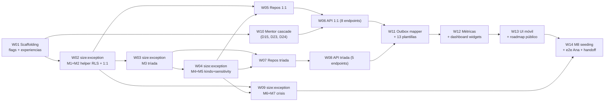

# Tasks: Fase 4 — Seguimiento Pastoral (1:1 + Tríada)

> force-chained, stacked-to-main, **Apply authorization: BLOQUEADO hasta autorización explícita del usuario**, post-F3-merge; PRs from latest `main`. Hereda F1/F2/F3 byte-identity. F4 añade solo en `lib/platform/pastoral/**`, `app/api/pastoral/**`, `app/(pastoral)/**`, `emails/pastoral/**`, `supabase/migrations/<ts>_pastoral_*.sql`.

## Review Workload Forecast

High risk; Chained; 14 work units (W01–W14); 4 `size:exception` (W02, W03, W04, W09); ~6,200 líneas estimadas (incluye DDL, tests, UI).

Decision needed before apply: No
Chained PRs recommended: Yes
Chain strategy: stacked-to-main
400-line budget risk: High

### Suggested Work Units

| Unit | Goal | Likely PR | Focused test command | Runtime harness | Rollback boundary |
|------|------|-----------|----------------------|-----------------|-------------------|
| W01 | Scaffolding + flags + experiencias + catalog | PR 1 | `F(pastoral/experience)` + `F(pastoral/flags)` | N/A | revert=contracts + flag-off |
| W02 | **size:exception** M1+M2 helper RLS + tablas 1:1 + state machine 1:1 | PR 2 | `F(pastoral/schema/one-on-one)` + `F(pastoral/state)` | DB | revert=migration-unapplied |
| W03 | **size:exception** M3 tablas tríada + state machine tríada | PR 3 | `F(pastoral/schema/triada)` + `F(pastoral/triad-state)` | DB | revert=migration-unapplied |
| W04 | **size:exception** M4+M5 kinds+sensitivity extension + writer al libro mayor | PR 4 | `F(pastoral/kinds-extension)` + `F(pastoral/ledger-writer)` | DB | revert=migration-unapplied |
| W05 | Repos 1:1 + fakes + service + read guards + validator resumen | PR 5 | `F(pastoral/one-on-one/{repository,repository-fake,service,validators,read-guard})` | N/A | revert=repos |
| W06 | API routes 1:1 (8 endpoints) + D22 shape pastoral en CAPTURE_UX | PR 6 | `F(api/pastoral/one-on-one)` | HTTP+R | revert=404 (kill switch) |
| W07 | Repos tríada + fakes + service + read guards con excepción P7 | PR 7 | `F(pastoral/triad/{repository,repository-fake,service,read-guard})` | N/A | revert=repos |
| W08 | API routes tríada (5 endpoints) + 409 conflict | PR 8 | `F(api/pastoral/triada)` | HTTP+R | revert=404 |
| W09 | **size:exception** M6+M7 catalog crisis + detector puro + scan endpoint + audit log | PR 9 | `F(pastoral/crisis/{detector,catalog,service})` + `F(api/pastoral/crisis/scan)` | DB+HTTP | revert=migration-unapplied |
| W10 | Mentor cascade puro + adapters read-only (D15, D23, D24) | PR 10 | `F(pastoral/mentor-cascade)` + `F(pastoral/adapters)` | N/A | revert=contracts |
| W11 | Outbox mapper pastoral + 13 plantillas `pastoral.*.v1` + scheduled job reminder | PR 11 | `F(pastoral/notifications/outbox-mapper)` + `F(emails/pastoral-templates)` | N/A | revert=unused-templates |
| W12 | Métricas + dashboard widgets + alarma 90-días (4 funciones puras) | PR 12 | `F(pastoral/metrics)` + `F(pastoral/dashboards/loader)` | UI+OFF | revert=widget-unmount |
| W13 | UI móvil líder (panel oculto + captura) + UI asistido (roadmap público) + UI tríada | PR 13 | `F(ui/pastoral-{lider,asistido,triada})` | UI+HTTP | revert=route-stub |
| W14 | M8 seeding + flags/route-access + e2e Ana pastoral + docs handoff | PR 14 | `F(pastoral/seeding)` + `F(pastoral/e2e-ana)` + `F(flags-route-access-pastoral)` | DB+OFF+R | revert=kill-switch OFF |

## Convenciones de rigor

Strict TDD (Jest 30 + RTL + `pnpm test`). RED → GREEN → REFACTOR. Tests primero, RED verificado, GREEN implementado, REFACTOR con cobertura. `pnpm test` verde + `tsc --noEmit` 0. Tests E2E `pastoral.end-to-end-ana.test.ts` (precedente F3). **Byte-identity obligatorio** sobre los 16 archivos protegidos del design (§5) más 4 invariantes de comportamiento (I-17, I-18, I-19, I-20). Cero DDL destructivo: solo `CREATE TABLE`, `CREATE INDEX`, `ALTER TABLE ADD COLUMN`, `ALTER TABLE ADD CONSTRAINT`, `CREATE OR REPLACE FUNCTION` con firma byte-idéntica. Ningún módulo protegido se toca; F4 añade solo módulo hermano `lib/platform/pastoral/**`. Multi-tenant OUT of MVP (P15). `uno_a_uno=archive` sigue bloqueado en `lib/platform/preflight.ts`; F4 NO invoca `registerPlatformUnoAUnoDecision`. Toda migration ≤ 400 líneas o `size:exception` documentada. `coverageThreshold` saneado (precedente F3 hygiene). `workflow pr-size.yml` label-timing fuera del alcance (precedente F3).

**Leyenda.** I=issue propio. F(x)=`pnpm test -- x --runInBand`. Harness `DB|HTTP|UI|OFF|N/A`. R=route auth/capability/flag/error RED (API). DT-NNN=task dentro del work unit W. Revert describe la estrategia de rollback (unapply migration, restore repo, kill-switch OFF).

## Dependencias entre work units

W01 es raíz sin dependencias. W02 depende solo de W01. W04 depende de W02+W03 (extiende el check constraint del ledger). W05+W07 dependen de W02+W03+W04. W10 depende solo de W01 (cascada pura sin DB). W09 depende de W02+W04 (requiere ledger con kinds extendidos). W11 depende de W06+W08 (consume eventos). W12 depende de W11+W07. W13 depende de W12+W06+W08+W11. W14 es slice de cierre con seeding + e2e Ana.

## Prerequisites

- [x] **Fase 3 mergeada a `main`** con sus 24 slices (S00–S23).
- [x] **Issue #103 cerrado** (auditoría SECURITY DEFINER; F3 S01 ya cerrado; F4 introduce nuevos RPCs con RLS respetando el patrón fijado).
- [x] **`coverageThreshold`** saneado en `jest.config.ts`.
- [x] **`workflow pr-size.yml`** label-timing resuelto o trabajo aceptado como `size:exception` explícito, fuera del alcance de F4.

## Foundation

- [ ] **W01** Scaffolding + flags + experiencias + catálogo, `I`, `type:feature`, `F(pastoral/{experience,flags,participation-kinds,types})`, `N/A`, revert=contracts, ~280
  - DT-001: Crear `lib/platform/pastoral/{index,types,errors,capabilities,participation-kinds}.ts` con `PastoralErrorCode` discriminated union (análogo F2 `DreamTeamErrorCode`). Test `F(pastoral/errors)`.
  - DT-002: Definir 13 kinds nuevos con prefijo `pastoral_` + `pastoral_crisis_detected` en `lib/platform/pastoral/participation-kinds.ts` (sibling; NO edita `lib/platform/operating-core/kinds.ts`). Test verifica byte-identity de kinds.ts (I-10).
  - DT-003: Crear `lib/platform/pastoral/flags.ts` con `NEXT_PUBLIC_PASTORAL_*` siblings (`isPastoralEnabled`, `getPastoralStage`, `getPastoralStageGate`). Test verifica byte-identity de `lib/platform/flags.ts` (I-7) y de `lib/platform/operating-core/flags.ts`.
  - DT-004: Extender `lib/platform/experiences.ts` aditivamente con `experience: 'pastoral'` y `scopeType: 'one_on_one' | 'triada'` en `PLATFORM_EXPERIENCE_CATALOG` + `PLATFORM_SCOPE_TYPES`. Test `F(pastoral/experience)` cubre ESC-01–07.
  - DT-005: Extender `PLATFORM_CAPABILITIES` aditivamente con 13 capacidades nuevas (`pastoral.one_on_one.{create,read,write_notes,validate_step,complete}`, `pastoral.triada.{create,read,write_notes,disband}`, `pastoral.metrics.read`, `pastoral.read.all`, `pastoral.mentor.cascade.resolve`, `pastoral.crisis.detect`). Test verifica que las capabilities de F1/F2/F3 siguen intactas.
  - DT-006: Crear `lib/platform/pastoral/capabilities.ts` con `resolvePastoralCapability(capabilityKey, sessionContext)` puro, misma forma que `resolveOperatingCoreCapability` de F3. Test `F(pastoral/capabilities)`.

- [x] **W02** `size:exception` M1+M2 helper RLS + tablas 1:1 + state machine 1:1, `I`, `type:feature`, `F(pastoral/{schema/one-on-one,state})`, `DB`, revert=migration-unapplied, ~620
  - **Justificación size:exception:** M1+M2 (DDL 1:1 con RLS + CHECK + 3 tablas) + state machine 1:1 (6 estados + transiciones + `version + 409`) supera 400 líneas; D17 validations; parte de M4 ya prepara check constraint. Se autoriza en `W02` para no partir la unidad pastoral del 1:1.
  - [x] DT-007: Migration M1 `20260722143357_pastoral_helper_auth_has_capability.sql` con `auth_has_pastoral_capability(p_capability_key text) STABLE SECURITY DEFINER` (D4). GRANT EXECUTE TO authenticated, service_role. Test `F(pastoral/schema/helper)` verifica invocabilidad.
  - [x] DT-008: Migration M2 `20260722143358_pastoral_tables_part1_one_on_one.sql` con `pastoral_one_on_one`, `pastoral_one_on_one_participantes`, `pastoral_one_on_one_notas` + RLS activada + CHECK constraints + índices parciales. Test `F(pastoral/schema/one-on-one-migration)` cubre I-6 (no DROP), I-19, I-20.
  - [x] DT-009: Policies RLS en M2: lectura mentor autor + asistido (roadmap) + `pastoral.read.all`; escritura solo mentor autor; notas anexables. Test verifica rechazo de UPDATE cuando `current_persona_id() != mentor_oficial_persona_id` (T5).
  - [x] DT-010: Crear `lib/platform/pastoral/state.ts` con `ONE_ON_ONE_STATES` (6 estados cerrados D12) + `ONE_ON_ONE_TRANSITIONS` matrix + `transition(currentState, action, version)` puro. Test `F(pastoral/state)` cubre ESC-01 happy path, ESC-02 invalid transition, ESC-03 version obsoleta → 409.
  - [x] DT-011: Crear `lib/platform/pastoral/triad-state.ts` parcial con placeholder (4 estados D13 + transiciones; completo en W03). Test placeholder.
  - [x] DT-012: Crear `lib/platform/pastoral/one-on-one/validators.ts` con `validarResumen(text)` bounded 500 chars + regex sensible (D17, P4). Test cubre ESC-04 (>500) + ESC-05 (sensitive pattern) de `pastoral-one-on-one-complete`.
  - [x] DT-013: TypeScript types en `lib/platform/pastoral/types.ts`: `PastoralOneOnOne`, `PastoralOneOnOneParticipante`, `PastoralOneOnOneNota` con `version: number`, `motivo_cancelacion?`, `resumen?`. Test cubre invariante de forma.

- [x] **W03** `size:exception` M3 tablas tríada + state machine tríada, `I`, `type:feature`, `F(pastoral/{schema/triada,triad-state})`, `DB`, revert=migration-unapplied, ~520
  - **Justificación size:exception:** M3 (DDL tríada con RLS + CHECK + cardinalidad 3 + 3 tablas) + catálogo cerrado de motivos (D14, 5 valores) + state machine 4 estados (D13) + validaciones de cardinalidad humana 3 fija (D25). Se autoriza para no romper la unidad pastoral de la tríada.
  - [x] DT-014: Migration M3 `20260722172128_pastoral_tables_part2_triada.sql` con `pastoral_triada`, `pastoral_triada_miembros`, `pastoral_triada_eventos` + RLS activada + CHECK constraint + índices. **Reglas W02**: DO block para enums, auth.uid() en policies, nombres únicos de policies. Test `F(pastoral/schema/triada-migration)` cubre ESC-03 de `pastoral-triada-create` (rechazo por cardinalidad incorrecta).
  - [x] DT-015: Policies RLS en M3: lectura por círculo (asistido solo roadmap, miembros ven composición, director agregado, pastor/admin completo); escritura solo mentor oficial autor. Test verifica que coordinador_area en simultaneidad NO lee notas del líder (T6).
  - [x] DT-016: Catálogo cerrado de motivos de disolución en `lib/platform/pastoral/triad-state.ts`: `TRIAD_DISSOLUTION_REASONS = ['gdv_liderazgo_removed','servicio_retirado','cambio_de_temporada','pastoral_decision','otro']` (D14). Test cubre ESC-05 de `pastoral-triada-disband` (motivo fuera del catálogo).
  - [x] DT-017: `TRIADA_STATES` (4 estados D13) + `TRIADA_TRANSITIONS` matrix + `triadTransition(currentState, action, motivo?, version)` puro con `disbanded` terminal absoluto (D13). Test cubre ESC-04 transiciones a `disbanded`, ESC-02 `en_pausa → active` round-trip. **Actualizar el placeholder de W02-DT-011** en `lib/platform/pastoral/triad-state.ts` con la implementación completa.
  - [x] DT-018: Validación de cardinalidad humana 3 fija (D25) en `lib/platform/pastoral/triad/validators.ts`: permite doble rol_en_triada si la persona tiene dos roles distintos, pero cardinalidad humana total = 3. Test parametrizado con combinaciones de roles.
  - [x] DT-019: Tipo `PastoralTriada`, `PastoralTriadaMiembro`, `PastoralTriadaEvento` en `types.ts` con `version: number`, `motivo_disolucion?`, `contexto ∈ {nuevo_paso, simultaneidad, inicial, reformada}`. Test cubre REQ-02 tipo declarado de `pastoral-triada-create`.

- [ ] **W04** `size:exception` M4+M5 kinds+sensitivity extension + writer al libro mayor compartido, `I`, `type:feature`, `F(pastoral/{kinds-extension,ledger-writer})`, `DB`, revert=migration-unapplied, ~580
  - **Justificación size:exception:** M4+M5 (DDL ALTER sobre check constraint del ledger compartido F3 con 11 kinds originales + 14 nuevos + `sensitivity` con `sensitive`) + `participation-ledger-pastoral-writer.ts` (cubre D2, D9, D15, D16, D28). F4 rompe la invariante byte-identity de `lib/supabase/database.types.ts` solo por regeneración post-migration, no por edición. Se autoriza para mantener la unidad de la integración con el ledger.
  - DT-020: Migration M4 `supabase/migrations/<ts>_pastoral_kinds_extension.sql` extiende CHECK constraint de `operating_core_participation_eventos.kind` con 14 nuevos valores con prefijo `pastoral_`. Test `F(pastoral/schema/kinds-extension)` verifica I-6 (ALTER ADD CONSTRAINT, no DROP TABLE) y que las 11 kinds originales siguen aceptas.
  - DT-021: Migration M5 `supabase/migrations/<ts>_pastoral_sensitivity_extension.sql` extiende CHECK constraint de `sensitivity` para incluir `sensitive` (precedente: ya estaba en F3 con `internal` y `public`). Test verifica aceptación de filas con `sensitivity='sensitive'` (para `pastoral_crisis_detected`).
  - DT-022: Crear `lib/platform/pastoral/participation-ledger-pastoral-writer.ts` que envuelve `OperatingCoreParticipationLedgerRepository` (F3) y emite filas con `kind LIKE 'pastoral_%'`. Test `F(pastoral/ledger-writer)` verifica que cada emisión queda registrada con `actor_persona_id` y `metadata` bounded (sin PII sensible, no `cedula/telefono/email` en `metadata`).
  - DT-023: Helper `buildPastoralEvent(kind, actorPersonaId, oneOnOneId|triadaId, metadata)` puro con default `sensitivity='internal'`, salvo `pastoral_crisis_detected` que retorna `sensitivity='sensitive'` (D15, D28). Test cubre REQ-06 de `operating-core-pastoral-bridge` (ESC-01, ESC-05, ESC-06).
  - DT-024: Verificador de byte-identity `F(pastoral/byte-identity)` que corre `git diff main...HEAD -- lib/platform/{grants,participation,navigation,routeGuard,persona,preflight,flags,family}.ts lib/platform/dream-team/ lib/platform/adapters/grupos-vida.ts lib/platform/operating-core/{kinds,state,capture-states,participation-read-guard,capture-ux/capture-ux-types,types}.ts` y falla si hay diff (I-1 a I-16). Test corre en CI por PR.
  - DT-025: Verificador `rg 'registerPlatformUnoAUnoDecision' lib/` retorna solo tests (I-18) y `rg 'uno_a_uno_' lib/platform/pastoral/` retorna vacío (I-19). Test corre en CI por PR.

## Repositorios + Servicios (TDD con fakes)

- [ ] **W05** Repos 1:1 + fakes + service + read guards + validator resumen, `I`, `type:feature`, `F(pastoral/one-on-one/{repository,repository-fake,service,read-guard,validators})`, `N/A`, revert=repos, ~380
  - DT-026: Crear `lib/platform/pastoral/one-on-one/repository.ts` interface (read+write+history+participation) análoga a F2 `DreamTeamRepository`. Test contrato `F(pastoral/one-on-one/repository-contract)`.
  - DT-027: `repository-fake.ts` in-memory (precedente F2 `repository-fake.ts` 218 líneas). Test `F(pastoral/one-on-one/repository-fake)` cubre todas las operaciones del contrato.
  - DT-028: `repository-supabase.ts` adapter con `ConcurrencyConflictError` + `version + 1` por escritura + SELECT/UPDATE parametrizados (T12 SQL injection prevention). Test `F(pastoral/one-on-one/repository-supabase)` con Supabase local; cubre happy path + 409 stale + 404 missing.
  - DT-029: `lib/platform/pastoral/one-on-one/read-guard.ts` con `canReadPastoralOneOnOneRoadmap(actor, oneOnOne)` que filtra tres círculos (P6, mentor autor, pastor/admin) + field-projection. Test cubre ESC-01/02/03/04/05/06 de `pastoral-one-on-one-read` y T2 (notas privadas NO en roadmap público).
  - DT-030: `service.ts` con `completeOneOnOneWithGrants(...)` (precedente F3 `servicios.ts`) + `emitPastoralOneOnOneCompleted(...)` que invoca el writer del ledger + emite `pastoral_one_on_one_completed`. Test cubre ESC-01 de `pastoral-one-on-one-complete`.
  - DT-031: `factories.ts` con `createOneOnOneRepository({ useFake: true|false })` análogo F3 `factories.ts`. Test cubre selección de fake vs supabase por flag.

- [x] **W07** Repos tríada + fakes + service + read guards con excepción P7, `I`, `type:feature`, `F(pastoral/triad/{repository,repository-fake,service,read-guard})`, `N/A`, revert=repos, ~360 — PR #341
  - [x] DT-032: `lib/platform/pastoral/triad/repository.ts` interface análoga a F2. Test contrato.
  - [x] DT-033: `repository-fake.ts` in-memory. Test cubre todas las operaciones + cardinalidad 3.
  - [x] DT-034: `repository-supabase.ts` con `ConcurrencyConflictError` + `disbandTriada(...)` que exige motivo del catálogo (DT-016). Test cubre ESC-02 rechazo sin motivo de `pastoral-triada-disband`.
  - [x] DT-035: `lib/platform/pastoral/triad/read-guard.ts` con `canReadPastoralTriadaNote(actor, triada, note)` que aplica excepción P7 (`contexto='simultaneidad' AND actor.rol='coordinador_area' AND note.autor_persona_id != actor.persona_id → deny`). Test cubre T6 + ESC-02 de `pastoral-triada-read` + ESC-07 de `pastoral-triada-notes`.
  - [x] DT-036: `service.ts` con `createTriadaWithAutoFormation(...)` que escucha eventos de paso tomado (P4) + `disbandTriadaWithAudit(...)` que emite `pastoral_triada_disbanded`. Test cubre ESC-01 creación automática por nuevo paso de `pastoral-triada-create`.

## API Routes

- [x] **W06** API routes 1:1 (8 endpoints) + D22 shape pastoral en CAPTURE_UX, `I`, `type:feature`, `F(api/pastoral/one-on-one)`, `HTTP`+`R`, revert=404 (kill switch), ~420
  - [x] DT-037: `app/api/pastoral/one-on-one/route.ts` POST create. 401 sin sesión, 403 sin `pastoral.one_on_one.create`, 404 flag off, 400 input malformado, 403 sin rol formal (ESC-04), 409 cascada sin resultado (ESC-03), 201 happy path con `id` + `version=1`. Test R cubre las seis ramas.
  - [x] DT-038: `app/api/pastoral/one-on-one/[id]/route.ts` GET read con tres círculos (read guard DT-029). Test R cubre ESC-01/02/03/04/05/06 de `pastoral-one-on-one-read`.
  - [x] DT-039: `app/api/pastoral/one-on-one/[id]/schedule/route.ts` POST cambiar `scheduled_at` con `expected_version`. 409 stale.
  - [x] DT-040: `app/api/pastoral/one-on-one/[id]/start/route.ts` POST `scheduled → in_progress`.
  - [x] DT-041: `app/api/pastoral/one-on-one/[id]/complete/route.ts` POST cerrar como `completed`. 400 si resumen > 500 o sensitive pattern (DT-012). Emite `pastoral_one_on_one_completed` + invoca crisis scan (W09). Test R cubre ESC-01/04/05/06 de `pastoral-one-on-one-complete`.
  - [x] DT-042: `app/api/pastoral/one-on-one/[id]/cancel/route.ts` POST cerrar como `cancelled` con motivo del catálogo. 400 sin motivo (ESC-03).
  - [x] DT-043: `app/api/pastoral/one-on-one/[id]/notes/route.ts` GET + POST. Solo mentor autor o `pastoral.read.all`. Anexable, no mutable. Test R cubre ESC-01–06 de `pastoral-one-on-one-notes` y D16.
  - [x] DT-044: `app/api/pastoral/one-on-one/[id]/validate-step/route.ts` POST validar paso espiritual. Solo mentor oficial (P5, T5). Idempotente por `(one_on_one_id, step_id)`. Test R cubre ESC-01/02/03/05/06/07 de `pastoral-one-on-one-validate-step` + T5 + T7 (auto-validación asistida → 403).

- [ ] **W08** API routes tríada (5 endpoints) + 409 conflict, `I`, `type:feature`, `F(api/pastoral/triada)`, `HTTP`+`R`, revert=404, ~340
  - DT-045: `app/api/pastoral/triada/route.ts` POST create manual (simultaneidad). 400 cardinalidad != 3, 400 sin tipo declarado, 403 sin rol formal (ESC-05 de `pastoral-triada-create`). Test R cubre ESC-02/03/04/05/06.
  - DT-046: `app/api/pastoral/triada/[id]/route.ts` GET read con cuatro círculos (read guard DT-035). Test R cubre ESC-01/02/03/04/05/06/07 de `pastoral-triada-read`.
  - DT-047: `app/api/pastoral/triada/[id]/confirm/route.ts` POST `pending_confirmation → active`. Cada miembro confirma por separado (AConf/CC/LC del Mermaid).
  - DT-048: `app/api/pastoral/triada/[id]/disband/route.ts` POST disolver con motivo del catálogo (DT-016) + `expected_version`. 400 sin motivo, 409 stale, 403 no mentor oficial, 409 ya disuelta (ESC-04). Test R cubre ESC-01–06 de `pastoral-triada-disband`.
  - DT-049: `app/api/pastoral/triada/[id]/notes/route.ts` GET + POST. Filtra coordinador_area en simultaneidad (P7). Test R cubre ESC-01–07 de `pastoral-triada-notes`.

## Mentor cascade + Crisis detector + Notificaciones + UI

- [ ] **W09** `size:exception` M6+M7 catalog crisis + detector puro + scan endpoint + audit log, `I`, `type:feature`, `F(pastoral/crisis/{detector,catalog,service})` + `F(api/pastoral/crisis/scan)`, `DB`+`HTTP`, revert=migration-unapplied, ~520
  - **Justificación size:exception:** M6+M7 (DDL `pastoral_crisis_keyword_catalog` + `pastoral_crisis_detection_log` con PK idempotente) + catálogo cerrado de 5 categorías con 5–7 frases cada una (~30 keywords) + detector puro (D29) + `scanAndAlert(...)` service + endpoint interno + audit log D32. Se autoriza para mantener la unidad pastoral de la detección de crisis (P16).
  - DT-050: Migration M6 `supabase/migrations/<ts>_pastoral_crisis_keyword_catalog.sql` con tabla `pastoral_crisis_keyword_catalog (id, categoria, termino, version, activo)` + INSERT de catálogo v1 cerrado: `duelo` (fallecido, duelo, etc.), `crisis_matrimonial`, `ideacion_suicida`, `violencia_intrafamiliar`, `crisis_de_fe`. Test `F(pastoral/schema/crisis-catalog)`.
  - DT-051: Migration M7 `supabase/migrations/<ts>_pastoral_crisis_detection_log.sql` con tabla `pastoral_crisis_detection_log (one_on_one_id PRIMARY KEY, categoria, keyword, actor_persona_id, created_at)` para idempotencia (D28). Test cubre intento de duplicar PK → rechazo.
  - DT-052: `lib/platform/pastoral/crisis/keyword-catalog.ts` con `CRISIS_KEYWORDS_V1` cargado desde DB en runtime (cache en memoria). Test parametrizado con todas las keywords.
  - DT-053: `lib/platform/pastoral/crisis/detector.ts` con `detectCrisisKeywords(content, catalog) → CategoriaMatch[]` puro, normaliza con `unaccent` + case-insensitive, matchea contra `resumen` + notas del mentor. Test `F(pastoral/crisis/detector)` cubre ESC-01 match duelo, ESC-02 sin match, ESC-03 nota original intacta, ESC-04 pareja una sola alerta, ESC-05 keyword en nota, ESC-06 auditable.
  - DT-054: `lib/platform/pastoral/crisis/service.ts` con `scanAndAlert(oneOnOneId)` que es idempotente por PK + inserta log + emite `pastoral_crisis_detected` con `sensitivity='sensitive'` + encola `pastoral.crisis.alert.v1` al outbox compartido (recipients: pastor + admin + carlos autor). Test cubre T1 (evasión parcial) + T8 (reintento idempotente).
  - DT-055: `app/api/pastoral/crisis/scan/route.ts` POST interno (no público). Recibe `{ one_on_one_id }`. Llama `scanAndAlert`. Test cubre happy path + idempotencia + rechazo si falta capability `pastoral.crisis.detect`.

- [ ] **W10** Mentor cascade puro + adapters read-only (D15, D23, D24), `I`, `type:feature`, `F(pastoral/mentor-cascade)` + `F(pastoral/adapters)`, `N/A`, revert=contracts, ~360
  - DT-056: `lib/platform/pastoral/adapters/pastoral-grupos-vida.ts` con `resolverGdVActivoPorTemporada(personaId)` read-only, **NO edita** `lib/platform/adapters/grupos-vida.ts`. Test cubre I-3 (byte-identity) + ESC-01/06 de `pastoral-mentor-cascade`.
  - DT-057: `lib/platform/pastoral/adapters/pastoral-talleres.ts` con `resolverLiderDeTaller(personaId)` read-only (Fase 3). Test cubre escenario "solo taller" (REQ-02).
  - DT-058: `lib/platform/pastoral/adapters/pastoral-servicios.ts` con `resolverCoordinadorDeServicio(personaId)` read-only (Fase 3). Test cubre escenario "solo servir" (REQ-03).
  - DT-059: `lib/platform/pastoral/mentor-cascade.ts` con `resolverMentorOficial(personaId, adapters)` puro (D15): discrimina por GDV → taller → servicio, retorna `{ kind: 'gdv'|'taller'|'servicio'|'none', mentorPersonaId?, pendingRecentChange?: boolean }`. Test cubre ESC-01/02/03/04/05/06 de `pastoral-mentor-cascade` + D23 (doble GDV) + D24 (ventana 7d `pending_recent_change`).
  - DT-060: `app/api/pastoral/mentor-cascade/resolve/route.ts` GET `?persona_id=...` con capability `pastoral.mentor.cascade.resolve`. 200 con `MentorAssignment` o `{ mentor: null, reason: 'no_active_membership' }` (P14). Test R cubre ESC-04 (sin candidato) + 403 sin capability.
  - DT-061: Tests property-based con `fast-check` que verifican: la cascada es determinista (ESC-05), GDV siempre pesa más (ESC-01/06), ninguna rama parcial devuelve líder por defecto (P14).

- [ ] **W11** Outbox mapper pastoral + 13 plantillas `pastoral.*.v1` + scheduled job reminder, `I`, `type:feature`, `F(pastoral/notifications/outbox-mapper)` + `F(emails/pastoral-templates)`, `N/A`, revert=unused-templates, ~420
  - DT-062: `lib/platform/pastoral/notifications/outbox-mapper.ts` con `mapEventToPastoralOutbox(eventKind, recipients, payload)` que mapea eventos pastorales → entradas del outbox compartido de F3 con `template_key: 'pastoral.*.v1'`. Test cubre D3 (no buzón paralelo) + REQ-01 de `pastoral-notifications`.
  - DT-063: `emails/pastoral/one-on-one-scheduled.v1.tsx` con redacción pastoral en español neutro, destinatarios = mentor oficial + asistidos (P10). Test `F(emails/pastoral/one-on-one-scheduled)` valida audience y template_key.
  - DT-064: `emails/pastoral/one-on-one-reminder.v1.tsx` con destinatarios ambos (P11). Test cubre canales correo + WhatsApp documentados; push como deuda.
  - DT-065: `emails/pastoral/one-on-one-{completed,cancelled,expiring,expiring-soon,expired}.v1.tsx` (5 plantillas). Tests verifican audience (director inmediato para completed/cancelled; mentor para expiring; ambos para expired).
  - DT-066: `emails/pastoral/triada-{formed,member-changed,disbanded,step-suggested,step-validated}.v1.tsx` (5 plantillas) + `emails/pastoral/crisis-alert.v1.tsx`. Tests verifican audience (miembros en formed/removed; asistida en step; pastor+admin+autor en crisis).
  - DT-067: Scheduled job T-24h en `lib/platform/pastoral/notifications/reminder-cron.ts` que recorre 1:1 con `scheduled_at` en `now()+23h..now()+25h` y encola `pastoral.one_on_one_reminder.v1`. Idempotente. Test cubre que un 1:1 ya terminal no se procesa (T8).
  - DT-068: Scheduled job T-7d + T-1d en `lib/platform/pastoral/notifications/expiring-cron.ts` (D20). Test cubre que NO muta 1:1 terminal.

- [ ] **W12** Métricas + dashboard widgets + alarma 90-días (4 funciones puras, D19, D27), `I`, `type:feature`, `F(pastoral/metrics)` + `F(pastoral/dashboards/loader)`, `UI`+`OFF`, revert=widget-unmount, ~280
  - DT-069: `lib/platform/pastoral/metrics.ts` con 4 funciones puras (`uno_auno_por_periodo`, `lideres_activos_por_ventana`, `triadas_por_tipo`, `alarma_gdv_sin_uno_auno_en_90_dias`). Test cubre ESC-01–06 de `pastoral-metrics` + D27 (líder pausado excluido pero histórico preservado).
  - DT-070: `lib/platform/pastoral/dashboards/loader.ts` con `loadPastoralDashboardData(actor, ventana)` que carga las 4 tarjetas. **NO edita** `obtenerDatosDashboard.ts`. Test `F(pastoral/dashboards/loader)`.
  - DT-071: `app/api/pastoral/metrics/[card]/route.ts` GET con `:card ∈ { uno_auno_por_periodo, lideres_activos_por_ventana, triadas_por_tipo, alarma_gdv_sin_uno_auno_en_90_dias }` + capability `pastoral.metrics.read` o `pastoral.read.all`. 403 sin capability (ESC-06 de `pastoral-metrics`).
  - DT-072: `app/(pastoral)/dashboard/widgets/pastoral-{uno-auno-por-periodo,lideres-activos,triadas-por-tipo,alarma-gdv}.tsx` (4 widgets UI). Test cubre renderizado correcto por capability + kill switch OFF (no render).
  - DT-073: Sección pastoral aditiva en `app/(pastoral)/dashboard/page.tsx`. NO rediseña el dashboard existente; agrega bloque condicional al flag.

- [ ] **W13** UI móvil líder (panel oculto + captura rápida D22) + UI asistido (roadmap público P6) + UI tríada, `I`, `type:feature`, `F(ui/pastoral-{lider,asistido,triada})`, `UI`+`HTTP`, revert=route-stub, ~480
  - DT-074: `app/(pastoral)/lider/uno-auno/page.tsx` listado agregado del líder (sin notas privadas en el listado, REQ-06 de `pastoral-one-on-one-read`). Test `F(ui/pastoral/lider-listado)`.
  - DT-075: `app/(pastoral)/lider/uno-auno/[id]/page.tsx` detalle completo del líder (con sus notas privadas). Test cubre ESC-02 de `pastoral-one-on-one-read`.
  - DT-076: `app/(pastoral)/lider/uno-auno/[id]/notas/page.tsx` panel de notas privadas del mentor. Test cubre D16 + ESC-03/04 de `pastoral-one-on-one-notes`.
  - DT-077: `app/(pastoral)/lider/uno-auno/[id]/validar-paso/page.tsx` flujo de validación con rechazo pastoral-amigable si actor != mentor oficial (T5, T7).
  - DT-078: `app/(pastoral)/lider/captura/page.tsx` captura rápida móvil. Reusa `CAPTURE_UX_STATES` de F3 con nuevo `CAPTURE_UX_SHAPE = 'pastoral_one_on_one'` (D22). **NO edita** `lib/platform/operating-core/capture-ux/capture-ux-types.ts`; crea `lib/platform/pastoral/capture-ux/pastoral-shape.ts` (sibling). Test cubre los 6 estados con shape pastoral.
  - DT-079: `app/(pastoral)/lider/triada/[id]/page.tsx` detalle de tríada con cuatro círculos. Test cubre ESC-01/02/05 de `pastoral-triada-read`.
  - DT-080: `app/(pastoral)/mi-roadmap/page.tsx` vista pública del asistido (P6: solo roadmap agregado, sin notas privadas, hitos de matrimonio compartidos). Test cubre ESC-01/02/07 de `pastoral-one-on-one-read` + REQ-06 de `pastoral-experience` (mensaje pastoral-amigable).
  - DT-081: `app/api/pastoral/roadmap/[personaId]/route.ts` GET público del asistido. Solo si actor == asistido, mentor autor, director, o pastor/admin. Test R cubre ESC-01 de `pastoral-one-on-one-read` y T2 (notas nunca filtradas).
  - DT-082: `lib/platform/pastoral/public-roadmap/load-public-roadmap.ts` con field-projection antes de serializar (D18). Test cubre P6 + P9 (hitos de matrimonio compartidos, individuales no cruzados).
  - DT-083: `lib/platform/pastoral/public-roadmap/next-step-suggestion.ts` con reglas declarativas cerradas (D26). Test cubre cada regla.

- [ ] **W14** M8 seeding + flags/route-access + e2e Ana pastoral + docs handoff, `I`, `type:feature`, `F(pastoral/{seeding,e2e-ana})` + `F(flags-route-access-pastoral)`, `DB`+`OFF`+`R`, revert=kill-switch OFF, ~360
  - DT-084: Migration M8 `supabase/migrations/<ts>_pastoral_seeding.sql` con INSERT idempotente en `platform_capability_grants` (D32): líderes GDV activos → `pastoral.one_on_one.{create,read,write_notes,validate_step,complete}` + `pastoral.triada.{create,read,write_notes,disband}` + `pastoral.metrics.read` + `pastoral.mentor.cascade.resolve`; coordinadores de área activos → mismo set; pastor/admin → `pastoral.read.all`. Test `F(pastoral/seeding)` cubre idempotencia + T3 (cobertura >0 si hay líder activo).
  - DT-085: `lib/platform/pastoral/route-access.ts` con `requirePastoralSession()` + `hasPastoralReadCapability` + `hasPastoralWriteCapability` + `isPastoralEnabled()`. Enforce separación leer vs validar (P5): rechaza `validate_step` cuando actor solo tiene `pastoral.read.all`. Test cubre T5 + REQ-04 de `pastoral-read-all`.
  - DT-086: `app/(pastoral)/pastor/page.tsx` dashboard pastoral del pastor con tarjetas + lista de crisis detectadas (sensitivity-aware).
  - DT-087: `app/(pastoral)/pastor/crisis/page.tsx` lista de crisis detectadas. Solo visible a pastor/admin. Test cubre ESC-01 de `pastoral-crisis-keywords`.
  - DT-088: `tests/e2e/pastoral.end-to-end-ana.test.ts` (precedente F3 `end-to-end-ana.test.ts`) cubriendo los 16 escenarios E2E mapeados a las decisiones P1–P16. Cada test nombra la decisión pastoral en el `describe`/`it`. Test corre en CI; verifica que T4 (drift pastoral ↔ implementación) no ocurre.
  - DT-089: `app/(pastoral)/pastor/lecturas/[oneOnOneId]/page.tsx` lectura completa con `pastoral.read.all`. Registra en `pastoral_access_audit_log` (D32) cada GET con audit append-only.
  - DT-090: `supabase/migrations/<ts>_pastoral_access_audit_log.sql` con tabla append-only + trigger en DB. Test cubre T10 (cada GET con `pastoral.read.all` registra una fila).
  - DT-091: Actualizar `docs/roadmap/fase-04-seguimiento-pastoral.md` (handoff pastoral-amigable) con: decisiones cerradas P1–P16, mapa de capacidades, threat matrix resumido, plan de rollout 4 etapas. Test de smoke verifica que el archivo existe y referencia las 16 decisiones.

## Open Owner Gates

- Issue #103 cerrado antes de W02 (RPCs pastorales nuevos con RLS respetan patrón S03 ya cerrado).
- Engineering floors/retention/KPIs deferred (precedente F3).
- `pr-size.yml` out-of-scope (precedente F3).
- Notificación push queda documentada como tarea futura, fuera del MVP (P11 deuda).
- Multi-tenant (`church_id`/`campus_id`/`tenant_id`) queda documentado como tarea futura, fuera del MVP (P15 deuda).
- Próximo paso sugerido como reglas declarativas puras (D26); evolución futura vía tabla `pastoral_step_catalog` queda documentada como tarea futura.

## Totales

14 work units (W01–W14); 14 PRs chained (stacked-to-main); 91 tareas DT-NNN; 4 slices con `size:exception` (W02, W03, W04, W09); ~6,200 líneas estimadas (incluye DDL, tests, UI); 8 migrations M1–M8; 16 decisiones pastorales cubiertas (P1–P16); 12 amenazas OWASP-pastoral cubiertas (T1–T12); 20 invariantes byte-identity verificadas en CI; 13 capacidades nuevas + 1 `crisis.detect`; 4 funciones puras de métricas.

Apply authorization: BLOQUEADO hasta autorización explícita del usuario.