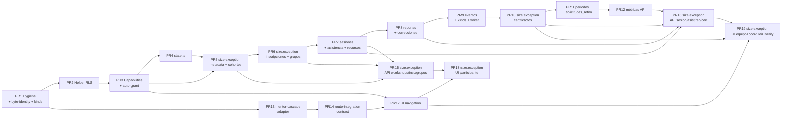

# Tasks: Fase 5 — Talleres de Crecimiento (Operating)

> force-chained, stacked-to-main, **Apply authorization: BLOQUEADO hasta autorización explícita del usuario**, post-F4-merge; PRs from latest `main`. Hereda F1/F2/F3/F4 byte-identity. F5 añade solo en `lib/platform/talleres/**`, `app/api/talleres/**`, `app/(auth)/talleres/**`, `app/verificar-certificado/**`, `supabase/migrations/<ts>_talleres_*.sql`. Strict RED → GREEN → REFACTOR (Jest 30 + RTL, `pnpm test`). Cap inheritance derived from role + scope; no manual grants. Handoff §16 protegidos byte-idénticos; CI guard global en `tests/byte-identity/protected-files.test.ts`.

## Review Workload Forecast

High risk; Chained; 19 work units (PR1–PR19); 7 `size:exception` (PR5, PR6, PR10, PR15, PR16, PR18, PR19); ~7,950 líneas estimadas (incluye DDL, tests, UI). `decision_strategy=force-chained stacked-to-main` → `Decision needed before apply: No` (cached). Capabilities derived from role+scope (no manual grants). Destructive DDL banned (C1). Multi-tenant deferred. Recursos snapshot via `taller_grupos.recursos_snapshot` (R5).

Decision needed before apply: No
Chained PRs recommended: Yes
Chain strategy: stacked-to-main
400-line budget risk: High

### Suggested Work Units

| Unit | Goal | Likely PR | Focused test command | Runtime harness | Rollback boundary |
|------|------|-----------|----------------------|-----------------|-------------------|
| PR1 | Hygiene + global byte-identity guard + participation kinds sibling | PR 1 | `F(talleres/byte-identity)` + `F(talleres/participation-kinds)` | N/A | revert=contracts + flag-off |
| PR2 | Helper `auth_has_talleres_capability` + scope helpers + migration | PR 2 | `F(talleres/schema/helper)` | DB | revert=migration-unapplied |
| PR3 | Capabilities extension + auto-grant trigger + seed grants | PR 3 | `F(talleres/capabilities)` | DB | revert=migration-unapplied |
| PR4 | `state.ts` (workshop/participant/report) + optimistic concurrency | PR 4 | `F(talleres/state)` | N/A | revert=contracts |
| PR5 | **size:exception** metadata + cohortes + RLS (P-DDL-1) | PR 5 | `F(talleres/schema/metadata)` + `F(talleres/schema/cohortes)` | DB | revert=migration-unapplied |
| PR6 | **size:exception** inscripciones + grupos + asignaciones + solicitudes_retiro + RLS | PR 6 | `F(talleres/schema/enrollment)` + `F(talleres/schema/groups)` | DB | revert=migration-unapplied |
| PR7 | sesiones + asistencias (immutable+self-FK) + recursos_snapshot + RLS | PR 7 | `F(talleres/schema/sesiones)` + `F(talleres/schema/recursos-snapshot)` | DB | revert=migration-unapplied |
| PR8 | reportes + correcciones (append-only) + signature preservation + RLS | PR 8 | `F(talleres/schema/reportes)` | DB | revert=migration-unapplied |
| PR9 | eventos + 5 `taller_*` kinds CHECK extension + writer al libro mayor | PR 9 | `F(talleres/events)` + `F(talleres/ledger-writer)` | DB | revert=migration-unapplied |
| PR10 | **size:exception** certificados + QR + verification page + periodo_general | PR 10 | `F(talleres/certificates)` + `F(talleres/periodo-general)` | DB+HTTP | revert=migration-unapplied + kill-switch |
| PR11 | periodos_generales + solicitudes_retiro + scheduler (nunca auto-cierra) | PR 11 | `F(talleres/recurrence)` + `F(talleres/period-closer)` | DB | revert=migration-unapplied |
| PR12 | métricas API (5 funciones puras, scope por rol) | PR 12 | `F(talleres/metrics)` + `F(api/talleres/metricas)` | HTTP+R | revert=404 (kill switch) |
| PR13 | F4 mentor-cascade adapter completion (`grupo-corto-plazo-supabase-adapter.ts`) | PR 13 | `F(pastoral/mentor-cascade-adapter)` | N/A | revert=adapter-body-revert |
| PR14 | Route-integration contract v1 + CI grep guard | PR 14 | `F(talleres/route-integration)` + `F(invariants/talleres-ruta)` | N/A | revert=contract-stub |
| PR15 | **size:exception** API workshops + inscripciones + grupos (8 endpoints) | PR 15 | `F(api/talleres/{workshops,inscripciones,grupos})` | HTTP+R | revert=404 (kill switch) |
| PR16 | **size:exception** API sesiones + asistencia + reportes + certificados (7 endpoints) | PR 16 | `F(api/talleres/{sesiones,asistencia,reportes,certificados})` | HTTP+R | revert=404 (kill switch) |
| PR17 | UI navigation extension + capability filter helper | PR 17 | `F(ui/talleres-navigation)` | UI | revert=group-hide |
| PR18 | **size:exception** UI participante RSC (explorar/mis-talleres/historial/certificados) | PR 18 | `F(ui/talleres-participante)` | UI+HTTP | revert=route-stub |
| PR19 | **size:exception** UI equipo + coordinacion + direccion dashboards + verification page | PR 19 | `F(ui/talleres-equipo)` + `F(ui/talleres-coordinacion)` + `F(ui/talleres-direccion)` + `F(ui/verificar-certificado)` | UI+HTTP | revert=route-stub |

## Convenciones de rigor

Strict TDD. `F(x)` = `pnpm test -- x --runInBand`. Harness: `DB` = migración aplicada a staging; `HTTP` = endpoint real; `R` = route auth/capability/flag/error RED matrix; `UI` = render RSC; `N/A` = pure contracts. RED → GREEN → REFACTOR. `pnpm test` verde + `tsc --noEmit` 0. Byte-identity obligatorio sobre los 16 archivos protegidos del design §5 + guard global `tests/byte-identity/protected-files.test.ts` en CI. Cero DDL destructivo: solo `CREATE TABLE`, `CREATE INDEX`, `ALTER TABLE ADD CONSTRAINT`, `CREATE OR REPLACE FUNCTION` con firma byte-idéntica. Ningún módulo protegido se toca; F5 añade solo módulo hermano `lib/platform/talleres/**`. Capabilities derived from role+scope (no manual grants). Multi-tenant OUT of MVP. `tests/byte-identity/protected-files.test.ts` corre en CI por PR; falla si `git diff main...HEAD -- <16 protected>` no está vacío. Toda migration ≤ 400 líneas o `size:exception` documentada. `work-unit-commits` y `chained-pr` skills gobiernan PR-by-work-unit y 400-line budget.

## Dependencias entre PRs

PR1 es raíz sin dependencias. PR2 depende solo de PR1. PR3 depende de PR2. PR4 depende de PR3. PR5 depende de PR3+PR4. PR6 depende de PR5. PR7 depende de PR6. PR8 depende de PR7. PR9 depende de PR8. PR10 depende de PR9. PR11 depende de PR10. PR12 depende de PR11. PR13 depende solo de PR1 (cascada pura). PR14 depende de PR13. PR15 depende de PR5+PR6+PR7. PR16 depende de PR7+PR8+PR10+PR12. PR17 depende de PR3+PR14. PR18 depende de PR15+PR17. PR19 depende de PR10+PR16+PR17.

## Prerequisites

- [ ] **Fase 4 mergeada a `main`** con sus 26 slices (W01–W26) + recap W23–W26.
- [ ] **`coverageThreshold`** saneado en `jest.config.ts`.
- [ ] **`workflow pr-size.yml`** label-timing resuelto o aceptado como `size:exception` (precedente F3/F4).
- [ ] **Issue #103** cerrado (auditoría SECURITY DEFINER; F4 ya respeta patrón; F5 introduce nuevos RPCs con RLS).

## Phase 1: Foundation

- [x] **PR1** Hygiene + global byte-identity guard + participation kinds sibling + flags + preflight, `type:foundation`, `F(talleres/{byte-identity,participation-kinds,flags})`, `N/A`, revert=contracts + flag-off, ~230
  - [x] DT-001: Crear `tests/byte-identity/protected-files.test.ts` con `execSync('git diff main...HEAD -- <16 protected paths>')` + fail si diff no vacío. Corre en CI por PR (cierra handoff §16 + invariantes I-1..I-16).
  - [x] DT-002: Crear `lib/platform/talleres/{index,types,errors,capabilities,flags,route-access,participation-kinds}.ts` con `TalleresErrorCode` discriminated union + `RouteAccessError`.
  - [x] DT-003: Definir 5 kinds `taller_cohort_started`, `taller_session_attended`, `taller_session_missed`, `taller_completion_recorded`, `taller_completion_failed` en `lib/platform/talleres/participation-kinds.ts` (sibling; NO edita `lib/platform/operating-core/kinds.ts`). Test verifica byte-identity.
  - [x] DT-004: Crear `lib/platform/talleres/flags.ts` con `NEXT_PUBLIC_TALLERES_*` siblings (`isTalleresEnabled`, `getTalleresStage`, `getTalleresStageGate`). Test verifica byte-identity de `lib/platform/flags.ts` y `lib/platform/operating-core/flags.ts`.
  - [x] DT-005: Pre-flight checks: `pnpm test:no-only`, `pnpm lint:migrations`, `deno check supabase/functions/*/index.ts`, baseline coverage saneado.

^- [x] **PR2** Helper `auth_has_talleres_capability` + scope helpers + migration, `type:foundation`, `F(talleres/schema/helper)`, `DB`, revert=migration-unapplied, ~250
  - DT-006: Migration `supabase/migrations/<ts>_talleres_helper_auth_has_capability.sql` con `CREATE OR REPLACE FUNCTION public.auth_has_talleres_capability(p_capability_key text) RETURNS boolean LANGUAGE sql STABLE SECURITY DEFINER SET search_path = public` (firma byte-idéntica a F4 precedent).
  - DT-007: Scope helpers `puede_editar_taller_grupo`, `puede_gestionar_participantes_taller_grupo`, `puede_ver_taller_grupo` (todos `LANGUAGE sql STABLE SECURITY DEFINER`).
  - DT-008: `GRANT EXECUTE ON FUNCTION ... TO authenticated, service_role`. Test `F(talleres/schema/helper)` verifica invocabilidad + firmas byte-idénticas + SECURITY DEFINER `search_path` correct.

- [x] **PR3** Capabilities extension + auto-grant trigger + seed grants, `type:foundation`, `F(talleres/{capabilities,experience})`, `DB`, revert=migration-unapplied, ~200
  - DT-009: Extender `lib/platform/experiences.ts` aditivamente con `experience: 'talleres_crecimiento'` y `scopeType: 'taller'` en `PLATFORM_EXPERIENCE_CATALOG` + `PLATFORM_SCOPE_TYPES` (cierra gap `admin.manage` pre-existente en `navigation.ts:93`).
  - DT-010: Extender `PLATFORM_CAPABILITIES` aditivamente con 13 capacidades nuevas (design §4: `talleres_crecimiento.{director.{read,write}, admin.manage, coordinator.{read,write}, lead.{read,write}, volunteer.read, participation.read, metrics.read, team.serve, integration.read, certificates.verify}`).
  - DT-011: Migration `supabase/migrations/<ts>_talleres_role_auto_grant.sql` con trigger AFTER INSERT/UPDATE/DELETE sobre `dream_team_servicios` (experiencia='talleres_crecimiento') + `taller_grupo_asignaciones` que otorgan/revocan capabilities (precedente `20260727000000_pastoral_auto_grant_on_role.sql`).
  - DT-012: Migration `supabase/migrations/<ts>_talleres_seed_initial_grants.sql` con INSERT idempotente de director grants iniciales (F5 bootstrap).
  - DT-013: Test `F(talleres/capabilities)` cubre herencia por scope (director/coordinador/líder/voluntario/participante) + revocación automática + 0 manual grants.

- [ ] **PR4** `state.ts` (workshop/participant/report) + optimistic concurrency, `type:foundation`, `F(talleres/{state,state-machine})`, `N/A`, revert=contracts, ~350
  - DT-014: `lib/platform/talleres/state.ts` con `WORKSHOP_STATES` (5 estados D15: `borrador→abierto→en_curso→cerrado|cancelado`) + `PARTICIPANT_STATES` (4 estados D16: `pendiente→aprobado→completado|no_completado|abandono`) + `REPORT_STATES` (4 estados: `borrador→enviado→reabierto→cerrado`) + matrices de transición + `transition(currentState, action, version)` puro.
  - DT-015: Test `F(talleres/state)` cubre happy path, invalid transition, terminal states, stale version → 409, motivo obligatorio en `reabierto`/`cancelado`.
  - DT-016: `lib/platform/talleres/state-machine.ts` con composición de state machines (workshop × enrollment) + helper `assertVersion(actual, expected)` reusable.

## Phase 2: Catalog

- [ ] **PR5** `size:exception` metadata + cohortes + RLS, `type:catalog`, `F(talleres/schema/{metadata,cohortes})`, `DB`, revert=migration-unapplied, ~450
  - **Justificación size:exception:** Migration `M5.1` (DDL `talleres_crecimiento_metadata` con FK UNIQUE a `operating_core_events(id)` + 12 columnas incluyendo snapshots + `talleres_crecimiento_cohortes` con FK a `dream_team_equipo_id` + RLS + CHECK + 8 índices parciales) supera 400 líneas; D15–D17 cubre modalidades + lifecycle + cohortes; unidades inseparables del catálogo.
  - DT-017: Migration `supabase/migrations/<ts>_talleres_tables_metadata_cohortes.sql` con `talleres_crecimiento_metadata` (`operating_core_event_id UNIQUE FK`, `tipo∈{individual,pareja}`, `link_type∈{matrimonio,novios}`, `modalidad_inscripcion∈{periodo_general,permanente_custom}`, `recurrence_rule jsonb`, `estado`, `*_snapshot`, `firmantes jsonb`, `version`) + `talleres_crecimiento_cohortes` (`dream_team_equipo_id FK`, `edicion`, `version`).
  - DT-018: Policies RLS con sufijos únicos `_select/_insert/_update/_delete` + `auth.uid()` directo (nunca `current_persona_id()`). Test cubre T-cross-scope-leakage.
  - DT-019: Test `F(talleres/schema/metadata)` cubre I-6 (no DROP) + invariantes modality snapshots (cambio de modalidad NO muta inscripciones existentes).
  - DT-020: Test `F(talleres/schema/cohortes)` cubre scope F2 `dream_team_equipo_id` byte-identity + 1 director + N coordinadores.

## Phase 3: Enrollment

- [ ] **PR6** `size:exception` inscripciones + grupos + asignaciones + solicitudes_retiro + RLS, `type:enrollment`, `F(talleres/schema/{enrollment,groups})`, `DB`, revert=migration-unapplied, ~450
  - **Justificación size:exception:** Migration `M5.2` (DDL `taller_inscripciones` con `UNIQUE(taller_id,cohorte_id,persona_principal_id)` + couple unit + `taller_grupos` + `taller_grupo_asignaciones` con `rol∈{lider,voluntario}` + `taller_catalogo_etiquetas` + `taller_solicitudes_retiro` + RLS + CHECK + índices) supera 400 líneas; unidades inseparables del enrollment + grupos.
  - DT-021: Migration `supabase/migrations/<ts>_talleres_tables_inscripciones_grupos.sql` con `taller_inscripciones` (`persona_principal_id`, `companero_id`, `link_type`, `estado∈{pendiente,aprobado,no_aprobado}`, `motivo_no_aprobado` internal, `ocurrencia_objetivo`, `unit_estado`, `version`, UNIQUE triple) + `taller_grupos` (`estado∈{activo,completado,cancelado}`, `capacidad`, `recursos_snapshot jsonb` R5) + `taller_grupo_asignaciones` (`rol`, `activo`, `approved_by_director_id`) + `taller_catalogo_etiquetas` (PK compuesta) + `taller_solicitudes_retiro` (`tipo∈{participante_retiro,equipo_retiro_definitivo}`).
  - DT-022: Policies RLS con sufijos únicos + `auth.uid()` directo. Test cubre T-cross-scope-leakage (matriz rol × scope).
  - DT-023: Test `F(talleres/schema/enrollment)` cubre couple unit (matrimonio/novios) + individual attendance + state machine `pendiente→aprobado|no_aprobado→pendiente` solo mientras periodo activo + motivo obligatorio en `no_aprobado`.
  - DT-024: Test `F(talleres/schema/groups)` cubre simultaneidad (N grupos por taller) + single-role-per-workshop + Director General dual-role exception + withdrawal request con director approval.

## Phase 4: Groups + Attendance

- [ ] **PR7** sesiones + asistencias (immutable+self-FK) + recursos_snapshot + RLS, `type:groups+attendance`, `F(talleres/schema/{sesiones,asistencia,recursos-snapshot})`, `DB`, revert=migration-unapplied, ~400
  - DT-025: Migration `supabase/migrations/<ts>_talleres_tables_sesiones_asistencia.sql` con `taller_sesiones` (`UNIQUE(grupo_id,numero)`, `meeting_time_override`, `meeting_time_applies_to∈{this_session,this_and_subsequent}`, `estado∈{programada,en_curso,cerrada,cancelada}`, `version`) + `taller_asistencias` (`estado∈{presente,ausente,no_aplica}`, `correccion_de_asistencia_id` self-FK, `UNIQUE(sesion_id,inscripcion_id)`, `version`).
  - DT-026: Trigger BEFORE UPDATE en `taller_asistencias` que rechaza modificación directa + requiere `correccion_de_asistencia_id` apuntando a fila anterior. Append-only pattern.
  - DT-027: Resource snapshot: trigger AFTER UPDATE en `taller_grupos` cuando `estado='completado'` copia recursos activos a `recursos_snapshot jsonb` (R5 — grupos completados NO se actualizan).
  - DT-028: Policies RLS + `auth.uid()`. Test cubre sequential progression (skip-ahead bloqueado) + immutability (corrección por append) + meeting-time override (this_session vs this_and_subsequent, sesiones previas inmutables).

## Phase 5: Reports

- [ ] **PR8** reportes + correcciones (append-only) + signature preservation + RLS, `type:reports`, `F(talleres/schema/reportes)`, `DB`, revert=migration-unapplied, ~400
  - DT-029: Migration `supabase/migrations/<ts>_talleres_tables_reportes_eventos.sql` con `taller_reportes` (`estado∈{borrador,enviado,reabierto,cerrado}`, `observaciones_generales NOT NULL`, `firma_lider_persona_id`, `firma_lider_fecha`, `reabierto_por_persona_id`, `reabierto_motivo NOT NULL`, `version`) + `taller_reporte_correcciones` (`reporte_id`, `autor_persona_id`, `contenido_anterior jsonb`, `contenido_nuevo jsonb`, `motivo NOT NULL`, append-only via trigger).
  - DT-030: Logic: lock al enviar (rechaza UPDATE); reopen solo por coordinador/director con motivo obligatorio; solo el reopener edita y re-publica.
  - DT-031: Test `F(talleres/schema/reportes)` cubre state machine + couple unit (1 reporte por unidad, no por persona) + signature preservation across corrections + audit trail append-only.

## Phase 6: Events

- [ ] **PR9** eventos + 5 `taller_*` kinds CHECK extension + writer al libro mayor, `type:events`, `F(talleres/{events,ledger-writer})`, `DB`, revert=migration-unapplied, ~350
  - DT-032: Migration `supabase/migrations/<ts>_talleres_tables_eventos.sql` con `taller_eventos` (`taller_id`, `cohorte_id`, `grupo_id?`, `persona_id`, `actor_persona_id`, `schema_version`, `payload jsonb` sensitive-excluded, `occurred_at`, `emitted_to_outbox`).
  - DT-033: Migration `supabase/migrations/<ts>_talleres_kinds_extension.sql` extiende CHECK constraint de `operating_core_participation_eventos.kind` con 5 nuevos valores con prefijo `taller_` + `sensitivity='internal'`. NO edita `lib/platform/operating-core/kinds.ts`.
  - DT-034: `lib/platform/talleres/events.ts` con catálogo versionado `SCHEMA_VERSION='v1'` + funciones puras de construcción (`buildTallerEvent(kind, actor, scope, metadata)` con sensitive-field filter — excluye cédula/teléfono/email/notes privadas).
  - DT-035: `lib/platform/talleres/participation-ledger-talleres-writer.ts` que envuelve F3 `OperatingCoreParticipationLedgerRepository` y emite filas con `kind LIKE 'taller_%'`. Test `F(talleres/ledger-writer)` cubre actor + metadata bounded (sin PII sensible) + 11 kinds originales intactos.

## Phase 7: Certificates

- [ ] **PR10** `size:exception` certificados + QR + verification page + periodo_general, `type:certificates`, `F(talleres/{certificates,periodo-general})`, `DB+HTTP`, revert=migration-unapplied + kill-switch, ~500
  - **Justificación size:exception:** Migration `M5.5` (DDL `taller_certificados` con `codigo_verificacion UNIQUE` base32-url-safe 16 chars + `taller_periodos_generales` con `fecha_cierre_real GENERATED COALESCE`) + `lib/platform/talleres/certificates.ts` (generación + PDF + QR SVG + verificación) + `app/api/public/verificar-certificado/[codigo]/route.ts` + `app/verificar-certificado/[codigo]/page.tsx` supera 400 líneas; unidades inseparables del subsystem de certificados.
  - DT-036: Migration `supabase/migrations/<ts>_talleres_tables_certificados_periodos.sql` con `taller_certificados` (`inscripcion_id UNIQUE`, `codigo_verificacion UNIQUE` base32-url-safe 16 chars derivado de `randomUUID()`, `taller_id`, `nombre_taller_snapshot`, `nombre_participante_snapshot`, `fecha_completitud`, `firmantes_snapshot jsonb`, `pdf_storage_path`, `revocado_at`) + `taller_periodos_generales` (`fecha_apertura_automatica`, `fecha_cierre_automatico`, `fecha_apertura_manual`, `fecha_cierre_manual`, `fecha_cierre_real GENERATED COALESCE(fecha_cierre_manual, fecha_cierre_automatico)`, `motivo_cierre`).
  - DT-037: `lib/platform/talleres/certificates.ts` con `generateCertificateForInscription(inscriptionId, actorPersonaId)`, `verifyCertificate(codigo)` (unauth), `composeCertificatePdf(snapshot)`, `revokeCertificate(codigo, motivo)`. Snapshot desde `talleres_crecimiento_metadata.firmantes` al completion.
  - DT-038: QR generation embedded as SVG in PDF → resuelve a `${PUBLIC_BASE_URL}/verificar-certificado/${codigo}`. Public page renders SOLO datos no sensibles (workshop name, participant name, completion date, signers).
  - DT-039: `app/verificar-certificado/[codigo]/page.tsx` (público, no auth) + `app/api/public/verificar-certificado/[codigo]/route.ts` GET.
  - DT-040: Test `F(talleres/certificates)` cubre generación + verificación + revocación + invalid code (friendly error) + sensitive data excluded (no email/phone/ID/group notes).

## Phase 8: Periods + Scheduler

- [ ] **PR11** periodos_generales + solicitudes_retiro + scheduler (nunca auto-cierra), `type:periods`, `F(talleres/{recurrence,period-closer,solicitudes-retiro})`, `DB`, revert=migration-unapplied, ~400
  - DT-041: Migration `supabase/migrations/<ts>_talleres_period_closer.sql` con scheduled job `talleres_period_closer` que detecta talleres `en_curso` overdue y emite evento interno `taller_session_overdue` (NUNCA auto-cierra talleres — R5 closed decision).
  - DT-042: Logic `lib/platform/talleres/recurrence.ts`: `periodo_general` lee `fecha_cierre_real = COALESCE(manual, automatic)` (R1, manual prevalece); `permanente_custom` lee `recurrence_rule jsonb` y calcula próxima ocurrencia vía F3 engine.
  - DT-043: Reschedule SOLO cuando inscription `pendiente` al iniciar (R2). Test cubre silencio (no event) cuando inscription ya aprobada.
  - DT-044: `lib/platform/talleres/solicitudes-retiro.ts` con state machine + auditoría (solicitante_persona_id, motivo NOT NULL, estado).
  - DT-045: Test `F(talleres/recurrence)` cubre periodo_general vs permanente_custom + reschedule behavior + manual override + close-and-reopen específicos.

## Phase 9: Metrics

- [ ] **PR12** métricas API (5 funciones puras, scope por rol), `type:metrics`, `F(talleres/metrics)` + `F(api/talleres/metricas)`, `HTTP+R`, revert=404 (kill switch), ~350
  - DT-046: `lib/platform/talleres/metrics.ts` con 5 funciones puras (design §8): `finalizationRateByTaller(tallerId)`, `finalizationRateByPeriodoGeneral(periodoId)`, `inscripcionesActivas(tallerId)`, `asistenciaPromedio(tallerId)`, `noAprobadosPorMotivo(tallerId)` (internal). Rate = `completados / total_con_estado_final`.
  - DT-047: `app/api/talleres/metricas/route.ts` GET con capability `talleres_crecimiento.metrics.read`. 401 sin auth, 403 sin capability, 404 flag off.
  - DT-048: Test `F(talleres/metrics)` cubre scope por rol (Director global, coordinador assigned, líder/voluntario group) + sensitive data excluded (motivos NO en payload).

## Phase 10: Integration

- [ ] **PR13** F4 mentor-cascade adapter completion (`grupo-corto-plazo-supabase-adapter.ts`), `type:integration`, `F(pastoral/mentor-cascade-adapter)`, `N/A`, revert=adapter-body-revert, ~200
  - DT-049: `lib/platform/pastoral/adapters/grupo-corto-plazo-supabase-adapter.ts` completar body (signature intacta) — soporta `resolverLiderDeTaller` para Fase 5. Precedente: F4 ya consume talleres en `mentor-cascade.ts:81-90`.
  - DT-050: Test `F(pastoral/mentor-cascade-adapter)` cubre integración con F4 + byte-identity de signature + cascade determinista (ESC-05 pastoral).

- [ ] **PR14** Route-integration contract v1 + CI grep guard, `type:integration`, `F(talleres/route-integration)` + `F(invariants/talleres-ruta)`, `N/A`, revert=contract-stub, ~300
  - DT-051: `lib/platform/talleres/route-integration.ts` con `SCHEMA_VERSION='v1'` + types `TallerIntegrationSnapshot` + field allowlist (ONLY `taller_id`, `nombre` snapshot, `tipo`, `edicion`, `periodo{id,nombre,fecha_cierre_real}`, `sesiones_total`, `estado`, `inscripcion.{estado,unit_estado,fecha_completitud}`, `certificado.{id,codigo_verificacion,emitido_at}`).
  - DT-052: `app/api/talleres/ruta-integracion/snapshot/route.ts` GET.
  - DT-053: CI grep guard: `rg 'taller_(inscripciones|asistencias|reportes)' app/\(pastoral\)/ruta/` debe retornar vacío (invariante I-ruta).
  - DT-054: Test `F(talleres/route-integration)` cubre contract versioning + sensitive data exclusion (motivos/attendance/group notes/correction history/contact data NO expuestos).

## Phase 11: API

- [ ] **PR15** `size:exception` API workshops + inscripciones + grupos (8 endpoints), `type:api`, `F(api/talleres/{workshops,inscripciones,grupos})`, `HTTP+R`, revert=404 (kill switch), ~500
  - **Justificación size:exception:** 8 endpoints REST nuevos (workshops list/create/read/transition; inscripciones list/create/approve/reject/resume; grupos list/create/assignments) + matrix R (401/403/404/409/400 × 8 endpoints = ~40 casos de prueba) supera 400 líneas; unidades inseparables del namespace `/api/talleres/`.
  - DT-055: `app/api/talleres/workshops/route.ts` GET + POST.
  - DT-056: `app/api/talleres/workshops/[id]/route.ts` GET + PATCH.
  - DT-057: `app/api/talleres/workshops/[id]/transition/route.ts` POST.
  - DT-058: `app/api/talleres/inscripciones/route.ts` POST + GET.
  - DT-059: `app/api/talleres/inscripciones/[id]/{approve,reject,resume}/route.ts` POST (3 endpoints).
  - DT-060: `app/api/talleres/grupos/route.ts` POST + GET.
  - DT-061: `app/api/talleres/grupos/[id]/assignments/route.ts` POST + PATCH + DELETE.
  - DT-062: Tests R cubren 401/403/404/409/400 por cada endpoint (deny-by-default).

- [ ] **PR16** `size:exception` API sesiones + asistencia + reportes + certificados (7 endpoints), `type:api`, `F(api/talleres/{sesiones,asistencia,reportes,certificados})`, `HTTP+R`, revert=404 (kill switch), ~500
  - **Justificación size:exception:** 7 endpoints REST (sesiones abrir/cerrar; asistencia; reportes enviar/reabrir; certificados) + matrix R (~35 casos) + immutability de asistencia supera 400 líneas; unidades inseparables del namespace operacional.
  - DT-063: `app/api/talleres/sesiones/[id]/{abrir,cerrar}/route.ts` POST (2 endpoints).
  - DT-064: `app/api/talleres/sesiones/[id]/asistencia/route.ts` POST (immutable + self-FK correction).
  - DT-065: `app/api/talleres/grupos/[id]/reporte/{enviar,reabrir}/route.ts` POST (2 endpoints).
  - DT-066: `app/api/talleres/certificados/route.ts` GET (por inscripcion_id).
  - DT-067: Tests R cubren 401/403/404/409/400 + immutability de asistencia + sequential progression (skip-ahead → 409) + couple unit (1 reporte por unidad).

## Phase 12: UI

- [ ] **PR17** UI navigation extension + capability filter helper, `type:ui`, `F(ui/talleres-navigation)`, `UI`, revert=group-hide, ~250
  - DT-068: `lib/platform/talleres/navigation.ts` con sub-items por rol (design §9): P[Explorar,Mis-Talleres,Historial]; V[Mis-Grupos,Próximas-Sesiones,Recursos]; L[Mis-Grupos,Asistencia,Reportes-Finales,Recursos]; C[Resumen,Inscripciones-Pendientes,Talleres,Equipos,Reportes]; D[Resumen-Global,Talleres,Periodos,Equipos,Solicitudes,Métricas,Reportes].
  - DT-069: `components/ui/platform-navigation-view-items.ts` extension aditiva — agrega grupo `Talleres de Crecimiento` con sub-items capability-filtered. NO edita `sidebar-moderna.tsx` ni `header-movil.tsx` (excepto nuevo `MenuItem` definition).
  - DT-070: `lib/platform/talleres/route-access.ts` con `getTalleresNavItems(sessionCapabilities)` helper (multi-role union).
  - DT-071: Test `F(ui/talleres-navigation)` cubre capability filter + multi-role union + kill switch OFF (no render del grupo).

- [ ] **PR18** `size:exception` UI participante RSC (explorar/mis-talleres/historial/certificados), `type:ui`, `F(ui/talleres-participante)`, `UI+HTTP`, revert=route-stub, ~600
  - **Justificación size:exception:** 4 RSC pages + 4 server actions co-located + counter badges (BadgeSistema) + FAB reuse (Grupos de Vida precedent) + capability filter por participante supera 400 líneas; unidades inseparables de la UI del participante.
  - DT-072: `app/(auth)/talleres/explorar/page.tsx` (RSC listado) + `actions.ts` (inscribirse).
  - DT-073: `app/(auth)/talleres/mis-talleres/page.tsx` (RSC inscripciones activas del participante).
  - DT-074: `app/(auth)/talleres/historial/page.tsx` (RSC historial longitudinal).
  - DT-075: `app/(auth)/talleres/certificados/[id]/page.tsx` (RSC certificado descargable).
  - DT-076: Tests cubren capability filter `participation.read` + kill switch + render + solo resumen/certificado (no detalles administrativos/asistencia).

- [ ] **PR19** `size:exception` UI equipo + coordinacion + direccion dashboards + verification page, `type:ui`, `F(ui/talleres-{equipo,coordinacion,direccion})` + `F(ui/verificar-certificado)`, `UI+HTTP`, revert=route-stub, ~700
  - **Justificación size:exception:** 13 RSC pages (equipo 4, coordinacion 6, direccion 7) + server actions + verification page pública + counter badges + FAB + capability filter por 3 roles distintos (líder, coordinador, director) supera 400 líneas; unidades inseparables del dashboard operacional.
  - DT-077: `app/(auth)/talleres/equipo/{mis-grupos,mis-grupos/[id]/asistencia,mis-grupos/[id]/reporte,recursos,proximas-sesiones}/page.tsx` (5 pages).
  - DT-078: `app/(auth)/talleres/coordinacion/{resumen,inscripciones,talleres,equipos,reportes,solicitudes}/page.tsx` (6 pages).
  - DT-079: `app/(auth)/talleres/direccion/{resumen,talleres,periodos,equipos,solicitudes,metricas,reportes}/page.tsx` (7 pages).
  - DT-080: `app/verificar-certificado/[codigo]/page.tsx` (público, datos no sensibles).
  - DT-081: Tests cubren capability filter (`lead.*`/`coordinator.*`/`director.*`/`metrics.read`) + dashboards widgets + counter badges (BadgeSistema) + FAB reuse + verification page sin PII.

## Open Owner Gates

- Issue #103 cerrado antes de PR2 (RPCs nuevos con RLS respetan patrón S03 ya cerrado).
- Issue `admin.manage` gap pre-existente se cierra en PR3 (F4 follow-up debt; navigation.ts:93).
- Engineering floors/retention/KPIs deferred (precedente F3/F4).
- `pr-size.yml` out-of-scope (precedente F3/F4).
- Notificación push/email/WhatsApp documentada como tarea futura, fuera del MVP (no channels wired en F5).
- Multi-tenant (`church_id`/`campus_id`/`tenant_id`) deferred a fase futura.
- Recursos modelo final: `recursos_snapshot` en `taller_grupos` (R5 close-snapshot). Confirmar OQ-3 antes de PR5.

## Open Questions (con resolución propuesta)

- **OQ-1** (5 `taller_*` kinds vs add `taller_inscripcion_rescheduled`): **Resolución propuesta** = mantener 5 kinds v1 (design §3). Si en PR7/PR11 detectamos necesidad de reschedule event explícito, agregar `taller_inscripcion_rescheduled` en una iteración menor de W09 (sin nuevo PR). Owner gate antes de PR9 si hay nueva evidencia.
- **OQ-2** (`persona_principal_id` vs `usuario_id` reference): **Resolución propuesta** = usar `persona_principal_id` + `companero_id` (design §3). F3 ledger usa `usuario_id`, pero las tablas F5 son entidades de dominio propias con FK a `public.personas`. RLS via `auth.uid()` + helper `auth_has_talleres_capability` no requiere renombrar. **Confirmar con Carlos** si F3→F5 link debe ser via `usuarios.id` o `personas.id` antes de PR6.
- **OQ-3** (`firmantes` JSON shape): **Resolución propuesta** = shape `{persona_id: uuid, rol_etiqueta: string, orden: int}[]` (más rico, soporta orden de firma + link a persona para revocación granular). Alternativa simple `{nombre, rol}[]` queda como fallback. **Lock en PR10** (certificados), confirmar con Director General qué metadata debe aparecer en el PDF.
- **OQ-4** (`firma_lider_persona_id` required when `estado='borrador'` or only `enviado`): **Resolución propuesta** = nullable en `borrador`, required al transicionar a `enviado` (validación en state machine). Coherente con handoff §"Reportes finales" (firma al enviar). **Lock en PR8** state machine.

## Totales

19 work units (PR1–PR19); 19 PRs chained (stacked-to-main); 81 tareas DT-NNN; 7 slices con `size:exception` (PR5, PR6, PR10, PR15, PR16, PR18, PR19); ~7,950 líneas estimadas (incluye DDL, tests, UI); 10 migrations `M5.1`–`M5.10`; 15 decisiones D15–D26 + 4 Open Questions; 16 archivos protegidos byte-idénticos (CI guard global en `tests/byte-identity/protected-files.test.ts`); 13 capacidades nuevas + `integration.read` + `certificates.verify` (público); 5 funciones puras de métricas; 1 capa de integración versionada (`SCHEMA_VERSION='v1'`).

Apply authorization: BLOQUEADO hasta autorización explícita del usuario.
